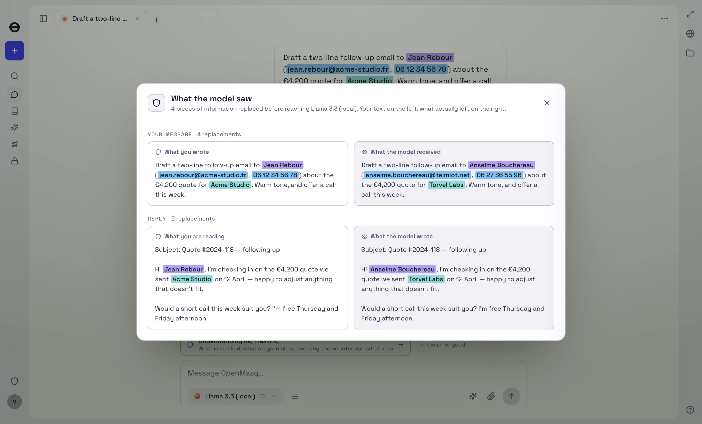
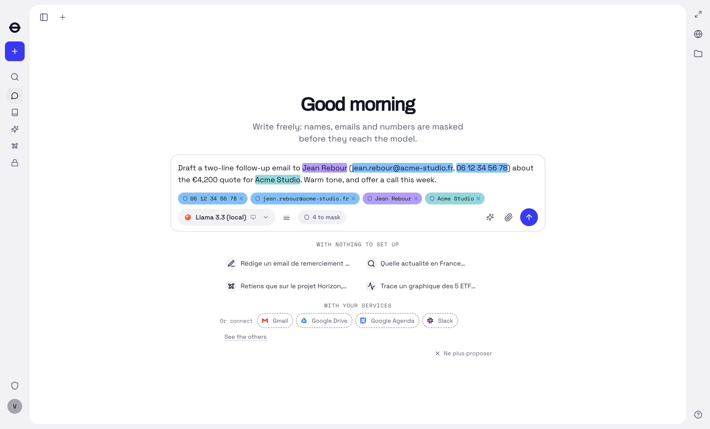
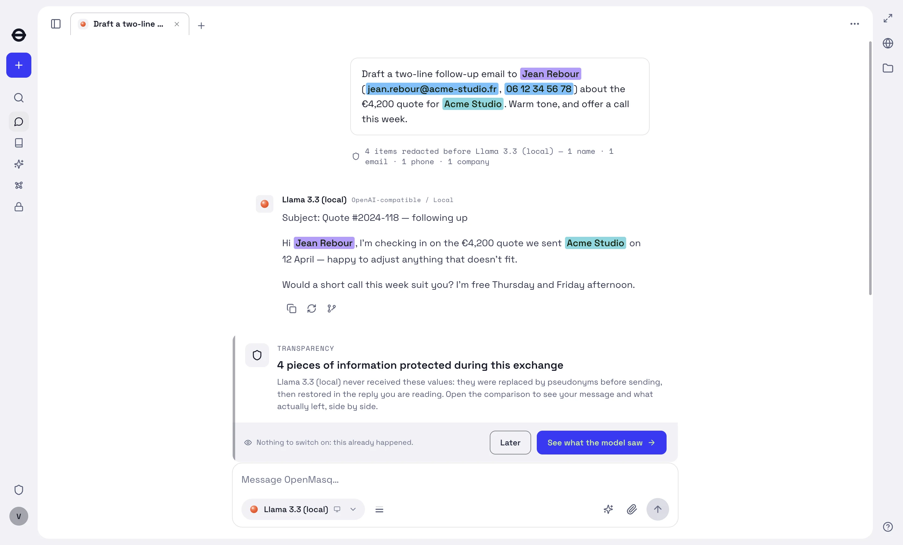

# OpenMasq

[](LICENSE)
[](#installation)
[](https://www.npmjs.com/package/@openmasq/redact)
[](https://openmasq.com/fr)
[](https://help.openmasq.com/fr)

**Le chat IA de bureau qui tient vos données personnelles à l'écart du modèle.**

OpenMasq est une application de chat de bureau pour les modèles d'OpenAI, Anthropic,
Mistral, Google et les modèles locaux. Avant qu'un message ne quitte votre machine, les
noms, e-mails, numéros de téléphone, IBAN, clés d'API et le reste sont remplacés par des
substituts crédibles. La réponse vous revient avec les vraies valeurs. Le masquage se fait
sur votre appareil, et le code est open source.

[English](README.md) · [Site](https://openmasq.com/fr) · [Centre d'aide](https://help.openmasq.com/fr) · [Contact](mailto:support@openmasq.com)



> [!NOTE]
> Chaque capture de cette page est une vraie exécution de l'application, sur un profil de
> test aux données inventées.

## Installation

| Plateforme | Paquet | |
|---|---|---|
| **macOS** | Apple Silicon et Intel, signé et notarisé, mis à jour automatiquement | [Télécharger](https://openmasq.com/fr/telecharger) |
| **Windows** | Windows 10 et plus, x64, installeur signé, mis à jour automatiquement | [Télécharger](https://openmasq.com/fr/telecharger) |
| **Linux** | Pas encore de paquet | [Compiler depuis les sources](#compiler-depuis-les-sources) |

L'application publiée comprend le compte, la synchronisation et des modèles utilisables
sans votre propre clé. Une version compilée depuis ces sources fonctionne avec vos clés, un
modèle local ou un abonnement CLI, sans backend : voir
[Compiler depuis les sources](#compiler-depuis-les-sources).

## Sommaire

- [Comment ça marche](#comment-ça-marche)
- [Fonctionnalités](#fonctionnalités)
- [Prise en main](#prise-en-main)
- [Utiliser le moteur dans votre code](#utiliser-le-moteur-dans-votre-code)
- [Bancs de mesure](#bancs-de-mesure)
- [Compiler depuis les sources](#compiler-depuis-les-sources)
- [Données collectées](#données-collectées)
- [Développement](#développement)
- [Sécurité](#sécurité)
- [Licence](#licence)

## Comment ça marche

```
message ──masquage──▶ ce que le modèle reçoit ──modèle──▶ réponse ──restauration──▶ ce que vous lisez
```

```
vous tapez :   « Relance Jean Rebour (SAS Acme) au 06 12 34 56 78 sur le CA de 850 000 € »
→ au modèle :  « Relance Léa Savary (Cyberdyne) au 36 86 42 08 64 sur le CA de 850 000 € »
← le modèle :  « J'écris à Léa Savary au sujet du CA de 850 000 €… »
→ vous lisez : « J'écris à Jean Rebour au sujet du CA de 850 000 €… »
```

Léa Savary n'existe pas. Son numéro non plus.

- **Les identités sont permutées, les chiffres restent vrais** par défaut : le modèle peut
  encore calculer avec.
- **Un coffre par conversation.** Une même valeur reçoit toujours le même substitut, et
  c'est ce qui rend la réponse réversible. Un sel propre à chaque conversation lui donne un
  autre substitut dans la conversation suivante, si bien qu'une table de correspondance
  des substituts ne révèle rien.
- **Vous voyez ce qui part.** Avant l'envoi, la zone de saisie surligne chaque valeur
  qu'elle va remplacer. Vous pouvez en retirer une.

> [!IMPORTANT]
> Le masquage gouverne ce que voit le **modèle**, et rien d'autre. Les services connectés
> (une boîte mail, un agenda, une recherche) reçoivent la vraie valeur, parce qu'une
> recherche sur un substitut ne trouve personne. Leurs résultats reviennent masqués par le
> même coffre. Ce compromis est documenté dans [`SECURITY.md`](SECURITY.md).

## Fonctionnalités

- **Tous les modèles** : votre propre clé d'API (OpenAI, Anthropic, Google, Mistral,
  DeepSeek, Scaleway, OpenRouter, ou tout point d'accès compatible OpenAI comme Ollama,
  LM Studio ou vLLM), un modèle local, ou votre abonnement Claude Code, Codex ou
  Antigravity CLI.
- **Masquage sur l'appareil** : des règles déterministes, des clés de contrôle et des
  détecteurs de forme, puis un modèle NER local. Actifs par défaut : noms, dates de
  naissance, e-mails, téléphones, adresses, lieux, entreprises, cartes, IBAN, identifiants
  nationaux et d'entreprise, IP, pseudos, clés et secrets. Inactifs par défaut, à un
  interrupteur près : chemins de fichiers, URL et dates ordinaires. Le niveau Strict active
  les trois.
- **Documents** : les pièces jointes PDF, Office et images sont extraites (pdf.js, OCR par
  un Tesseract durci et docTR) puis masquées avant l'envoi.
- **Connecteurs** : Gmail, Google Drive, Docs, Sheets, Agenda, Outlook, OneDrive,
  SharePoint, Teams, Slack et GitHub avec une authentification OAuth sur l'appareil ; une
  quarantaine de serveurs MCP distants (Notion, Linear, Sentry, PostHog, Atlassian, Stripe,
  Supabase, Vercel…) et ceux que vous ajoutez ; un serveur de fichiers local ; un navigateur
  piloté par l'agent. Les appels d'outils partent avec les vraies valeurs, et leurs
  résultats reviennent masqués.
- **Bac à sable Python** : le code écrit par le modèle s'exécute sur les vraies données,
  dans une prison système, hors du processus principal.
- **Synchronisation entre appareils** : chiffrée de bout en bout, le serveur ne stocke que
  du chiffré. *(Côté client seulement dans ce dépôt : il lui faut un backend qui n'en fait
  pas partie.)*
- **Organisations** : une console d'administration avec des rôles, un journal d'audit et
  des catégories de masquage que l'organisation peut imposer. *(Côté client seulement, pour
  la même raison.)*

L'inventaire complet, écran par écran, est dans [`FEATURES.md`](FEATURES.md).

<details>
<summary><b>Deux autres captures</b> : avant l'envoi, et après la réponse</summary>

**Avant que rien ne parte.** La zone de saisie surligne ce qu'elle va remplacer, présente
chaque valeur sous forme d'étiquette que vous pouvez retirer, et en affiche le nombre. Rien
n'a encore été envoyé.



**Après la réponse.** Le modèle a répondu au sujet d'*Anselme Bouchereau* chez *Torvel
Labs* ; vous lisez la réponse au sujet de Jean Rebour chez Acme Studio. La ligne sous votre
message indique ce qui a été remplacé, par catégorie.



</details>

## Prise en main

1. Installez l'application depuis [openmasq.com/fr/telecharger](https://openmasq.com/fr/telecharger).
2. Ouvrez les **Réglages** et collez une clé de fournisseur, indiquez un modèle local, ou
   connectez votre abonnement CLI.
3. Écrivez un message qui contient de vraies données. La zone de saisie surligne ce qui
   sera remplacé.
4. Envoyez, puis ouvrez la carte de transparence sous votre message pour voir exactement ce
   que le modèle a reçu.

Le [centre d'aide](https://help.openmasq.com/fr) détaille chaque écran.

## Utiliser le moteur dans votre code

Le moteur de masquage est publié sur npm sous le nom
[`@openmasq/redact`](https://www.npmjs.com/package/@openmasq/redact) : le même code que
celui de l'application, pour vos propres appels à un LLM.

```bash
npm install @openmasq/redact
```

```ts
import { pseudonymize, unredactReply } from "@openmasq/redact";

const vault = {};                                         // un par conversation, jamais envoyé
const { text } = await pseudonymize(prompt, { vault });  // ce que voit le modèle
const shown = unredactReply(await callYourLLM(text), vault);
```

Le [guide développeur](https://help.openmasq.com/fr/redact) couvre les conversations, les
appels d'outils, la NER locale, les documents et les options.

## Bancs de mesure

Deux questions, mesurées séparément.

**La valeur a-t-elle quitté la machine ?** Notre corpus : 18 familles de documents, 14
langues, de vraies mises en page, des dégâts d'OCR, 907 cas, 3 364 valeurs annotées. Une
valeur compte comme trouvée quand au moins 60 % de ses mots significatifs ont été
remplacés ; un faux positif (FP) ne recouvre aucune valeur annotée.

| corpus | valeurs | `patterns` (sans modèle) | **OpenMasq** (`ner`) | PII-Tracer | Presidio (par défaut) |
|---|---:|---:|---:|---:|---:|
| **le nôtre** | 3 364 | 89 % · 89 FP | **95 %** · 251 FP | 92 % · 530 FP † | 46 % · 845 FP |
| **celui de Presidio** (anglais, modèles + faker) | 2 523 | 32 % · 6 FP | **75 %** · 111 FP | — | 58 % · 196 FP |

† PII-Tracer a été mesuré sur le corpus à 3 357 valeurs et n'a pas été relancé depuis.

**Où exactement le moteur a-t-il tracé la limite ?** F1 au caractère, selon le protocole
de l'article [PII-TRACE](https://www.perplexity.ai/hub/blog/pii-trace-detecting-personal-data-before-it-leaves-the-device)
de Perplexity, sur les catégories pour lesquelles l'application a un interrupteur.

| corpus | cas | `patterns` | **`ner`** (Strict) | `ner` (Renforcé) | PII-Tracer | OpenAI PF | Presidio |
|---|---:|---:|---:|---:|---:|---:|---:|
| OpenMasq | 907 | 0,931 | **0,923** | 0,931 | 0,888 | 0,833 | 0,547 |
| TAB | 127 | 0,425 | **0,855** | 0,606 | 0,742 | 0,435 | 0,815 |
| Gretel | 2000 | 0,575 | **0,646** | 0,646 | 0,611 | 0,565 | 0,422 |
| ai4privacy | 2000 | 0,756 | **0,827** | 0,796 | 0,952 | 0,945 | 0,579 |
| Nemotron | 2000 | 0,627 | **0,928** | 0,735 | 0,887 | 0,736 | 0,768 |

Ce qui fait bouger ces chiffres plus que les moteurs eux-mêmes :

- **Une forme est une preuve, un nom est une hypothèse.** Cartes, IBAN, e-mails et IP sont
  à 100 % ou presque sans modèle : une clé de contrôle tranche. Les noms, adresses et
  entreprises sont là où le modèle local fait la différence. En chinois, japonais et
  coréen, les règles seules atteignent 24 à 26 %, le modèle 66 à 88 %.
- **La plupart des numéros de carte de ces corpus n'auraient jamais pu être émis.** 89 % de
  ceux de Nemotron et 52 % de ceux de Gretel échouent au contrôle de Luhn : le générateur
  s'est montré plus créatif qu'une banque. Tout numéro dont la clé est valide est trouvé,
  sur les deux corpus.
- **Gretel n'annote pas les numéros de compte** de ses documents MT940, SWIFT et XBRL : la
  précision de tous les moteurs y chute (0,24 pour PII-Tracer, 0,43 pour le nôtre).
- **Presidio est un `pip install` par défaut** : Presidio avec spaCy `en_core_web_lg`,
  lancé en anglais sur les quatorze langues. C'est ce qu'on obtient sans réglage, pas son
  plafond.

> [!WARNING]
> La détection est bonne, pas infaillible. Le Coffre, les termes que vous marquez
> vous-même, est la seule couverture que l'application promet pour une chaîne donnée.

Méthode, tableaux par catégorie et par langue, temps de réponse et reproduction :
[`packages/redact/bench`](packages/redact/bench).

## Compiler depuis les sources

Il faut Node.js 20 ou plus (la CI utilise la 26) et pnpm (`corepack enable` le fournit).

```bash
git clone https://github.com/openmasq/openmasq && cd openmasq
pnpm install
pnpm dev          # compile les paquets, puis lance l'application
```

Ouvrez ensuite les **Réglages** et ajoutez une clé, un modèle local ou un abonnement CLI.

> [!TIP]
> Vous travaillez sur le masquage ? Lancez une fois `pnpm --filter @openmasq/desktop bake`
> pour récupérer les modèles NER et OCR. Sans eux, l'application fonctionne, mais la
> détection se replie sur les règles sans vous prévenir : vous testeriez les règles, pas le
> modèle.

**Cette version n'a pas de backend.** Ni facturation, ni synchronisation, ni organisations,
ni modèles inclus : ces services vivent dans un dépôt privé, derrière la porte
`OPENMASQ_BILLING`. Le code d'une offre payante (`packages/credits`, un onglet Paiement)
existe pour qui déploie cette pile et la facture. L'application publiée par la marque est
compilée sans : elle ne vend rien et n'affiche aucune offre. Les notes de version
antérieures au passage en open source (septembre 2026) décrivent l'ancienne offre hébergée
et sont conservées pour mémoire.

Pour faire tourner votre propre pile, voir [`SELF_HOSTING.md`](SELF_HOSTING.md).

## Données collectées

Une version compilée depuis ces sources contacte cinq petits services hébergés par la
marque, listés dans [`apps/desktop/scripts/publicServices.ts`](apps/desktop/scripts/publicServices.ts) :

- **Connexion** : un projet Supabase, par lien magique ou Google. Le compte sert seulement
  à vous identifier.
- **Relais Slack** : l'échange code contre jeton que Slack n'autorise pas sur l'appareil.
- **Relais d'analytique** : des compteurs pseudonymes, actifs par défaut, liés à un
  identifiant d'installation. Désactivables dans les Réglages ; jamais envoyés quand Do Not
  Track ou GPC est activé. Le même relais sert les notes de version et les drapeaux de
  fonctionnalités. La requête des drapeaux est de la configuration, pas de la mesure : elle
  part quel que soit le consentement, avec l'identifiant d'installation et, si vous êtes
  connecté, votre jeton de compte ([`packages/analytics/src/flags.ts`](packages/analytics/src/flags.ts)).
- **Rapports de plantage** : Sentry, sur une liste fermée de champs machine, jamais une clé
  ni une valeur du coffre. Les messages d'exception et les noms de fonctions ne se filtrent
  pas champ par champ : ils sont nettoyés et tronqués, ce qui atténue le risque sans le
  supprimer ([`apps/desktop/src/sentry/policy.ts`](apps/desktop/src/sentry/policy.ts)).
  Seul un binaire compilé et signé par la CI envoie des rapports.
- **Flux de mises à jour** : là où une application installée vérifie les nouvelles
  versions, avec un identifiant d'installation pour pouvoir freiner un déploiement
  progressif.

Chacun tient en une variable. Laissez-la vide à la compilation (`OPENMASQ_SENTRY_DSN=`,
`VITE_UPDATES_URL=`) pour vous en passer. Un fork distribué sous son propre nom doit vider
le flux de mises à jour, pour ne jamais se remplacer par le binaire signé de la marque. Les
réglages locaux vont dans `apps/desktop/.env.development.local`, ignoré par git.

## Développement

```bash
pnpm test              # tests unitaires, gratuits, à lancer souvent
pnpm test:changed      # seulement ce que votre changement touche
pnpm test:redact       # le moteur de masquage seul (~20 s)
pnpm typecheck
pnpm build
pnpm verify            # toutes les vérifications locales
```

Les suites e2e pilotent la vraie application contre de vraies API et coûtent de vrais
euros : elles restent hors de cette boucle. Chaque spécification s'ignore sans sa clé
(`pnpm --filter @openmasq/desktop e2e:openai`, voir `apps/desktop/e2e/README.md`).

Certaines conventions sont vérifiées plutôt que demandées : 300 lignes au plus par fichier
source (`check:loc`), une documentation qui ne cite que des chemins existants
(`check:docs`), rien d'implémenté deux fois (`check:dup`), un `FEATURES.md` à jour
(`check:features`), et chaque GitHub Action épinglée à un commit (`check:actions`). La CI
les lance ; `pnpm verify` aussi, en local. Lisez le [`CLAUDE.md`](CLAUDE.md) racine avant
une première modification : il recense les invariants et l'emplacement de chaque chose.

<details>
<summary><b>Organisation du dépôt</b></summary>

```
apps/
  desktop/       Application Electron : main (IPC, base, MCP, streaming) · preload · renderer · e2e
  proxy/         Proxy de masquage local pour les outils compatibles OpenAI, Anthropic et Gemini
  mcp-broker/    Broker MCP + serveur OAuth, un service local lancé par l'application
packages/
  redact/        Le moteur de masquage, publié sur npm sous @openmasq/redact
  ui/            Toute l'interface React, le store et le design system
  llm/           Clients des fournisseurs, registre des modèles, streaming, appels d'outils
  mcp/           Client MCP qui masque · connectors/ outils OAuth sur l'appareil
  catalog/       Listes de référence uniques : modèles, connecteurs, catégories
  i18n/          Catalogue de messages typé (source française, anglais)
  credits/ schema/ sync/ branding/ analytics/
  tesseract2/    OCR durci (worker_threads + WASM) · ort/ · vendor/xlsx/
```

`ui` dépend de `llm`, `redact`, `mcp`, `catalog`, `schema` et `analytics` ; `desktop` les
assemble tous. Les applications ne s'importent jamais entre elles (`check:dup`).

</details>

## Sécurité

[`SECURITY.md`](SECURITY.md) présente le modèle de menace, les garanties et les limites
connues, avec le même niveau de détail. Le masquage est une détection, et la détection est
imparfaite ; l'injection de prompt est contenue, pas résolue ; le chiffrement au repos n'est
pas garanti sur toutes les installations ; la prison Python n'a pas la même solidité sur
toutes les plateformes. Le document est écrit pour être vérifié contre ces sources.

Signalez une vulnérabilité en privé via **Security → Report a vulnerability** sur ce dépôt.
N'ouvrez pas d'issue ni de pull request publique contenant les détails d'une faille.

## Liens

| | |
|---|---|
| **Centre d'aide** | [help.openmasq.com/fr](https://help.openmasq.com/fr) : chaque écran, en français et en anglais |
| **Guide développeur** | [help.openmasq.com/fr/redact](https://help.openmasq.com/fr/redact) : le moteur dans votre code |
| **Site** | [openmasq.com/fr](https://openmasq.com/fr) |
| **Contact** | [support@openmasq.com](mailto:support@openmasq.com) |
| **Fonctionnalités** | [`FEATURES.md`](FEATURES.md) |
| **Contribuer** | [`CONTRIBUTING.md`](CONTRIBUTING.md) · [`CODE_OF_CONDUCT.md`](CODE_OF_CONDUCT.md) |

## Licence

[Licence Apache 2.0](LICENSE), pour tout le dépôt : l'application, les paquets (moteur de
masquage compris), le broker MCP local et l'outillage. Vous pouvez l'utiliser, la modifier,
la redistribuer et bâtir dessus, y compris commercialement, à condition de conserver les
mentions ([`NOTICE`](NOTICE)) et d'indiquer vos modifications. La licence comprend une
concession expresse de brevets de chaque contributeur, et les contributions sont acceptées
sous cette même licence (section 5) : il n'y a pas d'accord séparé à signer.

Le code tiers garde sa propre licence : `packages/tesseract2` (dérivé de tesseract.js) et
`vendor/xlsx` (SheetJS), tous deux sous Apache-2.0. Les ressources récupérées à la
compilation et livrées dans l'application sont listées dans [`NOTICE`](NOTICE).
