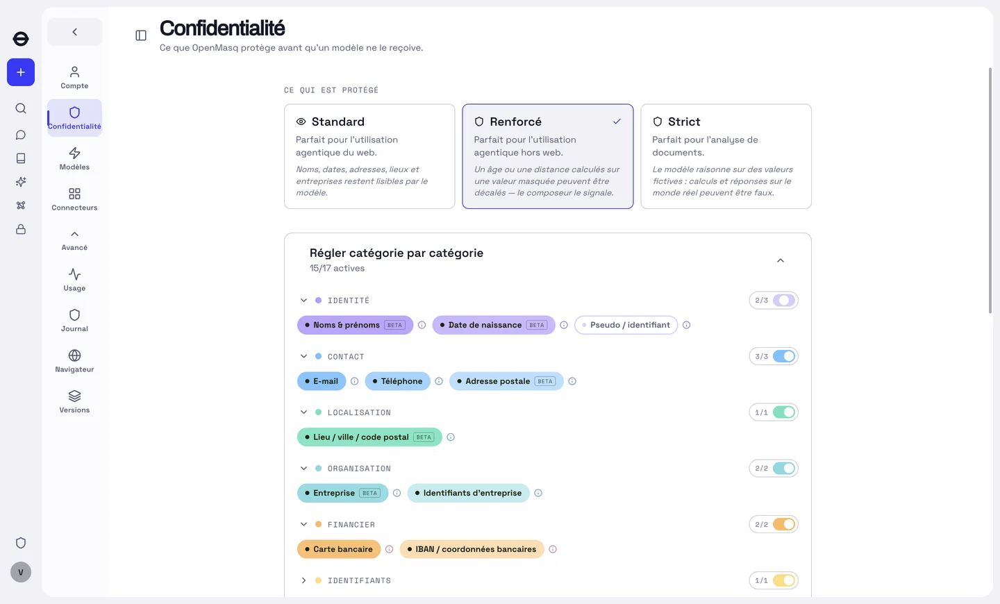
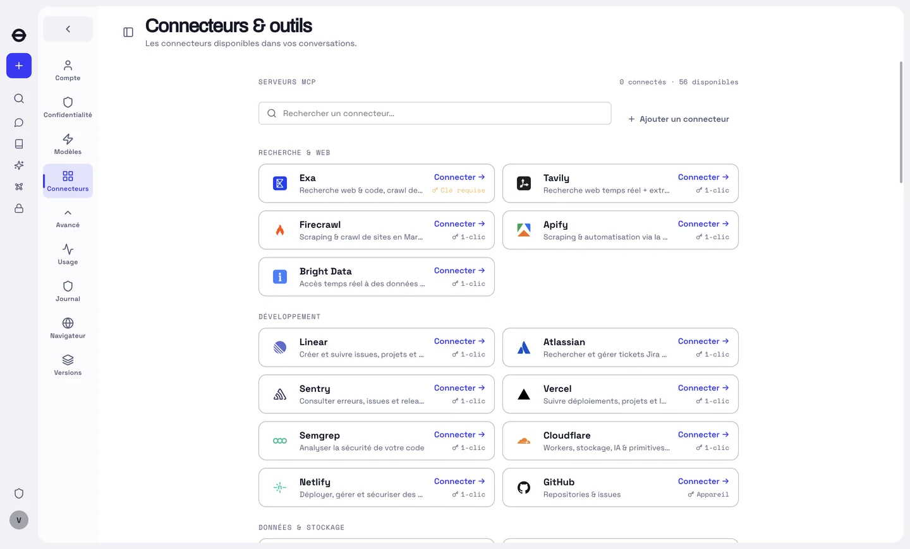

# OpenMasq

**A multi-model desktop chat app that redacts sensitive data before it leaves your
machine — and puts it back in the reply.**

[](LICENSE)
[](#getting-started)
[](#whats-in-the-box)


> **No binary is published yet.** You build it from source — two commands, see
> [Getting started](#getting-started). The interface ships in French and English; the
> screenshots here are the French one.

The model never sees the real thing. Values the engine detects are replaced with
believable substitutes before any network call; the reply is restored locally from a
per-conversation vault, so the conversation reads naturally on your side.

```
prompt ──redact──▶ what the model receives ──model──▶ reply ──de-redact──▶ what you see
```

```
you type:   "Call Jean Rebour (SAS Acme) on 06 12 34 56 78 — revenue 850 000 €"
→ to model: "Call Léa Savary (Cyberdyne) on 36 86 42 08 64 — revenue 850 000 €"
← model:    "I'll email Léa Savary about the 850 000 € revenue…"
→ you see:  "I'll email Jean Rebour about the 850 000 € revenue…"
```

Identities are swapped; **figures stay real by default**, so a model can still compute
with them. The vault is stable across turns — the same value always maps to the same
substitute, which is what makes the reply reversible.

Models are reached with **your own API keys**, a local model, or a Claude Code / Codex CLI
subscription. (The code also supports reaching them on the app's key through a metered
gateway; that service is not part of this build — see *Running it* below.)

> **The redaction boundary governs what the *model* sees, and nothing else.** Connected
> services — a mailbox, a calendar, a search — receive the **real** value, because a
> search for a substitute finds nobody. Their results come back redacted through the same
> vault. This is a deliberate, documented trade-off; see [`SECURITY.md`](SECURITY.md).

---

## What's in the box

- **Redaction engine** — deterministic rules, checksums and shape detectors, then a local
  NER model. Runs on-device. Names, dates of birth, e-mails, phones, addresses, places,
  companies, cards, IBANs, national identifiers, IPs, file paths, health data, handles,
  URLs, keys and secrets.
- **Documents** — PDF, Office and image attachments are extracted (pdf.js, OCR via a
  vendored, hardened Tesseract + docTR) and redacted before they are sent.
- **MCP connectors** — Gmail, Drive, Calendar, Slack, GitHub, Notion, Linear, Sentry,
  PostHog, a local filesystem server, and an agent-driven browser. Tool calls leave
  de-redacted and their results return redacted.
- **A Python sandbox** — model-generated code runs against de-redacted data under an OS
  jail, out of the privileged process.
- **Cross-device sync** — end-to-end encrypted; the server stores ciphertext only.
  *(Client code only in this build: it needs a backend, which is not part of it.)*
- **Organizations** — an admin console with RBAC, an audit log, mandated redaction
  categories and a confirmation-posture floor.
  *(Client code only in this build, same reason.)*

The exhaustive, screen-by-screen inventory lives in [`FEATURES.md`](FEATURES.md).

---

<details>
<summary><b>More screenshots</b> — what is protected, and what the app can reach</summary>

**Settings → Privacy.** Seventeen categories, three protection levels. What the *model*
sees is decided here, and nothing else: a connected service still receives the real value.



**Settings → Connectors.** Fifty-six MCP connectors, each connected on your own account.
Their arguments leave un-redacted — a search for a substitute finds nobody — and their
results come back redacted through the same vault.



</details>

## Repository layout

```
apps/
  desktop/       Electron app — the product. main (IPC, DB, MCP, streaming) ·
                 preload (contextBridge → window.openmasq) · renderer · e2e
  mcp-broker/    MCP broker + OAuth AS — a LOCAL sidecar the desktop spawns
                 (not the backend: the server side lives in a separate repository)
packages/
  redact/        The redaction engine (pure, unit-tested)
  ui/            All React UI + store + design system (4 themes)
  llm/           Provider clients, model registry, SSE, tool-calling
  mcp/           Redacting MCP client · connectors/ on-device-OAuth MCP tools
  catalog/       Single-source governable lists (models, connectors, categories)
  i18n/          Typed message catalogue (fr source + en)
  credits/ schema/ sync/ branding/ analytics/
  tesseract2/    Vendored hardened OCR (worker_threads + WASM) · ort/ · vendor/xlsx/
```

**Dependency direction:** `ui` → `llm`/`redact`/`mcp`/`catalog`/`schema`/`analytics`;
`mcp` → `redact`; `sync` → `schema`; `desktop` composes all and supplies the
`Host`. **Apps never import apps** — enforced by `pnpm check:dup`.

---

## Getting started

**Prerequisites** — Node.js ≥ 20 (CI runs 26) and pnpm (`corepack enable` provides it).

```bash
pnpm install
pnpm dev          # builds the packages, then launches the Electron app
```

> **Working on redaction?** The on-device NER and OCR models are not part of `dev` or
> `build` — run `pnpm --filter @openmasq/desktop bake` once to fetch them. Without it the
> app runs, but detection falls back to the pattern rules **with no warning**, so you'd be
> testing the regex floor rather than the model. See [`CONTRIBUTING.md`](CONTRIBUTING.md).

Then open **⚙ Settings** and paste a provider key (OpenAI, Anthropic, Google, Mistral,
DeepSeek, OpenRouter, or any OpenAI-compatible endpoint — Ollama, LM Studio, vLLM), or
point the app at a local model. Your Claude Code / Codex CLI subscription works too.

**This build has no backend.** No billing, no sync, no organizations, no included
models: those services are not part of it — they live in a private repository, behind the
`OPENMASQ_BILLING` gate — and the app runs on your machine: your keys, a local model, or a
CLI subscription. Redaction is on-device.

**Five small services stay hosted by the brand, and a build from these sources
reaches them by default** (`apps/desktop/scripts/publicServices.ts`): sign-in (a
Supabase project — magic link or Google; the account only identifies you, nothing sits
behind it), the Slack relay (the code→token exchange Slack forbids on-device), the
analytics relay (anonymous counters behind an explicit consent, plus the release notes
the app displays), crash reports (Sentry — an allow-list of a few machine fields,
never a message, a key or a vault value: `apps/desktop/src/sentry/policy.ts`) and the
update feed (where a packaged build checks for new versions). Their code is not in this
repository. Each is one variable, and a variable set **empty** at build time
(`OPENMASQ_SENTRY_DSN=`, `VITE_UPDATES_URL=`) opts out of it — a fork that ships under
its own identity should empty the feed so it never updates itself with the brand's
signed binary (`SELF_HOSTING.md`). `pnpm dev` applies them too.

Running a local stack is an explicit choice: the overrides go in a gitignored
`apps/desktop/.env.development.local`, and the committed `.env.development` says which
overrides go there.

---

## Working on it

```bash
pnpm test              # unit tests — free, run them constantly
pnpm test:changed      # only what the change graph touches
pnpm test:redact       # the redaction engine alone (~4 s)
pnpm typecheck
pnpm build
pnpm verify            # the full local gate suite
```

The e2e suites are **not** part of that loop: they drive the built app against real
provider APIs and cost real money. Each spec skips itself without its key —
`pnpm --filter @openmasq/desktop e2e:openai` (`apps/desktop/e2e/README.md`).

Some conventions are enforced rather than asked for, each by its own gate: a 300-line
cap per source file (`check:loc`), documentation that points at paths which exist
(`check:docs`), no fact or behaviour implemented twice (`check:dup`), `FEATURES.md` kept
in step with the product (`check:features`), and every GitHub Action pinned to a commit
SHA (`check:actions`). They run in CI; `pnpm verify` runs them locally.

`CLAUDE.md` at the root is the map — the invariants, the traps, and where each thing
lives. Each app and package also has a nested `CLAUDE.md` used by the maintainers as a
working guide; those are kept out of the published tree (`.gitignore`) — the code and
its tests are the contract here, not the notes.
Read the root one before a first change.

---

## Security

The threat model, the guarantees, and — at the same length — the **known limitations**
are in [`SECURITY.md`](SECURITY.md). It is written to be checked against this source, not
taken on faith: redaction is detection and detection is imperfect, prompt injection is
bounded rather than solved, encryption at rest is not guaranteed on every install, and
the Python jail is not equally strong on every platform. All of that is stated there.

**Report a vulnerability privately** through this repository's *Security → Report a
vulnerability* flow. Please do not open a public issue, discussion or pull request
containing exploit details.

---

## License

[Apache License 2.0](LICENSE) — for the whole repository: the desktop app, the packages
(including the redaction engine), the local MCP broker and the tooling. You may use,
modify, redistribute and build on it, commercially included, provided you keep the notices
([`NOTICE`](NOTICE)) and state your changes; the licence also carries an express patent
grant from every contributor.

Contributions are accepted under the same licence, by section 5 of the licence itself —
there is no separate agreement to sign.

Third-party code included here keeps its own licence: `packages/tesseract2` (derived from
tesseract.js) and `vendor/xlsx` (SheetJS), both Apache-2.0. Assets fetched at build time
and shipped inside the app are listed in [`NOTICE`](NOTICE).
