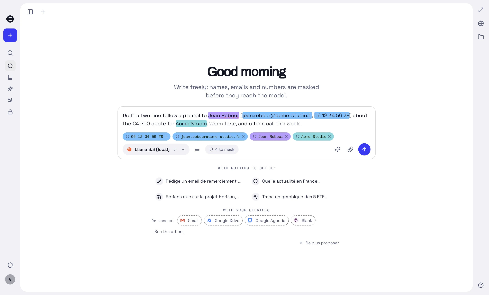
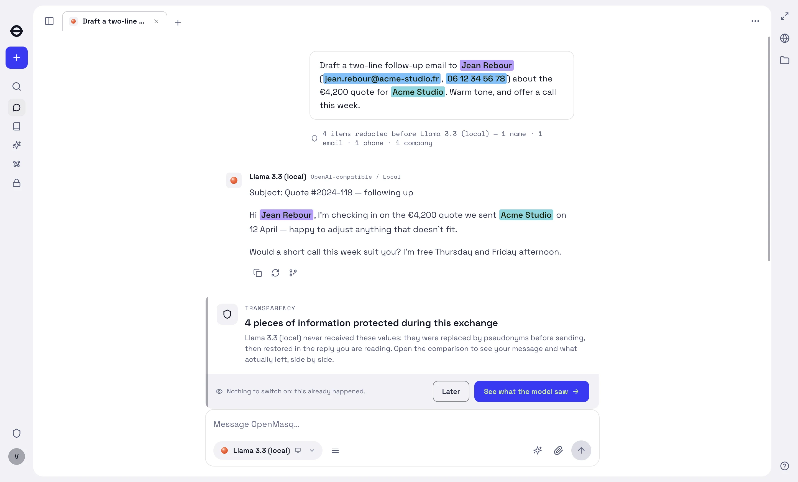

# OpenMasq

**A multi-model desktop chat app that redacts sensitive data before it leaves your
machine — and puts it back in the reply.**

[](LICENSE)
[](#getting-started)
[](#whats-in-the-box)
[](https://openmasq.com)
[](https://help.openmasq.com)

<sub>**English** · [Français](#français) · [openmasq.com](https://openmasq.com) · [Help centre](https://help.openmasq.com) · [Contact](mailto:support@openmasq.com)</sub>


*Every screenshot on this page is a real run of the app, captured on a seeded profile
with fixture data — never anyone's real conversation.*

> **No binary is published yet.** You build it from source — two commands, see
> [Getting started](#getting-started).

The model never sees the real thing. Values the engine detects are replaced with
believable substitutes before any network call; the reply is restored locally from a
per-conversation vault, so the conversation reads naturally on your side.

```
prompt ──redact──▶ what the model receives ──model──▶ reply ──de-redact──▶ what you see
```

```
you type:   "Call Jean Rebour (SAS Acme) on 06 12 34 56 78 — revenue 850 000 €"
→ to model: "Call Léa Savary (Cyberdyne) on 36 86 42 08 64 — revenue 850 000 €"
← model:    "I'll email Léa Savary about the 850 000 € revenue…"
→ you see:  "I'll email Jean Rebour about the 850 000 € revenue…"
```

Identities are swapped; **figures stay real by default**, so a model can still compute
with them. The vault is stable across turns — the same value always maps to the same
substitute, which is what makes the reply reversible.

Models are reached with **your own API keys**, a local model, or a Claude Code / Codex CLI
subscription. (The code also supports reaching them on the app's key through a metered
gateway; that service is not part of this build — see *Running it* below.)

> **The redaction boundary governs what the *model* sees, and nothing else.** Connected
> services — a mailbox, a calendar, a search — receive the **real** value, because a
> search for a substitute finds nobody. Their results come back redacted through the same
> vault. This is a deliberate, documented trade-off; see [`SECURITY.md`](SECURITY.md).

---

## What's in the box

- **Redaction engine** — deterministic rules, checksums and shape detectors, then a local
  NER model. Runs on-device. Names, dates of birth, e-mails, phones, addresses, places,
  companies, cards, IBANs, national identifiers, IPs, file paths, health data, handles,
  URLs, keys and secrets.
- **Documents** — PDF, Office and image attachments are extracted (pdf.js, OCR via a
  vendored, hardened Tesseract + docTR) and redacted before they are sent.
- **MCP connectors** — Gmail, Drive, Calendar, Slack, GitHub, Notion, Linear, Sentry,
  PostHog, a local filesystem server, and an agent-driven browser. Tool calls leave
  de-redacted and their results return redacted.
- **A Python sandbox** — model-generated code runs against de-redacted data under an OS
  jail, out of the privileged process.
- **Cross-device sync** — end-to-end encrypted; the server stores ciphertext only.
  *(Client code only in this build: it needs a backend, which is not part of it.)*
- **Organizations** — an admin console with RBAC, an audit log, mandated redaction
  categories and a confirmation-posture floor.
  *(Client code only in this build, same reason.)*

The exhaustive, screen-by-screen inventory lives in [`FEATURES.md`](FEATURES.md).

---

<details>
<summary><b>Two more screenshots</b> — before the send, and after the reply</summary>

**Before anything leaves.** The composer highlights what it is about to replace, lists each
value as a chip you can strike out, and carries the count. Nothing has been sent yet.



**After the reply.** The model answered about *Anselme Bouchereau* at *Torvel Labs*; you
read it about Jean Rebour at Acme Studio. The line under your message names what was
replaced, by category, and the card offers the side-by-side comparison above. The
substitute is not a fixed alias: a per-conversation salt gives the same real value a
different one in the next conversation, so a table built over the pool reverses nothing.



</details>

## Benchmarks

Two corpora, three engines, **one scorer** — and one command that replays all of it.

| corpus | truths | `patterns` (no model) | **the product** (`ner`) | Presidio (default) |
|---|---:|---:|---:|---:|
| **Ours** — 18 document families, 14 languages, real layouts, OCR damage | 3 357 | 89 % · 89 FP | **95 %** · 256 FP | 46 % · 847 FP |
| **Presidio's** — its own evaluation set, English, template + faker | 2 523 | 31 % · 6 FP | **74 %** · 118 FP | 58 % · 196 FP |

A truth counts as *found* when ≥ 60 % of its significant tokens were replaced; a *false
positive* (FP) is a detection that overlaps no annotated value. Titles, ages, nationalities
and dates are annotated but not scored — an engine is never charged for finding a real
datum we chose not to count. Presidio is its default `AnalyzerEngine`, replayed from
committed detections so the column needs no Python to verify.

<details>
<summary><b>Our corpus, by category and by language</b> — 907 cases</summary>

| category | truths | openmasq `patterns` | **openmasq `ner`** (the product) | Presidio (default) |
|---|---:|---:|---:|---:|
| NAME | 663 | 78 % | 94 % | 58 % |
| EMAIL | 247 | 99 % | 99 % | 98 % |
| CITY | 243 | 53 % | 87 % | 23 % |
| CARD | 233 | 100 % | 100 % | 65 % |
| ADDRESS | 232 | 97 % | 99 % | 15 % |
| ID | 215 | 93 % | 93 % | 45 % |
| COMPANY_ID | 206 | 100 % | 100 % | 24 % |
| HEALTH | 205 | 100 % | 100 % | 66 % |
| USERNAME | 203 | 100 % | 100 % | 4 % |
| TOKEN | 201 | 100 % | 100 % | 7 % |
| PHONE | 156 | 95 % | 95 % | 94 % |
| POSTAL | 101 | 88 % | 88 % | 17 % |
| DOB | 90 | 89 % | 89 % | 77 % |
| ORG | 71 | 61 % | 85 % | 30 % |
| IBAN | 54 | 100 % | 100 % | 83 % |
| AMOUNT | 30 | 3 % | 3 % | 17 % |
| IP | 29 | 100 % | 100 % | 100 % |
| PLACE | 28 | 93 % | 96 % | 4 % |
| DATE | 28 | 100 % | 100 % | 79 % |
| PATH | 28 | 93 % | 93 % | 0 % |
| COMPANY | 25 | 92 % | 92 % | 8 % |
| SECRET | 23 | 91 % | 91 % | 13 % |
| URL | 23 | 91 % | 91 % | 96 % |
| BIC | 23 | 74 % | 74 % | 4 % |
| **GLOBAL** | 3357 | **89 %** · 89 FP | **95 %** · 256 FP | **46 %** · 847 FP |

| language | cases | openmasq `patterns` | **openmasq `ner`** (the product) | Presidio (default) |
|---|---:|---:|---:|---:|
| fr | 468 | 87 % | 93 % | 50 % |
| en | 215 | 92 % | 96 % | 41 % |
| de | 47 | 98 % | 99 % | 46 % |
| es | 32 | 97 % | 99 % | 52 % |
| it | 29 | 97 % | 99 % | 59 % |
| pt | 30 | 97 % | 98 % | 40 % |
| nl | 24 | 99 % | 100 % | 38 % |
| zh | 17 | 26 % | 66 % | 6 % |
| pl | 10 | 100 % | 100 % | 75 % |
| ja | 12 | 24 % | 76 % | 16 % |
| ko | 11 | 24 % | 88 % | 16 % |
| sv | 6 | 100 % | 100 % | 35 % |
| da | 5 | 100 % | 100 % | 47 % |
| ru | 1 | 0 % | 100 % | 0 % |

</details>

<details>
<summary><b>Presidio's corpus, by category</b> — 1 387 cases</summary>

| category | truths | openmasq `patterns` | **openmasq `ner`** (the product) | Presidio (default) |
|---|---:|---:|---:|---:|
| NAME | 857 | 32 % | 98 % | 87 % |
| ADDRESS | 598 | 26 % | 38 % | 17 % |
| CITY | 411 | 2 % | 68 % | 58 % |
| ORG | 250 | 5 % | 73 % | 22 % |
| CARD | 136 | 100 % | 100 % | 97 % |
| PHONE | 92 | 57 % | 57 % | 63 % |
| EMAIL | 49 | 100 % | 100 % | 100 % |
| POSTAL | 37 | 0 % | 0 % | 5 % |
| URL | 37 | 100 % | 100 % | 100 % |
| ID | 21 | 95 % | 95 % | 100 % |
| IBAN | 21 | 100 % | 100 % | 100 % |
| IP | 14 | 100 % | 100 % | 100 % |
| **GLOBAL** | 2523 | **31 %** · 6 FP | **74 %** · 118 FP | **58 %** · 196 FP |

</details>

> [!WARNING]
> **Read the categories, not the total.** A single percentage hides which of your data is
> actually protected, and the answer is not uniform.
>
> - **Structured values are solved** — cards, IBANs, e-mails, URLs, IPs sit at or near
>   100 % with no model at all, because a checksum or a shape is a proof rather than a
>   guess.
> - **Names are the strong case** (94 % at home, 98 % away), and they are what a chat
>   leaks most.
> - **Addresses are the honest weakness.** 99 % on our documents, **38 %** on Presidio's
>   corpus, whose truths are multi-line US street addresses recovered in pieces — the
>   city, sometimes the number — rather than as one span. Presidio does worse there
>   (17 %); that is a reason to keep working, not a reason to be satisfied.
> - **The two corpora disagree about Presidio, and the disagreement is the finding.**
>   87 % on names in its own template sentences, 58 % on names in real documents; 46 %
>   overall at home, and **41 % on our English cases** — so the gap is not the language.
>   A default install is tuned for the sentences it was evaluated on. Ours was tuned
>   for the documents people actually paste.
> - **Presidio's default install is English.** The `fr` line (50 %) is what a French
>   user gets out of the box; it is not Presidio's ceiling, which is a library built to
>   receive recognizers and models.
> - **CJK needs the model.** Rules alone reach 24–26 % on Chinese, Japanese and Korean;
>   the local NER lifts them to 66–88 %. A name with no word boundaries is not a shape.
> - **`AMOUNT` at 3 % is a decision, not a miss** — the category was retired (an amount
>   is not an identity), and the corpus keeps annotating it so the measure stays honest.
> - **Recall is paid for in false positives**, and the hierarchy is visible on both
>   corpora: 89 · 256 · 847 at home, 6 · 118 · 196 away.
> - **Synthetic against synthetic.** Presidio's corpus is faker-built and structurally
>   kind to pattern engines; ours carries real layouts and OCR noise. Compare columns
>   to each other, not to field performance.
>
> **Whatever the numbers, detection is not a guarantee.** The Vault — terms you mark
> yourself — is the only coverage promise the product makes for a given string.

### Replay it

```bash
git clone https://github.com/openmasq/openmasq && cd openmasq && pnpm install
pnpm bench:compare --engines patterns,presidio   # ~1 min, no model: rules vs Presidio's committed detections
pnpm build && pnpm bench:compare                  # adds the product column (bakes the local NER, sha256-pinned)
pnpm bench:compare --markdown                     # prints the tables above, verbatim — diff them against this file
```

Presidio's column is a committed artifact (`packages/redact/bench/**/presidio.detections.json`)
so the comparison replays without Python. To regenerate it from scratch:

```bash
python3.12 -m venv v && v/bin/pip install presidio-analyzer==2.2.364 spacy==3.8.16
v/bin/python -m spacy download en_core_web_lg
v/bin/python packages/redact/bench/presidio.py internal && v/bin/python packages/redact/bench/presidio.py external
```

The corpora, the scorer, the runner and the exact provenance of Presidio's evaluation set
(pinned commit, sha256) are in [`packages/redact/bench`](packages/redact/bench).

## Links

| | |
|---|---|
| **Help centre** | [help.openmasq.com](https://help.openmasq.com) — how each screen works, in French and English |
| **Website** | [openmasq.com](https://openmasq.com) — the landing: what the product is, for whom, and how to get it |
| **Contact** | [support@openmasq.com](mailto:support@openmasq.com) — questions, and the address the app's feedback reaches |
| **Security** | [`SECURITY.md`](SECURITY.md) — the trust boundary, the residuals, and how to report a vulnerability |
| **What it does, screen by screen** | [`FEATURES.md`](FEATURES.md) |
| **Contributing** | [`CONTRIBUTING.md`](CONTRIBUTING.md) · [`CODE_OF_CONDUCT.md`](CODE_OF_CONDUCT.md) |
| **Running your own stack** | [`SELF_HOSTING.md`](SELF_HOSTING.md) |

<!-- docs/img/social-preview.png is the GitHub social preview (1280×640): upload it under
     Settings → General → Social preview. It is not referenced by any page — it exists so the
     card that shows up in Slack, X and Discord lives in the repository like everything else. -->

## Repository layout

```
apps/
  desktop/       Electron app — the product. main (IPC, DB, MCP, streaming) ·
                 preload (contextBridge → window.openmasq) · renderer · e2e
  mcp-broker/    MCP broker + OAuth AS — a LOCAL sidecar the desktop spawns
                 (not the backend: the server side lives in a separate repository)
packages/
  redact/        The redaction engine (pure, unit-tested)
  ui/            All React UI + store + design system (light + dark)
  llm/           Provider clients, model registry, SSE, tool-calling
  mcp/           Redacting MCP client · connectors/ on-device-OAuth MCP tools
  catalog/       Single-source governable lists (models, connectors, categories)
  i18n/          Typed message catalogue (fr source + en)
  credits/ schema/ sync/ branding/ analytics/
  tesseract2/    Vendored hardened OCR (worker_threads + WASM) · ort/ · vendor/xlsx/
```

**Dependency direction:** `ui` → `llm`/`redact`/`mcp`/`catalog`/`schema`/`analytics`;
`mcp` → `redact`; `sync` → `schema`; `desktop` composes all and supplies the
`Host`. **Apps never import apps** — enforced by `pnpm check:dup`.

---

## Getting started

**Prerequisites** — Node.js ≥ 20 (CI runs 26) and pnpm (`corepack enable` provides it).

```bash
pnpm install
pnpm dev          # builds the packages, then launches the Electron app
```

> **Working on redaction?** The on-device NER and OCR models are not part of `dev` or
> `build` — run `pnpm --filter @openmasq/desktop bake` once to fetch them. Without it the
> app runs, but detection falls back to the pattern rules **with no warning**, so you'd be
> testing the regex floor rather than the model. See [`CONTRIBUTING.md`](CONTRIBUTING.md).

Then open **⚙ Settings** and paste a provider key (OpenAI, Anthropic, Google, Mistral,
DeepSeek, OpenRouter, or any OpenAI-compatible endpoint — Ollama, LM Studio, vLLM), or
point the app at a local model. Your Claude Code / Codex CLI subscription works too.

**This build has no backend.** No billing, no sync, no organizations, no included
models: those services are not part of it — they live in a private repository, behind the
`OPENMASQ_BILLING` gate — and the app runs on your machine: your keys, a local model, or a
CLI subscription. Redaction is on-device.

**Five small services stay hosted by the brand, and a build from these sources
reaches them by default** (`apps/desktop/scripts/publicServices.ts`): sign-in (a
Supabase project — magic link or Google; the account only identifies you, nothing sits
behind it), the Slack relay (the code→token exchange Slack forbids on-device), the
analytics relay (pseudonymous counters — ON by default, tied to a stable install id,
turned off in Settings, and never sent when Do Not Track or GPC is set — plus the release notes
the app displays, plus the feature-flag read — that last one is a configuration request,
not measurement, so it runs outside consent and carries the install id and, when you are
signed in, your account token: `packages/analytics/src/flags.ts` says so in full), crash reports (Sentry — an allow-list of a few machine
fields, never a key or a vault value; the exception message and the frame names cannot be
allow-listed field by field, so they are scrubbed and truncated instead — a mitigation, not
a guarantee, and `apps/desktop/src/sentry/policy.ts` states the residual it accepts) and
the update feed (where a packaged build checks for new versions, carrying a per-install
identifier so a staged rollout can be held back). Their code is not in this
repository. Each is one variable, and a variable set **empty** at build time
(`OPENMASQ_SENTRY_DSN=`, `VITE_UPDATES_URL=`) opts out of it — a fork that ships under
its own identity should empty the feed so it never updates itself with the brand's
signed binary (`SELF_HOSTING.md`). `pnpm dev` applies them too.

Running a local stack is an explicit choice: the overrides go in a gitignored
`apps/desktop/.env.development.local`, and the committed `.env.development` says which
overrides go there.

---

## Working on it

```bash
pnpm test              # unit tests — free, run them constantly
pnpm test:changed      # only what the change graph touches
pnpm test:redact       # the redaction engine alone (~4 s)
pnpm typecheck
pnpm build
pnpm verify            # the full local gate suite
```

The e2e suites are **not** part of that loop: they drive the built app against real
provider APIs and cost real money. Each spec skips itself without its key —
`pnpm --filter @openmasq/desktop e2e:openai` (`apps/desktop/e2e/README.md`).

Some conventions are enforced rather than asked for, each by its own gate: a 300-line
cap per source file (`check:loc`), documentation that points at paths which exist
(`check:docs`), no fact or behaviour implemented twice (`check:dup`), `FEATURES.md` kept
in step with the product (`check:features`), and every GitHub Action pinned to a commit
SHA (`check:actions`). They run in CI; `pnpm verify` runs them locally.

`CLAUDE.md` at the root is the map — the invariants, the traps, and where each thing
lives. Each app and package also has a nested `CLAUDE.md` used by the maintainers as a
working guide; those are kept out of the published tree (`.gitignore`) — the code and
its tests are the contract here, not the notes.
Read the root one before a first change.

---

## Security

The threat model, the guarantees, and — at the same length — the **known limitations**
are in [`SECURITY.md`](SECURITY.md). It is written to be checked against this source, not
taken on faith: redaction is detection and detection is imperfect, prompt injection is
bounded rather than solved, encryption at rest is not guaranteed on every install, and
the Python jail is not equally strong on every platform. All of that is stated there.

**Report a vulnerability privately** through this repository's *Security → Report a
vulnerability* flow. Please do not open a public issue, discussion or pull request
containing exploit details.

---

## License

[Apache License 2.0](LICENSE) — for the whole repository: the desktop app, the packages
(including the redaction engine), the local MCP broker and the tooling. You may use,
modify, redistribute and build on it, commercially included, provided you keep the notices
([`NOTICE`](NOTICE)) and state your changes; the licence also carries an express patent
grant from every contributor.

Contributions are accepted under the same licence, by section 5 of the licence itself —
there is no separate agreement to sign.

Third-party code included here keeps its own licence: `packages/tesseract2` (derived from
tesseract.js) and `vendor/xlsx` (SheetJS), both Apache-2.0. Assets fetched at build time
and shipped inside the app are listed in [`NOTICE`](NOTICE).


---

# Français

<sub>[openmasq.com](https://openmasq.com) · [Centre d'aide](https://help.openmasq.com) · [Contact](mailto:support@openmasq.com)</sub>

**Une application de chat de bureau multi-modèles qui masque les données sensibles avant
qu'elles ne quittent votre machine — et les rétablit dans la réponse.**

Le modèle ne voit jamais la vraie valeur. Ce que le moteur détecte est remplacé par un
substitut crédible avant tout appel réseau ; la réponse est rétablie localement depuis un
coffre propre à la conversation, si bien que l'échange se lit normalement de votre côté.

```
message ──masquage──▶ ce que le modèle reçoit ──modèle──▶ réponse ──démasquage──▶ ce que vous lisez
```

```
vous tapez :  « Relance Jean Rebour (SAS Acme) au 06 12 34 56 78 — CA 850 000 € »
→ au modèle : « Relance Léa Savary (Cyberdyne) au 36 86 42 08 64 — CA 850 000 € »
← le modèle : « J'écris à Léa Savary au sujet du CA de 850 000 €… »
→ vous lisez : « J'écris à Jean Rebour au sujet du CA de 850 000 €… »
```

Les identités sont permutées ; **les chiffres restent vrais par défaut**, pour qu'un modèle
puisse encore calculer avec. Le coffre est stable d'un tour à l'autre — une même valeur
donne toujours le même substitut, et c'est ce qui rend la réponse réversible.

Les modèles sont atteints avec **vos propres clés d'API**, un modèle local, ou un abonnement
Claude Code / Codex CLI. (Le code sait aussi passer par la passerelle facturée de la marque ;
ce service ne fait pas partie de ce build — voir *Le faire tourner* plus bas.)

> **La frontière de masquage gouverne ce que le *modèle* voit, et rien d'autre.** Les
> services connectés — une boîte mail, un agenda, une recherche — reçoivent la **vraie**
> valeur, parce qu'une recherche sur un substitut ne trouve personne. Leurs résultats
> reviennent masqués par le même coffre. C'est un compromis délibéré et documenté :
> [`SECURITY.md`](SECURITY.md).

## Ce qu'il y a dedans

- **Le moteur de masquage** — des règles déterministes, des sommes de contrôle et des
  détecteurs de forme, puis un modèle NER local. Tout s'exécute sur la machine. Noms, dates
  de naissance, e-mails, téléphones, adresses, lieux, entreprises, cartes, IBAN,
  identifiants nationaux, IP, chemins de fichiers, données de santé, pseudos, URL, clés et
  secrets.
- **Les documents** — les pièces jointes PDF, Office et images sont extraites (pdf.js, OCR
  par un Tesseract durci et vendorisé + docTR) puis masquées avant l'envoi.
- **Les connecteurs MCP** — Gmail, Drive, Agenda, Slack, GitHub, Notion, Linear, Sentry,
  PostHog, un serveur de fichiers local et un navigateur piloté par l'agent. Les appels
  d'outils partent démasqués et leurs résultats reviennent masqués.
- **Un bac à sable Python** — le code écrit par le modèle s'exécute sur des données
  démasquées, sous une prison système, hors du processus privilégié.
- **La synchronisation entre appareils** — chiffrée de bout en bout ; le serveur ne stocke
  que du chiffré. *(Côté client seulement dans ce build : il lui faut un backend, qui n'en
  fait pas partie.)*
- **Les organisations** — une console d'administration avec RBAC, un journal d'audit, des
  catégories de masquage imposées et un plancher de posture de confirmation.
  *(Côté client seulement, pour la même raison.)*

L'inventaire exhaustif, écran par écran, est dans [`FEATURES.md`](FEATURES.md).

## Bancs de mesure

Deux corpus, trois moteurs, **un seul scoreur** — et une commande qui rejoue le tout.

| corpus | vérités | `patterns` (sans modèle) | **le produit** (`ner`) | Presidio (par défaut) |
|---|---:|---:|---:|---:|
| **Le nôtre** — 18 familles de documents, 14 langues, vraies mises en page, dégât OCR | 3 357 | 89 % · 89 FP | **95 %** · 256 FP | 46 % · 847 FP |
| **Celui de Presidio** — son propre jeu d'évaluation, anglais, gabarits + faker | 2 523 | 31 % · 6 FP | **74 %** · 118 FP | 58 % · 196 FP |

Une vérité compte comme *trouvée* quand ≥ 60 % de ses tokens significatifs ont été
remplacés ; un *faux positif* (FP) est une détection qui ne chevauche aucune valeur
annotée. Titres, âges, nationalités et dates sont annotés mais non notés — un moteur n'est
jamais pénalisé pour avoir trouvé une donnée réelle qu'on a choisi de ne pas compter.
Presidio est son `AnalyzerEngine` par défaut, rejoué depuis des détections commitées : la
colonne se vérifie sans Python.

Les tableaux détaillés — par catégorie sur les deux corpus, et par langue sur le nôtre —
sont **ceux de la section anglaise ci-dessus** : ils sont générés par la commande, et une
seconde copie traduite dériverait de la première au prochain relevé.

> [!WARNING]
> **Lisez les catégories, pas le total.** Un pourcentage unique cache lesquelles de vos
> données sont réellement protégées, et la réponse n'est pas uniforme.
>
> - **Les valeurs structurées sont réglées** — cartes, IBAN, e-mails, URL, IP sont à 100 %
>   ou presque sans aucun modèle, parce qu'une somme de contrôle ou une forme est une
>   preuve et non une supposition.
> - **Les noms sont le point fort** (94 % chez nous, 98 % chez eux), et c'est ce qu'une
>   conversation laisse le plus échapper.
> - **Les adresses sont la faiblesse honnête.** 99 % sur nos documents, **38 %** sur le
>   corpus de Presidio, dont les vérités sont des adresses américaines sur plusieurs
>   lignes, récupérées par morceaux — la ville, parfois le numéro — plutôt que comme un
>   seul span. Presidio y fait moins bien (17 %) : une raison d'y travailler, pas de s'en
>   contenter.
> - **Les deux corpus ne sont pas d'accord sur Presidio, et ce désaccord est le
>   résultat.** 87 % sur les noms de ses propres phrases-gabarits, 58 % sur les noms de
>   vrais documents ; 46 % chez nous au global, et **41 % sur nos cas en anglais** — l'écart
>   n'est donc pas la langue. Une installation par défaut est réglée pour les phrases sur
>   lesquelles elle a été évaluée. La nôtre l'est pour les documents que les gens collent.
> - **L'installation par défaut de Presidio est anglaise.** La ligne `fr` (50 %) est ce
>   qu'un utilisateur français obtient en sortie de boîte ; ce n'est pas le plafond de
>   Presidio, bibliothèque faite pour recevoir des reconnaisseurs et des modèles.
> - **Le CJK a besoin du modèle.** Les règles seules atteignent 24–26 % en chinois,
>   japonais et coréen ; la NER locale les porte à 66–88 %. Un nom sans frontière de mot
>   n'est pas une forme.
> - **`AMOUNT` à 3 % est une décision, pas un raté** — la catégorie a été retirée (un
>   montant n'est pas une identité), et le corpus continue de l'annoter pour que la mesure
>   reste honnête.
> - **Le rappel se paie en faux positifs**, et la hiérarchie est lisible sur les deux
>   corpus : 89 · 256 · 847 chez nous, 6 · 118 · 196 chez eux.
> - **Synthétique contre synthétique.** Le corpus de Presidio est bâti avec faker et
>   structurellement aimable avec les moteurs à motifs ; le nôtre porte de vraies mises en
>   page et du bruit OCR. Comparez les colonnes entre elles, pas à du terrain.
>
> **Quels que soient les chiffres, une détection n'est pas une garantie.** Le Coffre — les
> termes que vous marquez vous-même — est la seule promesse de couverture que le produit
> fasse pour une chaîne donnée.

### Le rejouer

```bash
git clone https://github.com/openmasq/openmasq && cd openmasq && pnpm install
pnpm bench:compare --engines patterns,presidio   # ~1 min, sans modèle : les règles contre les détections commitées de Presidio
pnpm build && pnpm bench:compare                  # ajoute la colonne du produit (cuit la NER locale, épinglée sha256)
pnpm bench:compare --markdown                     # imprime les tableaux ci-dessus, tels quels — à differ contre ce fichier
```

La colonne Presidio est un artefact commité (`packages/redact/bench/**/presidio.detections.json`),
donc la comparaison se rejoue sans Python. Pour la régénérer de zéro :

```bash
python3.12 -m venv v && v/bin/pip install presidio-analyzer==2.2.364 spacy==3.8.16
v/bin/python -m spacy download en_core_web_lg
v/bin/python packages/redact/bench/presidio.py internal && v/bin/python packages/redact/bench/presidio.py external
```

Les corpus, le scoreur, le harnais et la provenance exacte du jeu d'évaluation de Presidio
(commit épinglé, sha256) sont dans [`packages/redact/bench`](packages/redact/bench).

## Liens

| | |
|---|---|
| **Centre d'aide** | [help.openmasq.com](https://help.openmasq.com) — le fonctionnement de chaque écran, en français et en anglais |
| **Site** | [openmasq.com](https://openmasq.com) — la landing : ce qu'est le produit, pour qui, et comment l'obtenir |
| **Contact** | [support@openmasq.com](mailto:support@openmasq.com) — les questions, et l'adresse où arrivent les avis envoyés depuis l'app |
| **Sécurité** | [`SECURITY.md`](SECURITY.md) — la frontière de confiance, les résiduels, et comment signaler une faille |
| **Ce que fait l'app, écran par écran** | [`FEATURES.md`](FEATURES.md) |
| **Contribuer** | [`CONTRIBUTING.md`](CONTRIBUTING.md) · [`CODE_OF_CONDUCT.md`](CODE_OF_CONDUCT.md) |
| **Héberger sa propre pile** | [`SELF_HOSTING.md`](SELF_HOSTING.md) |

## L'arborescence

```
apps/
  desktop/       L'application Electron — le produit. main (IPC, base, MCP, streaming) ·
                 preload (contextBridge → window.openmasq) · renderer · e2e
  mcp-broker/    Courtier MCP + serveur OAuth — un annexe LOCAL que le desktop lance
                 (ce n'est PAS le backend : le côté serveur vit dans un autre dépôt)
packages/
  redact/        Le moteur de masquage (pur, couvert par ses tests)
  ui/            Toute l'interface React + le store + le design system (4 thèmes)
  llm/           Les clients de fournisseurs, le registre de modèles, le SSE, les outils
  mcp/           Client MCP masquant · connectors/ outils MCP à OAuth sur l'appareil
  catalog/       Les listes gouvernables à une seule maison (modèles, connecteurs, catégories)
  i18n/          Le catalogue de messages typé (français source + anglais)
  credits/ schema/ sync/ branding/ analytics/
  tesseract2/    OCR durci et vendorisé (worker_threads + WASM) · ort/ · vendor/xlsx/
```

**Sens des dépendances :** `ui` → `llm`/`redact`/`mcp`/`catalog`/`schema`/`analytics` ;
`mcp` → `redact` ; `sync` → `schema` ; `desktop` compose le tout et fournit le `Host`.
**Une app n'importe jamais une autre app** — tenu par `pnpm check:dup`.

## Démarrer

**Prérequis** — Node.js ≥ 20 (la CI tourne en 26) et pnpm (`corepack enable` le fournit).

```bash
pnpm install
pnpm dev          # construit les paquets, puis lance l'application Electron
```

> **Vous travaillez sur le masquage ?** Les modèles NER et OCR embarqués ne font partie ni
> de `dev` ni de `build` — lancez `pnpm --filter @openmasq/desktop bake` une fois pour les
> récupérer. Sans eux l'app tourne, mais la détection retombe **sans le dire** sur les
> règles à motifs : vous testeriez le plancher des expressions régulières, pas le modèle.
> Voir [`CONTRIBUTING.md`](CONTRIBUTING.md).

Ouvrez ensuite **⚙ Réglages** et collez une clé de fournisseur (OpenAI, Anthropic, Google,
Mistral, DeepSeek, OpenRouter, ou n'importe quel point d'accès compatible OpenAI — Ollama,
LM Studio, vLLM), ou pointez l'app sur un modèle local. Votre abonnement Claude Code /
Codex CLI fonctionne aussi.

**Ce build n'a pas de backend.** Ni facturation, ni synchronisation, ni organisations, ni
modèles inclus : ces services n'en font pas partie — ils vivent dans un dépôt privé,
derrière la porte `OPENMASQ_BILLING` — et l'app tourne sur votre machine : vos clés, un
modèle local, ou un abonnement CLI. Le masquage s'exécute sur l'appareil.

**Cinq petits services restent hébergés par la marque, et un build issu de ces sources les
atteint par défaut** (`apps/desktop/scripts/publicServices.ts`) : la connexion (un projet
Supabase — lien magique ou Google ; le compte ne fait que vous identifier, rien ne se cache
derrière), le relais Slack (l'échange code→jeton que Slack interdit sur l'appareil), le
relais analytics (des compteurs pseudonymes — ACTIFS par défaut, liés à un identifiant
d'installation stable, désactivables dans les Réglages, et jamais envoyés si Do Not Track ou
GPC est posé — plus les notes
de version que l'app affiche, plus la lecture des drapeaux de fonctionnalité — celle-ci est
une requête de configuration, pas une mesure : elle s'exécute hors consentement et porte
l'identifiant d'installation et, si vous êtes connecté, votre jeton de compte ;
`packages/analytics/src/flags.ts` l'énonce en entier), les rapports de plantage (Sentry — une liste d'autorisation
de quelques champs machine, jamais une clé ni une valeur du coffre ; le message d'exception
et les noms de frames ne peuvent pas être autorisés champ par champ, ils sont donc épurés
puis tronqués — une atténuation, pas une garantie, et `apps/desktop/src/sentry/policy.ts`
énonce le résidu qu'il accepte) et le flux de mises à jour (là où un build empaqueté cherche
les nouvelles versions, en portant un identifiant par installation pour qu'un déploiement
progressif puisse être retenu). Leur code n'est pas dans ce dépôt. Chacun tient en une
variable, et une variable posée **vide** au build (`OPENMASQ_SENTRY_DSN=`,
`VITE_UPDATES_URL=`) le débranche — un fork qui publie sous sa propre identité devrait vider
le flux, pour ne jamais se mettre à jour avec le binaire signé de la marque
(`SELF_HOSTING.md`). `pnpm dev` les applique aussi.

Faire tourner une pile locale est un choix explicite : les surcharges vont dans un
`apps/desktop/.env.development.local` ignoré par git, et le `.env.development` versionné dit
lesquelles y mettre.

## Y travailler

```bash
pnpm test              # tests unitaires — gratuits, à lancer sans cesse
pnpm test:changed      # seulement ce que le graphe de changement touche
pnpm test:redact       # le moteur de masquage seul (~4 s)
pnpm typecheck
pnpm build
pnpm verify            # toute la série de contrôles, en local
```

Les suites e2e ne font **pas** partie de cette boucle : elles pilotent l'app construite
contre de vraies API de fournisseurs et coûtent de l'argent. Chaque spec se saute d'elle-même
sans sa clé — `pnpm --filter @openmasq/desktop e2e:openai`
(`apps/desktop/e2e/README.md`).

Certaines conventions sont tenues plutôt que demandées, chacune par son propre contrôle :
un plafond de 300 lignes par fichier source (`check:loc`), une documentation qui ne cite que
des chemins existants (`check:docs`), aucun fait ni comportement écrit deux fois
(`check:dup`), `FEATURES.md` tenu au pas du produit (`check:features`), et chaque GitHub
Action épinglée à un SHA de commit (`check:actions`). Elles tournent en CI ; `pnpm verify`
les lance en local.

Le `CLAUDE.md` à la racine est la carte — les invariants, les pièges, et où vit chaque
chose. Chaque app et chaque paquet a aussi son `CLAUDE.md` imbriqué, que les mainteneurs
utilisent comme carnet de bord ; ceux-là restent hors de l'arbre publié (`.gitignore`) — ici,
le contrat, c'est le code et ses tests, pas les notes. Lisez celui de la racine avant une
première modification.

## Sécurité

Le modèle de menace, les garanties et — avec la même longueur — les **limites connues** sont
dans [`SECURITY.md`](SECURITY.md). Il est écrit pour être vérifié contre ces sources, pas
pour être cru sur parole : masquer c'est détecter, et détecter est imparfait ; l'injection de
prompt est bornée, pas résolue ; le chiffrement au repos n'est pas garanti sur toutes les
installations ; et la prison Python n'est pas aussi solide sur toutes les plateformes. Tout
cela y est dit.

**Signalez une faille en privé** par le parcours *Security → Report a vulnerability* de ce
dépôt. N'ouvrez pas d'issue, de discussion ni de pull request publique contenant les détails
d'un exploit.

## Licence

[Licence Apache 2.0](LICENSE) — pour tout le dépôt : l'application de bureau, les paquets (le
moteur de masquage compris), le courtier MCP local et l'outillage. Vous pouvez l'utiliser, le
modifier, le redistribuer et bâtir dessus, y compris commercialement, à condition de
conserver les mentions ([`NOTICE`](NOTICE)) et d'indiquer vos modifications ; la licence
porte aussi une concession de brevet expresse de chaque contributeur.

Les contributions sont acceptées sous la même licence, par la section 5 de la licence
elle-même — il n'y a aucun accord séparé à signer.

Le code tiers inclus ici garde sa propre licence : `packages/tesseract2` (dérivé de
tesseract.js) et `vendor/xlsx` (SheetJS), tous deux en Apache-2.0. Les ressources
téléchargées au build et embarquées dans l'app sont listées dans [`NOTICE`](NOTICE).
