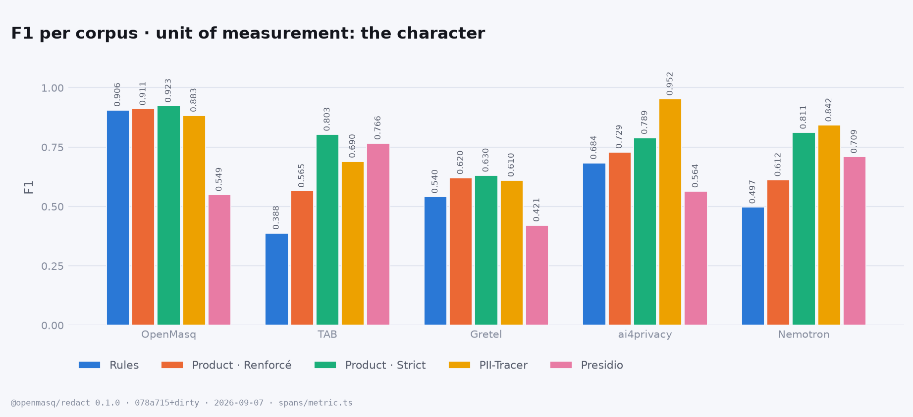

# OpenMasq

[](LICENSE)
[](#install)
[](https://www.npmjs.com/package/@openmasq/redact)
[](https://openmasq.com)
[](https://help.openmasq.com)

**The desktop AI chat that keeps your personal data away from the model.**

OpenMasq is a desktop chat app for OpenAI, Anthropic, Mistral, Google and local models.
Before a message leaves your machine, names, e-mails, phone numbers, IBANs, API keys and
the rest are replaced with believable substitutes. The reply comes back with the real
values put back. Redaction runs on your device, and the code is open source.

[Français](README.fr.md) · [Website](https://openmasq.com) · [Help centre](https://help.openmasq.com) · [Contact](mailto:support@openmasq.com)


> [!NOTE]
> Every screenshot here is a real run of the app on a test profile with made-up data.

## Install

| Platform | Package | |
|---|---|---|
| **macOS** | Apple Silicon and Intel, signed and notarized, updates itself | [Download](https://openmasq.com/download) |
| **Windows** | Windows 10 and later, x64, signed installer, updates itself | [Download](https://openmasq.com/download) |
| **Linux** | No package yet | [Build from source](#build-from-source) |

The published app includes sign-in, sync and models you can use without your own key. A
build from these sources runs on your keys, a local model or a CLI subscription, with no
backend: see [Build from source](#build-from-source).

## Table of contents

- [How it works](#how-it-works)
- [Features](#features)
- [Quick start](#quick-start)
- [Use the engine in your own code](#use-the-engine-in-your-own-code)
- [Benchmarks](#benchmarks)
- [Build from source](#build-from-source)
- [Data collection & usage](#data-collection--usage)
- [Development](#development)
- [Security](#security)
- [License](#license)

## How it works

```
prompt ──redact──▶ what the model receives ──model──▶ reply ──restore──▶ what you see
```

```
you type:   "Call Jean Rebour (SAS Acme) on 06 12 34 56 78 about the 850 000 € revenue"
→ to model: "Call Léa Savary (Cyberdyne) on 36 86 42 08 64 about the 850 000 € revenue"
← model:    "I'll email Léa Savary about the 850 000 € revenue…"
→ you see:  "I'll email Jean Rebour about the 850 000 € revenue…"
```

Léa Savary does not exist. Neither does her phone number.

- **Identities are swapped, figures stay real** by default, so the model can still compute
  with them.
- **One vault per conversation.** The same value always gets the same substitute, which is
  what makes the reply reversible. A per-conversation salt gives it a different substitute
  in the next conversation, so a lookup table of substitutes reverses nothing.
- **You see what leaves.** Before you send, the composer highlights every value it is
  about to replace. You can strike one out.

> [!IMPORTANT]
> Redaction governs what the **model** sees, and nothing else. Connected services (a
> mailbox, a calendar, a search) receive the real value, because a search for a substitute
> finds nobody. Their results come back redacted through the same vault. This trade-off is
> documented in [`SECURITY.md`](SECURITY.md).

## Features

- **Any model**: your own API key (OpenAI, Anthropic, Google, Mistral, DeepSeek, Scaleway,
  OpenRouter, or any OpenAI-compatible endpoint such as Ollama, LM Studio or vLLM), a local
  model, or your Claude Code, Codex or Antigravity CLI subscription.
- **On-device redaction**: deterministic rules, checksums and shape detectors, then a local
  NER model. On by default: names, dates of birth, e-mails, phones, addresses, places,
  companies, cards, IBANs, national and company identifiers, IPs, handles, keys and secrets.
  Off by default, one switch away: file paths, URLs and plain dates. The Strict level turns
  all three on.
- **Documents**: PDF, Office and image attachments are extracted (pdf.js, OCR with a
  hardened Tesseract and docTR) and redacted before they are sent.
- **Connectors**: Gmail, Google Drive, Docs, Sheets, Calendar, Outlook, OneDrive,
  SharePoint, Teams, Slack and GitHub with on-device OAuth; some forty remote MCP servers
  (Notion, Linear, Sentry, PostHog, Atlassian, Stripe, Supabase, Vercel…) and any you add;
  a local file server; a browser the agent drives. Tool calls leave with the real values,
  and their results come back redacted.
- **Python sandbox**: code written by the model runs on the real data, in an OS jail,
  outside the main process.
- **Sync across devices**: end-to-end encrypted, the server only stores ciphertext.
  *(Client side only in this repository: it needs a backend that is not part of it.)*
- **Organizations**: an admin console with roles, an audit log and redaction categories the
  organization can enforce. *(Client side only, same reason.)*

The full inventory, screen by screen, is in [`FEATURES.md`](FEATURES.md).

<details>
<summary><b>Two more screenshots</b>: before the send, and after the reply</summary>

**Before anything leaves.** The composer highlights what it is about to replace, lists each
value as a chip you can strike out, and shows the count. Nothing has been sent yet.


**After the reply.** The model answered about *Anselme Bouchereau* at *Torvel Labs*; you
read it about Jean Rebour at Acme Studio. The line under your message lists what was
replaced, by category.


</details>

## Quick start

1. Install the app from [openmasq.com/download](https://openmasq.com/download).
2. Open **Settings** and paste a provider key, point the app at a local model, or connect
   your CLI subscription.
3. Write a message with real data in it. The composer highlights what will be replaced.
4. Send, and open the transparency card under your message to see exactly what the model
   received.

The [help centre](https://help.openmasq.com) walks through every screen.

## Use the engine in your own code

The redaction engine is published on npm as
[`@openmasq/redact`](https://www.npmjs.com/package/@openmasq/redact): the same code the app
runs, for your own LLM calls.

```bash
npm install @openmasq/redact
```

```ts
import { pseudonymize, unredactReply } from "@openmasq/redact";

const vault = {};                                         // one per conversation, never sent
const { text } = await pseudonymize(prompt, { vault });  // what the model sees
const shown = unredactReply(await callYourLLM(text), vault);
```

The [developer guide](https://help.openmasq.com/en/redact) covers conversations, tool calls,
the on-device NER, documents and the options.

## Benchmarks

Two questions, measured separately.

**Did the value leave the machine?** Our corpus: 18 document families, 14 languages, real
layouts, OCR damage, 907 cases, 3 364 annotated values. A value counts as found when at
least 60 % of its significant tokens were replaced; a false positive (FP) overlaps no
annotated value.

| corpus | values | `patterns` (no model) | **OpenMasq** (`ner`) | PII-Tracer | Presidio (default) |
|---|---:|---:|---:|---:|---:|
| **ours** | 3 364 | 89 % · 89 FP | **95 %** · 251 FP | 92 % · 530 FP † | 46 % · 845 FP |
| **Presidio's own** (English, template + faker) | 2 523 | 32 % · 6 FP | **75 %** · 111 FP | — | 58 % · 196 FP |

† PII-Tracer was measured on the corpus at 3 357 values and has not been re-run since.

**Where exactly did the engine draw the line?** Character-level F1, the protocol of
Perplexity's [PII-TRACE](https://www.perplexity.ai/hub/blog/pii-trace-detecting-personal-data-before-it-leaves-the-device)
paper, on the categories the app has a switch for.

| corpus | cases | `patterns` | **`ner`** (Strict) | `ner` (Renforcé) | PII-Tracer | OpenAI PF | Presidio |
|---|---:|---:|---:|---:|---:|---:|---:|
| OpenMasq | 907 | 0.931 | **0.923** | 0.931 | 0.888 | 0.833 | 0.547 |
| TAB | 127 | 0.425 | **0.855** | 0.606 | 0.742 | 0.435 | 0.815 |
| Gretel | 2000 | 0.575 | **0.646** | 0.646 | 0.611 | 0.565 | 0.422 |
| ai4privacy | 2000 | 0.756 | **0.827** | 0.796 | 0.952 | 0.945 | 0.579 |
| Nemotron | 2000 | 0.627 | **0.928** | 0.735 | 0.887 | 0.736 | 0.768 |

<picture>
  <source media="(prefers-color-scheme: dark)" srcset="packages/redact/bench/spans/figures/f1-by-corpus-en-dark.png">
  
</picture>

What moves these numbers more than the engines do:

- **A shape is a proof, a name is a guess.** Cards, IBANs, e-mails and IPs sit at or near
  100 % with no model: a checksum decides. Names, addresses and companies are where the
  local model earns its keep. On Chinese, Japanese and Korean, rules alone reach 24–26 %,
  the model 66–88 %.
- **Most card numbers in these corpora could not be issued.** 89 % of Nemotron's and 52 % of
  Gretel's fail the Luhn check; the generator was more creative than any bank. Every number
  whose check digit verifies is found, on both corpora.
- **Gretel leaves account numbers unannotated** in its MT940, SWIFT and XBRL documents, so
  every engine's precision drops there (0.24 for PII-Tracer, 0.43 for ours).
- **Presidio is a default `pip install`**: Presidio with spaCy `en_core_web_lg`, run in
  English on all fourteen languages. That is what you get out of the box, not its ceiling.

> [!WARNING]
> Detection is good, not a guarantee. The Vault, the terms you mark yourself, is the only
> coverage the app promises for a given string.

Method, per-category and per-language tables, timings and how to reproduce:
[`packages/redact/bench`](packages/redact/bench).

```bash
pnpm bench:spans   --replay --markdown            # the character-level tables, from committed results
pnpm bench:compare --engines patterns,presidio    # ~1 min, no model
pnpm build && pnpm bench:compare                  # adds the OpenMasq column (fetches the pinned NER)
```

## Build from source

Requires Node.js 20 or later (CI runs 26) and pnpm (`corepack enable` provides it).

```bash
git clone https://github.com/openmasq/openmasq && cd openmasq
pnpm install
pnpm dev          # builds the packages, then launches the app
```

Then open **Settings** and add a key, a local model or a CLI subscription.

> [!TIP]
> Working on redaction? Run `pnpm --filter @openmasq/desktop bake` once to fetch the
> on-device NER and OCR models. Without them the app still runs, but detection falls back
> to the pattern rules without telling you, so you would be testing the rules, not the
> model.

**This build has no backend.** No billing, no sync, no organizations, no included models:
those services live in a private repository, behind the `OPENMASQ_BILLING` gate. The code
for a paid plan (`packages/credits`, a Payment tab) exists for someone who deploys that
stack and charges for it. The app the brand publishes is built without it: it sells
nothing and shows no plan. Release notes from before the open-source launch (September
2026) describe the earlier hosted offer and are kept as history.

To run your own stack, see [`SELF_HOSTING.md`](SELF_HOSTING.md).

## Data collection & usage

A build from these sources reaches five small services hosted by the brand, listed in
[`apps/desktop/scripts/publicServices.ts`](apps/desktop/scripts/publicServices.ts):

- **Sign-in**: a Supabase project, magic link or Google. The account only identifies you.
- **Slack relay**: the code-for-token exchange Slack does not allow on the device.
- **Analytics relay**: pseudonymous counters, on by default, tied to an install id. Turn
  them off in Settings; they are never sent when Do Not Track or GPC is set. The same relay
  serves the release notes and the feature flags. The flag request is configuration, not
  measurement: it is sent regardless of consent, with the install id and, when signed in,
  your account token ([`packages/analytics/src/flags.ts`](packages/analytics/src/flags.ts)).
- **Crash reports**: Sentry, on an allow-list of machine fields, never a key or a vault
  value. Exception messages and frame names cannot be allow-listed field by field, so they
  are scrubbed and truncated: a mitigation, not a guarantee
  ([`apps/desktop/src/sentry/policy.ts`](apps/desktop/src/sentry/policy.ts)). Only a
  binary built and signed by the CI reports crashes.
- **Update feed**: where a packaged build checks for new versions, with a per-install id so
  a staged rollout can be held back.

Each one is a single variable. Set it empty at build time (`OPENMASQ_SENTRY_DSN=`,
`VITE_UPDATES_URL=`) to opt out. A fork that ships under its own name should empty the
update feed, so it never replaces itself with the brand's signed binary. Local overrides go
in the gitignored `apps/desktop/.env.development.local`.

## Development

```bash
pnpm test              # unit tests, free, run them often
pnpm test:changed      # only what your change touches
pnpm test:redact       # the redaction engine alone (~20 s)
pnpm typecheck
pnpm build
pnpm verify            # every local gate
```

The e2e suites drive the real app against real provider APIs and cost real money, so they
stay out of that loop. Each spec skips itself without its key
(`pnpm --filter @openmasq/desktop e2e:openai`, see `apps/desktop/e2e/README.md`).

Some conventions are checked rather than asked for: a 300-line cap per source file
(`check:loc`), docs that only point at paths that exist (`check:docs`), nothing implemented
twice (`check:dup`), `FEATURES.md` in step with the product (`check:features`), and every
GitHub Action pinned to a commit SHA (`check:actions`). CI runs them; `pnpm verify` runs
them locally. Read the root [`CLAUDE.md`](CLAUDE.md) before a first change: it maps the
invariants and where each thing lives.

<details>
<summary><b>Repository layout</b></summary>

```
apps/
  desktop/       Electron app: main (IPC, DB, MCP, streaming) · preload · renderer · e2e
  proxy/         Local redaction proxy for OpenAI, Anthropic and Gemini-compatible tools
  mcp-broker/    MCP broker + OAuth server, a local sidecar the desktop starts
packages/
  redact/        The redaction engine, published on npm as @openmasq/redact
  ui/            All React UI, the store and the design system
  llm/           Provider clients, model registry, streaming, tool calls
  mcp/           Redacting MCP client
  connectors/    On-device OAuth tools (Gmail, Drive, Outlook, Slack, GitHub…)
  catalog/       Single-source lists: models, connectors, categories
  i18n/          Typed message catalogue (French source, English)
  credits/ schema/ sync/ branding/ analytics/
  tesseract2/    Hardened OCR (worker_threads + WASM) · ort/ · vendor/xlsx/
```

`ui` depends on `llm`, `redact`, `mcp`, `catalog`, `schema` and `analytics`; `desktop`
composes them all. Apps never import each other (`check:dup`).

</details>

## Security

[`SECURITY.md`](SECURITY.md) gives the threat model, the guarantees and the known
limitations, at the same length. Redaction is detection, and detection is imperfect;
prompt injection is bounded, not solved; encryption at rest is not guaranteed on every
install; the Python jail is not equally strong on every platform. It is written to be
checked against this source.

Report a vulnerability privately through **Security → Report a vulnerability** on this
repository. Please do not open a public issue or pull request with exploit details.

## Links

| | |
|---|---|
| **Help centre** | [help.openmasq.com](https://help.openmasq.com): every screen, in French and English |
| **Developer guide** | [help.openmasq.com/en/redact](https://help.openmasq.com/en/redact): the engine in your own code |
| **Website** | [openmasq.com](https://openmasq.com) |
| **Contact** | [support@openmasq.com](mailto:support@openmasq.com) |
| **Features** | [`FEATURES.md`](FEATURES.md) |
| **Contributing** | [`CONTRIBUTING.md`](CONTRIBUTING.md) · [`CODE_OF_CONDUCT.md`](CODE_OF_CONDUCT.md) |

<!-- docs/img/social-preview.png is the GitHub social preview (1280×640): upload it under
     Settings → General → Social preview. No page references it; it lives in the repository
     so the card shown in Slack, X and Discord is versioned like everything else. -->

## License

[Apache License 2.0](LICENSE), for the whole repository: the app, the packages (the
redaction engine included), the local MCP broker and the tooling. You may use, modify,
redistribute and build on it, commercially too, as long as you keep the notices
([`NOTICE`](NOTICE)) and state your changes. The licence includes an express patent grant
from every contributor, and contributions are accepted under it (section 5); there is no
separate agreement to sign.

Third-party code keeps its own licence: `packages/tesseract2` (derived from tesseract.js)
and `vendor/xlsx` (SheetJS), both Apache-2.0. Assets fetched at build time and shipped in
the app are listed in [`NOTICE`](NOTICE).
