# `@openmasq/redact` — the public benchmarks, at character level

<sub>**English** · [Français](#openmasqredact--les-bancs-publics-au-caractère-près) · [openmasq.com](https://openmasq.com)</sub>

The home benches (`../corpora/`) score *values*: a truth counts when most of its tokens were
replaced. That is the right measure for a regression floor, and the wrong one for a reader who
knows the literature, where a detector is judged on **character offsets, on public datasets,
with precision as well as recall**. This directory is that measure — the protocol of
Perplexity's [PII-TRACE](https://www.perplexity.ai/hub/blog/pii-trace-detecting-personal-data-before-it-leaves-the-device)
paper (September 2026), reproduced so that our numbers, PII-Tracer's and the ones Perplexity
publishes can sit in one table.

```bash
pnpm bench:spans --replay --markdown            # re-score the committed results, no model, ~20 s
pnpm bench:spans --replay --extra pplx=results/<dataset>.pplx.json   # add PII-Tracer's column
```

## What is measured

Everything is scored **on character offsets straight from the upstream annotation** — nothing
re-annotated, nothing re-aligned — and **without requiring categories to match**: a name found
as a company is found. That is how Perplexity scores its external benchmarks.

| measure | definition |
|---|---|
| P / R / F1, **the character being the unit** | pooled over the corpus: precision = share of the characters the engine marked that are annotated PII; recall = share of the annotated PII characters it marked |
| span-overlap F1 | a gold span is found when ANY of its characters is marked; a predicted span is right when it touches an annotation |
| span-containment F1 | a gold span is found only when ALL its characters are marked; a predicted span is right only when it lies entirely inside annotation |
| consistency | share of the identifiers whose EVERY mention is fully covered — by number of mentions (1 · 2 · 3–5 · 6–10 · 11+) and for the recurring ones (≥ 2) overall |
| by length · language · label | character P / R / F1 pooled inside < 1 k · 1–10 k · ≥ 10 k characters; per language; character recall per upstream label |

Two **views** of the gold, both reported (`metric.ts`):

- **all labels** — every upstream annotation. The number comparable to what Perplexity
  publishes.
- **product scope** — only the labels the product claims to redact: names, contacts,
  addresses, identifiers, credentials, health. Plain dates and times, countries,
  occupations, demographics and opinions are *out*. `adapt.py` spells the mapping out per
  dataset; `manifest.json` counts it.

**The product is measured as it ships.** Every `openmasq` column runs the engine with a
LEVEL's own policy (`../engines.ts`): `patterns` and `ner` at the default level, Renforcé —
the opt-in categories off (`url`, `username`, `date`), notorious brands and public figures
spared — and `ner (Strict)` with every category on and nothing spared. The value bench
(`../compare.mts`) keeps the bare engine instead, so its floors stay comparable to every
figure it ever published; the two are the same pipeline under two policies, and the README
of each says which.

Precision is identical in both views and **never charges an engine for marking an annotated
datum we chose not to score** — the `CONTEXT` rule of `../metric.ts`, kept. It is not free:
on TAB it is worth 0.096 of character F1 to the product and 0.006 to PII-Tracer, and the
paragraph on TAB below gives both readings rather than only the flattering one.

An **identifier** is a group of mentions: TAB carries an entity id from its own annotation, the
other corpora group on label plus lowercased surface form. So two different people who share a
first name inside one document count as one identifier there — a proxy for what Perplexity
groups with a pipeline we do not have.

## The datasets — what is actually in them

Four of the five external benchmarks in the PII-TRACE paper (SPY is not published on the Hub)
plus this repository's own, all re-expressed as character offsets by `adapt.py`. Each is
fetched by `fetch.sh` at a **pinned revision, checksum-verified**, and sampled with a **fixed
seed** (`20260907`) whose drawn ids are written into `manifest.json` — so the exact same cases
rebuild on another machine.

The short names on the figures are these five. What each one *is*, and what a document in it
looks like:

### `OpenMasq` — this repository's own corpus

907 cases, 125 characters median, 14 languages, 25 categories, 3 394 gold spans. Eighteen
document families written for this engine: French administrative forms, payslips, notarial
deeds, lab results, school reports, bank statements, tool results from connectors, and OCR
damage produced rather than simulated. Entirely synthetic — invented people, identifiers
recomputed valid against their checksums.

```
DIRECTION GÉNÉRALE DES FINANCES PUBLIQUES
AVIS D'IMPÔT 2026 — IMPÔT SUR LE REVENU

Numéro fiscal :         12 34 567 890 123
Référence de l'avis :   20 35 A195936 32
Numéro FIP :            350 54 32 4525937789 3
```

*It is home ground, and it is the only corpus here we wrote. Read it as the regression floor
it is, not as evidence against the four we did not.*

### `TAB` — real court judgments, annotated by hand

127 cases, 3 886 characters median, English, 8 entity types, 7 565 mentions.
[Text Anonymization Benchmark](https://aclanthology.org/2022.cl-4.19/) (Pilán et al., 2022):
judgments of the European Court of Human Rights, annotated by people for the task of
anonymising a ruling. **The only corpus in this set that is not synthetic** — and the only one
where identifiers genuinely recur across a long document.

```
PROCEDURE

The case originated in an application (no. 36110/97) against the Republic of Turkey
lodged with the European Commission of Human Rights ("the Commission") under former
Article 25 of the Convention for the Protection of Human Rights…
```

*Its gold is a **re-identification** annotation, not a list of personal data: annotators marked
anything that could help identify the applicant, so organisations are 36 % of the annotated
characters and plain dates 30 %. `NO_MASK` mentions — 2 141 of 7 565, which the annotators
judged safe to leave — are treated here as context: neither gold nor error.*

### `Gretel` — synthetic finance documents

5 594 cases, 1 306 characters median, 7 languages, 29 labels, 36 990 spans.
[gretelai/synthetic_pii_finance_multilingual](https://huggingface.co/datasets/gretelai/synthetic_pii_finance_multilingual):
invoices, statements, payment advices, insurance policies — and machine-to-machine banking
formats (MT940, SWIFT, EDI, FIX, XBRL).

```
Sammanfattning: Samsung Pay-betalning
Transaktions-ID: SMP-2022-003912
Datum: 2022-04-11    Tid: 14:27:36 (CET)
Payer: Nigel Henschel    Adress: 6 Vadim-Pohl-Ring
```

*⚠️ On the machine formats its gold annotates one address and leaves the wall of account
numbers unlabelled. Precision measured on Gretel therefore says as much about the annotation's
coverage as about an engine's restraint — for every column, ours included.*

### `ai4privacy` — dense synthetic records, six languages

6 000 cases sampled from 47 728, 426 characters median, 6 languages, 28 labels, 39 927 spans.
[ai4privacy/pii-masking-300k](https://huggingface.co/datasets/ai4privacy/pii-masking-300k),
validation split. **This release and not the larger `400k`**: the paper reports on a validation
split of 47 728 documents, which is exactly this one; `400k` annotates 1.1 spans per row
against 7 and leaves passports and IBANs unmarked.

```
- Gebäudenummer: 745    - Straße: Neßlach    - Stadt: Aindling
- Bundesland: Bayern    - Postleitzahl: 86447
- Nebenadresse: Ranch 412    - IP-Adresse: 222.232.249.225
```

*Every value sits beside an explicit label — a bullet list, a JSON key, an XML tag. That makes
it the easiest corpus here for a model trained on it, and it is where PII-Tracer scores 96–100 %
on all 27 labels, sex and country included. See the caveat in the results.*

### `Nemotron` — English documents across fifty industries

6 000 cases sampled from 100 000, 752 characters median, English, 55 labels, 50 391 spans.
[nvidia/Nemotron-PII](https://huggingface.co/datasets/nvidia/Nemotron-PII), test split.
Persona-grounded forms, e-mails, invoices and free text, structured and unstructured, with the
widest label set of the five — it annotates occupation, education level, political view and
blood type alongside names and cards.

```
- **Policyholder Last Name:** Calderon
- **Payment Date:** 07/15/2023
- **Account Number:** 9826371540
```

*Its 55 labels are why the two views matter most here: 14 656 of its 50 391 spans are things
the product does not claim to redact.*

### What "in scope" means, per corpus

`adapt.py` maps every upstream label to one of three scopes, and `manifest.json` counts them.
`in` = a datum the product claims to redact. `out` = a real annotation it does not claim
(plain dates and times, country, occupation, demographics, opinions, coordinates) — scored for
recall in the all-labels view only. `ctx` = annotated upstream as needing no masking (TAB's
`NO_MASK`) — never gold, never an error.

| corpus | `in` | `out` | `ctx` |
|---|---:|---:|---:|
| OpenMasq | 3 394 | AMOUNT only | CONTEXT annotations |
| TAB | 2 360 | 3 064 | 2 141 |
| Gretel | 26 686 | 10 304 | — |
| ai4privacy | 30 955 | 8 972 | — |
| Nemotron | 35 735 | 14 656 | — |

## Results — 2026-09-07

Every figure on this page is generated from `results/scores.json` and stamped with the engine
that produced the numbers — `figures/manifest.json` records the version, the commit and the
sha256 of every input, so a stale figure is detectable rather than merely suspected:

| | |
|---|---|
| `@openmasq/redact` | **0.1.0** |
| commit | `f3e2fd8` *(engine tree modified)* |
| measured | 2026-09-07 |
| figures generated | 2026-09-07 |
| scorer | `spans/metric.ts` — the ONE scorer; the figures only draw |
| inputs | 26 files, sha256 in `figures/manifest.json` |

### The headline — F1 with the CHARACTER as the unit, all labels

<picture>
  <source media="(prefers-color-scheme: dark)" srcset="figures/f1-by-corpus-en-dark.png">
  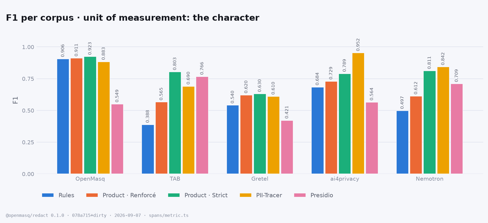
</picture>

| corpus | cases | `patterns` | **`ner`** (Renforcé) | `ner` (Strict) | PII-Tracer | Presidio |
|---|---:|---:|---:|---:|---:|---:|
| OpenMasq | 907 | 0.906 | 0.911 | 0.923 | 0.883 | 0.549 |
| TAB | 127 | 0.388 | 0.565 | 0.803 | 0.690 | 0.766 |
| Gretel | 2 000 | 0.540 | 0.620 | 0.630 | 0.610 | 0.421 |
| ai4privacy | 2 000 | 0.684 | 0.729 | 0.789 | 0.952 | 0.564 |
| Nemotron | 2 000 | 0.497 | 0.612 | 0.811 | 0.842 | 0.709 |

The figure carries the **all-labels** view, the one comparable to the published figures.
Same table on the **product's scope** only — the labels it claims to redact, plain dates,
countries, occupations and demographics removed from the denominator:

| corpus | cases | `patterns` | **`ner`** (Renforcé) | `ner` (Strict) | PII-Tracer | Presidio |
|---|---:|---:|---:|---:|---:|---:|
| OpenMasq | 907 | 0.908 | 0.913 | 0.925 | 0.884 | 0.550 |
| TAB | 127 | 0.526 | 0.797 | 0.819 | 0.543 | 0.621 |
| Gretel | 2 000 | 0.614 | 0.692 | 0.650 | 0.634 | 0.404 |
| ai4privacy | 2 000 | 0.749 | 0.792 | 0.819 | 0.952 | 0.575 |
| Nemotron | 2 000 | 0.595 | 0.715 | 0.871 | 0.894 | 0.748 |


**Presidio is now measured on all five, and the fifth column changes the reading.** It had
only ever run on our own corpus, where a default English install faces fourteen languages and
scores 0.549 — a number that flattered us by omission. On **TAB it scores 0.766**, above this
product's default level and within 0.04 of its Strict level: English formal prose full of
organisations, people and dates is exactly what spaCy's model was trained for. On Gretel it
falls to 0.421, where seven languages meet a default install that reads only English.

That configuration is `AnalyzerEngine()` with its predefined recognizers and `language="en"` —
what a `pip install` gives you, not Presidio's ceiling, which is a library built to receive
recognizers and models. Every number here is that default, on every corpus, and the point of
running it everywhere is that a comparison shown on one corpus only is not a comparison.

### Does this bench reproduce the published figures?

<picture>
  <source media="(prefers-color-scheme: dark)" srcset="figures/reproduction-en-dark.png">
  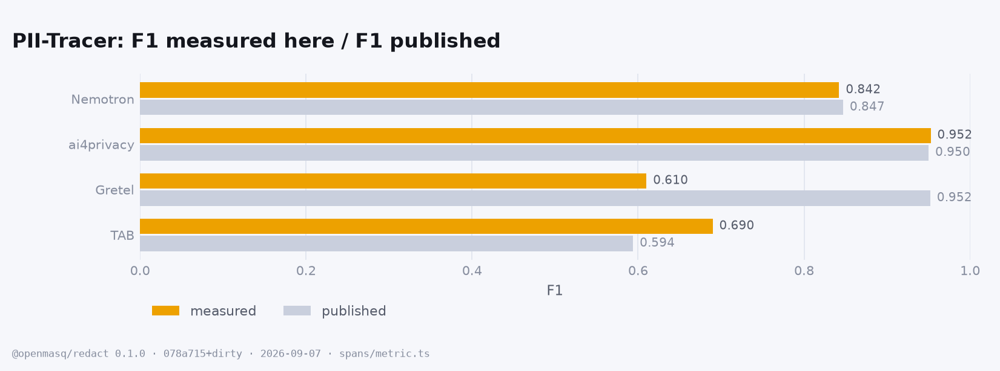
</picture>

| benchmark | measured here | published | gap |
|---|---:|---:|---:|
| TAB (ECHR) | 0.690 | 0.594 | 0.096 |
| Gretel | 0.610 | 0.952 | 0.342 |
| ai4privacy | 0.952 | 0.950 | 0.002 |
| Nemotron-PII | 0.842 | 0.847 | 0.005 |

**Two of four land within three thousandths.** The metric here was written from the paper's
description alone, so agreeing with its author on ai4privacy and Nemotron-PII is the one
external check available — and it is what makes the two disagreements worth stating rather
than hiding.

- **TAB (0.690 here, 0.594 published).** TAB carries up to ten annotators per document and the
  paper does not say how it pools them; this bench takes one (§ *The datasets*). Compare the
  columns to each other on that line, not to the paper.
- **Gretel (0.610 here, 0.952 published).** Unexplained. What is measurable: PII-Tracer's
  per-label recall on Gretel is 96–100 % on e-mails, IBANs and addresses, and its precision
  falls to 0.606 on the machine-to-machine banking formats — MT940, SWIFT, EDI, FIX — where
  the gold annotates one address and the rest of the document is a wall of unlabelled account
  numbers. 5 % of the documents carry 47 % of its false-positive characters; dropping those
  formats lifts its precision to 0.800 and its F1 to 0.671. Still not 0.952.
- **⚠️ And ai4privacy's 0.952 deserves a caveat, in both directions.** PII-Tracer scores
  96–100 % there on all 27 labels — sex, country and geographic coordinates included, none of
  which has a recognisable shape — with 99 % consistency. That is the profile of a model
  measured inside its own training distribution: the paper says it learned on "single-record
  examples", which is what ai4privacy is. On TAB, the only corpus here made of real
  human-annotated text, the same model falls to 0.529 recall.

### Precision against recall

<picture>
  <source media="(prefers-color-scheme: dark)" srcset="figures/precision-recall-en-dark.png">
  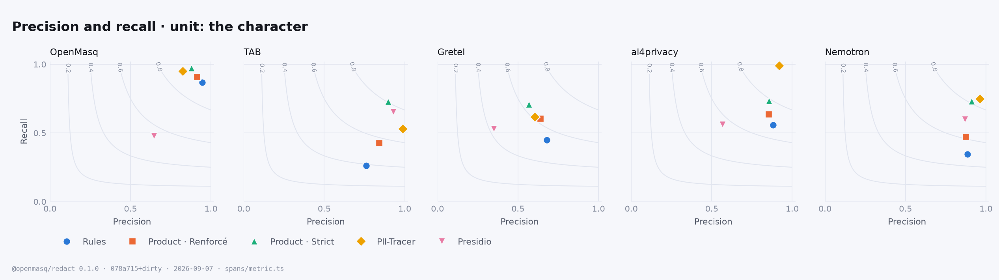
</picture>

Two engines on the same iso-F1 curve share a number and not a behaviour. There is no useful
**accuracy** here: the negative class is every other character of the document, and every
engine would score above 99 %.

### Finding EVERY mention — the measure PII-TRACE introduced

<picture>
  <source media="(prefers-color-scheme: dark)" srcset="figures/consistency-en-dark.png">
  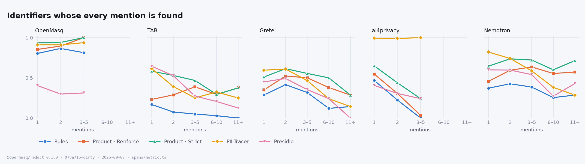
</picture>

An identifier counts only when **all** of its characters, in **all** of its mentions, were
marked. It is the measure a redaction product should be judged on: one missed copy of a name
is the whole name leaked. The product carries a conversation vault — once a value is in it,
every later occurrence is substituted without being detected again — and that shows as the
curves cross with repetition.

### What each engine costs

<picture>
  <source media="(prefers-color-scheme: dark)" srcset="figures/latency-en-dark.png">
  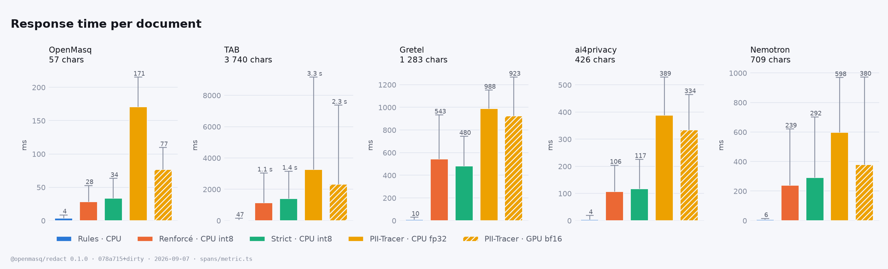
</picture>

| corpus | median chars | `patterns`<br><sub>CPU</sub> | `ner` (Renforcé)<br><sub>CPU · int8</sub> | `ner` (Strict)<br><sub>CPU · int8</sub> | PII-Tracer<br><sub>CPU · fp32</sub> | PII-Tracer<br><sub>**GPU** · bf16</sub> |
|---|---:|---:|---:|---:|---:|---:|
| Notre corpus | 57 | 4 ms | 28 ms | 34 ms | 171 ms | 77 ms |
| TAB (ECHR) | 3 740 | 47 ms | 1.1 s | 1.4 s | 3.3 s | 2.3 s |
| Gretel | 1 283 | 10 ms | 543 ms | 480 ms | 988 ms | 923 ms |
| ai4privacy | 426 | 4 ms | 106 ms | 117 ms | 389 ms | 334 ms |
| Nemotron-PII | 709 | 6 ms | 239 ms | 292 ms | 598 ms | 380 ms |

⚠️ **Three things differ between those columns, not one**: the device, the runtime and the
numeric type. PII-Tracer ships for the GPU in bfloat16 under PyTorch; the product runs on the
CPU, in int8 through onnxruntime. It is therefore measured on **both** devices, and the
CPU column is the one that compares to ours. Measured by `latency.mts` / `pplx.py --latency`:
one engine at a time, nothing else on the machine, the same documents, a warm-up case
excluded. The per-case timings inside `results/<dataset>.<engine>.json` are NOT this — they
are taken during the accuracy passes, under contention, and must not be charted as latency.

### Every label, every engine

<picture>
  <source media="(prefers-color-scheme: dark)" srcset="figures/recall-by-label-en-dark.png">
  
</picture>

<details>
<summary><b>The full tables</b> — per category, per language, per length, per mention count, for every corpus</summary>

```
> openmasq@0.1.0 bench:spans /Users/thomasgaudibert/Desktop/info/OPENMASQ/openmasq
> tsx packages/redact/bench/spans/run.mts --replay --markdown


### ai4privacy — 2000 cases · 135871 annotated characters (115862 in the product's scope)

| metric | openmasq `patterns` | **openmasq `ner`** (the product, Renforcé) | openmasq `ner` (Strict) | PII-Tracer | Presidio (default) |
|---|---:|---:|---:|---:|---:|
| character precision | 0.881 | 0.854 | 0.857 | 0.920 | 0.568 |
| character recall · all labels | 0.558 | 0.636 | 0.732 | 0.987 | 0.561 |
| **character F1 · all labels** | **0.684** | **0.729** | **0.789** | **0.952** | **0.564** |
| character recall · product scope | 0.651 | 0.739 | 0.785 | 0.986 | 0.582 |
| character F1 · product scope | 0.749 | 0.792 | 0.819 | 0.952 | 0.575 |
| span-overlap F1 | 0.628 | 0.692 | 0.768 | 0.962 | 0.553 |
| span-containment F1 | 0.578 | 0.635 | 0.708 | 0.920 | 0.466 |
| recurring identifiers, every mention found | 19 % (228) | 27 % (228) | 41 % (228) | 99 % (228) | 30 % (228) |
| latency during this pass (ms/case) | 21.8 · 68.3 | 232.7 · 559.2 | 234.7 · 502.9 | 498.3 · 713.4 | 21.6 · 30.8 |

Identifiers whose every mention is fully covered, by number of mentions (all labels):

| mentions | openmasq `patterns` | **openmasq `ner`** (the product, Renforcé) | openmasq `ner` (Strict) | PII-Tracer | Presidio (default) |
|---|---:|---:|---:|---:|---:|
| 1 (12354) | 47 % | 55 % | 65 % | 99 % | 41 % |
| 2 (196) | 22 % | 31 % | 44 % | 99 % | 31 % |
| 3–5 (29) | 0 % | 3 % | 24 % | 100 % | 24 % |
| 6–10 (3) | 0 % | 0 % | 33 % | 67 % | 33 % |

Character F1 by language (all labels):

| language | openmasq `patterns` | **openmasq `ner`** (the product, Renforcé) | openmasq `ner` (Strict) | PII-Tracer | Presidio (default) |
|---|---:|---:|---:|---:|---:|
| de (1031) | 0.692 | 0.746 | 0.803 | 0.950 | 0.472 |
| en (969) | 0.674 | 0.709 | 0.774 | 0.955 | 0.703 |

Character recall by upstream label (spans · scope), all engines:

| label | openmasq `patterns` | **openmasq `ner`** (the product, Renforcé) | openmasq `ner` (Strict) | PII-Tracer | Presidio (default) |
|---|---:|---:|---:|---:|---:|
| IP (599 · in) | 95 % | 95 % | 95 % | 98 % | 96 % |
| EMAIL (614 · in) | 97 % | 98 % | 98 % | 98 % | 98 % |
| SOCIALNUMBER (709 · in) | 49 % | 49 % | 49 % | 100 % | 58 % |
| USERNAME (768 · in) | 11 % | 19 % | 51 % | 95 % | 27 % |
| DRIVERLICENSE (568 · in) | 65 % | 65 % | 65 % | 99 % | 36 % |
| BOD (607 · in) | 64 % | 64 % | 92 % | 100 % | 77 % |
| TEL (508 · in) | 72 % | 72 % | 72 % | 96 % | 55 % |
| IDCARD (666 · in) | 82 % | 83 % | 82 % | 100 % | 74 % |
| PASSPORT (712 · in) | 83 % | 83 % | 83 % | 100 % | 49 % |
| STREET (422 · in) | 42 % | 90 % | 90 % | 100 % | 44 % |
| DATE (450 · out) | 1 % | 1 % | 74 % | 100 % | 75 % |
| TIME (1014 · out) | 2 % | 2 % | 72 % | 99 % | 39 % |
| CITY (445 · in) | 67 % | 95 % | 95 % | 100 % | 47 % |
| LASTNAME1 (560 · in) | 43 % | 82 % | 82 % | 99 % | 41 % |
| GIVENNAME1 (483 · in) | 51 % | 79 % | 79 % | 97 % | 37 % |
| PASS (400 · in) | 58 % | 58 % | 59 % | 96 % | 8 % |
| TITLE (528 · out) | 8 % | 14 % | 15 % | 94 % | 18 % |
| SEX (534 · out) | 6 % | 7 % | 7 % | 99 % | 17 % |
| POSTCODE (449 · in) | 74 % | 74 % | 74 % | 100 % | 27 % |
| STATE (447 · in) | 14 % | 76 % | 76 % | 100 % | 20 % |
| COUNTRY (365 · out) | 1 % | 1 % | 2 % | 100 % | 62 % |
| SECADDRESS (190 · in) | 63 % | 66 % | 66 % | 100 % | 8 % |
| BUILDING (422 · in) | 44 % | 44 % | 44 % | 100 % | 3 % |
| LASTNAME2 (163 · in) | 32 % | 82 % | 82 % | 100 % | 41 % |
| GEOCOORD (60 · out) | 0 % | 0 % | 0 % | 100 % | 2 % |
| GIVENNAME2 (128 · in) | 37 % | 74 % | 74 % | 96 % | 46 % |
| LASTNAME3 (53 · in) | 22 % | 70 % | 70 % | 100 % | 45 % |

### gretel — 2000 cases · 212640 annotated characters (169592 in the product's scope)

| metric | openmasq `patterns` | **openmasq `ner`** (the product, Renforcé) | openmasq `ner` (Strict) | PII-Tracer | Presidio (default) |
|---|---:|---:|---:|---:|---:|
| character precision | 0.679 | 0.639 | 0.569 | 0.606 | 0.350 |
| character recall · all labels | 0.449 | 0.603 | 0.707 | 0.614 | 0.529 |
| **character F1 · all labels** | **0.540** | **0.620** | **0.630** | **0.610** | **0.421** |
| character recall · product scope | 0.560 | 0.753 | 0.757 | 0.663 | 0.477 |
| character F1 · product scope | 0.614 | 0.692 | 0.650 | 0.634 | 0.404 |
| span-overlap F1 | 0.525 | 0.582 | 0.636 | 0.581 | 0.501 |
| span-containment F1 | 0.411 | 0.472 | 0.535 | 0.531 | 0.407 |
| recurring identifiers, every mention found | 37 % (1870) | 51 % (1870) | 59 % (1870) | 55 % (1870) | 44 % (1870) |
| latency during this pass (ms/case) | 29.1 · 86.3 | 1177.8 · 2373.3 | 1191.7 · 2386.5 | 1464.4 · 1880 | 57.7 · 86.8 |

Identifiers whose every mention is fully covered, by number of mentions (all labels):

| mentions | openmasq `patterns` | **openmasq `ner`** (the product, Renforcé) | openmasq `ner` (Strict) | PII-Tracer | Presidio (default) |
|---|---:|---:|---:|---:|---:|
| 1 (7977) | 29 % | 35 % | 51 % | 60 % | 45 % |
| 2 (1236) | 42 % | 52 % | 61 % | 61 % | 49 % |
| 3–5 (519) | 32 % | 50 % | 55 % | 47 % | 35 % |
| 6–10 (108) | 12 % | 38 % | 50 % | 24 % | 24 % |
| 11+ (7) | 14 % | 29 % | 29 % | 14 % | 0 % |

Character P / R / F1 by text length (all labels):

| length | openmasq `patterns` | **openmasq `ner`** (the product, Renforcé) | openmasq `ner` (Strict) | PII-Tracer | Presidio (default) |
|---|---:|---:|---:|---:|---:|
| 1k–10k (1427) | 0.745 / 0.436 / 0.550 | 0.670 / 0.591 / 0.628 | 0.589 / 0.688 / 0.634 | 0.795 / 0.561 / 0.658 | 0.344 / 0.526 / 0.416 |
| <1k (573) | 0.536 / 0.493 / 0.514 | 0.558 / 0.645 / 0.598 | 0.516 / 0.772 / 0.619 | 0.385 / 0.793 / 0.519 | 0.372 / 0.541 / 0.441 |

Character F1 by language (all labels):

| language | openmasq `patterns` | **openmasq `ner`** (the product, Renforcé) | openmasq `ner` (Strict) | PII-Tracer | Presidio (default) |
|---|---:|---:|---:|---:|---:|
| en (1033) | 0.546 | 0.613 | 0.636 | 0.632 | 0.543 |
| de (187) | 0.548 | 0.635 | 0.658 | 0.631 | 0.315 |
| sv (161) | 0.506 | 0.636 | 0.620 | 0.599 | 0.356 |
| nl (156) | 0.484 | 0.577 | 0.553 | 0.510 | 0.316 |
| it (159) | 0.573 | 0.626 | 0.622 | 0.567 | 0.305 |
| es (166) | 0.499 | 0.618 | 0.613 | 0.551 | 0.284 |
| fr (138) | 0.589 | 0.685 | 0.687 | 0.648 | 0.412 |

Character recall by upstream label (spans · scope), all engines:

| label | openmasq `patterns` | **openmasq `ner`** (the product, Renforcé) | openmasq `ner` (Strict) | PII-Tracer | Presidio (default) |
|---|---:|---:|---:|---:|---:|
| name (3559 · in) | 61 % | 76 % | 76 % | 75 % | 67 % |
| street_address (1562 · in) | 64 % | 80 % | 81 % | 95 % | 43 % |
| company (2375 · in) | 23 % | 64 % | 65 % | 5 % | 9 % |
| date (3107 · out) | 1 % | 1 % | 48 % | 40 % | 77 % |
| email (502 · in) | 96 % | 97 % | 97 % | 96 % | 97 % |
| time (504 · out) | 1 % | 1 % | 68 % | 50 % | 47 % |
| phone_number (341 · in) | 76 % | 76 % | 76 % | 90 % | 79 % |
| ipv6 (60 · in) | 91 % | 91 % | 91 % | 77 % | 74 % |
| iban (63 · in) | 94 % | 94 % | 94 % | 99 % | 76 % |
| bban (64 · in) | 63 % | 63 % | 63 % | 100 % | 9 % |
| api_key (27 · in) | 88 % | 88 % | 88 % | 93 % | 20 % |
| swift_bic_code (87 · in) | 45 % | 45 % | 45 % | 99 % | 1 % |
| date_of_birth (86 · in) | 79 % | 79 % | 89 % | 87 % | 80 % |
| credit_card_number (54 · in) | 86 % | 86 % | 86 % | 100 % | 65 % |
| local_latlng (34 · in) | 30 % | 30 % | 30 % | 97 % | 55 % |
| first_name (112 · in) | 33 % | 94 % | 94 % | 98 % | 63 % |
| last_name (67 · in) | 49 % | 94 % | 95 % | 73 % | 37 % |
| customer_id (63 · in) | 67 % | 67 % | 67 % | 92 % | 41 % |
| ssn (53 · in) | 58 % | 58 % | 58 % | 100 % | 82 % |
| password (42 · in) | 48 % | 48 % | 48 % | 100 % | 7 % |
| ipv4 (40 · in) | 100 % | 100 % | 100 % | 100 % | 100 % |
| employee_id (60 · in) | 63 % | 63 % | 63 % | 89 % | 44 % |
| bank_routing_number (56 · in) | 63 % | 63 % | 63 % | 100 % | 100 % |
| driver_license_number (35 · in) | 72 % | 72 % | 72 % | 100 % | 52 % |
| passport_number (47 · in) | 78 % | 78 % | 78 % | 98 % | 93 % |
| date_time (20 · out) | 0 % | 0 % | 97 % | 100 % | 64 % |
| account_pin (63 · in) | 55 % | 55 % | 55 % | 100 % | 73 % |
| user_name (21 · in) | 15 % | 40 % | 42 % | 93 % | 19 % |
| credit_card_security_code (64 · in) | 50 % | 50 % | 50 % | 97 % | 3 % |

### internal — 907 cases · 49588 annotated characters (49392 in the product's scope)

| metric | openmasq `patterns` | **openmasq `ner`** (the product, Renforcé) | openmasq `ner` (Strict) | PII-Tracer | Presidio (default) |
|---|---:|---:|---:|---:|---:|
| character precision | 0.947 | 0.913 | 0.881 | 0.826 | 0.648 |
| character recall · all labels | 0.868 | 0.909 | 0.970 | 0.949 | 0.477 |
| **character F1 · all labels** | **0.906** | **0.911** | **0.923** | **0.883** | **0.549** |
| character recall · product scope | 0.872 | 0.912 | 0.974 | 0.952 | 0.478 |
| character F1 · product scope | 0.908 | 0.913 | 0.925 | 0.884 | 0.550 |
| span-overlap F1 | 0.886 | 0.897 | 0.913 | 0.877 | 0.553 |
| span-containment F1 | 0.851 | 0.853 | 0.875 | 0.782 | 0.469 |
| recurring identifiers, every mention found | 86 % (83) | 92 % (83) | 95 % (83) | 92 % (83) | 30 % (83) |
| latency during this pass (ms/case) | 5.4 · 20.3 | 102 · 400.5 | 103.8 · 418.3 | 147.8 · 297.7 | 0 · 0 |

Identifiers whose every mention is fully covered, by number of mentions (all labels):

| mentions | openmasq `patterns` | **openmasq `ner`** (the product, Renforcé) | openmasq `ner` (Strict) | PII-Tracer | Presidio (default) |
|---|---:|---:|---:|---:|---:|
| 1 (3159) | 80 % | 85 % | 94 % | 91 % | 40 % |
| 2 (67) | 87 % | 90 % | 94 % | 91 % | 30 % |
| 3–5 (16) | 81 % | 100 % | 100 % | 94 % | 31 % |

Character P / R / F1 by text length (all labels):

| length | openmasq `patterns` | **openmasq `ner`** (the product, Renforcé) | openmasq `ner` (Strict) | PII-Tracer | Presidio (default) |
|---|---:|---:|---:|---:|---:|
| 1k–10k (27) | 0.983 / 0.988 / 0.986 | 0.912 / 0.994 / 0.951 | 0.860 / 1.000 / 0.925 | 0.757 / 0.964 / 0.848 | 0.414 / 0.717 / 0.525 |
| <1k (880) | 0.945 / 0.862 / 0.901 | 0.913 / 0.904 / 0.909 | 0.882 / 0.968 / 0.923 | 0.830 / 0.948 / 0.885 | 0.681 / 0.464 / 0.552 |

Character F1 by language (all labels):

| language | openmasq `patterns` | **openmasq `ner`** (the product, Renforcé) | openmasq `ner` (Strict) | PII-Tracer | Presidio (default) |
|---|---:|---:|---:|---:|---:|
| fr (468) | 0.902 | 0.914 | 0.915 | 0.861 | 0.572 |
| en (215) | 0.898 | 0.910 | 0.938 | 0.916 | 0.528 |
| de (47) | 0.926 | 0.916 | 0.936 | 0.877 | 0.464 |
| es (32) | 0.929 | 0.895 | 0.925 | 0.922 | 0.497 |
| it (29) | 0.982 | 0.925 | 0.931 | 0.918 | 0.569 |
| pt (30) | 0.877 | 0.856 | 0.940 | 0.937 | 0.509 |
| nl (24) | 0.963 | 0.945 | 0.963 | 0.932 | 0.432 |
| pl (10) | 1.000 | 0.988 | 0.988 | 0.988 | 0.671 |
| sv (6) | 1.000 | 0.824 | 0.824 | 0.988 | 0.537 |
| da (5) | 1.000 | 1.000 | 1.000 | 0.995 | 0.634 |
| zh (17) | 0.372 | 0.441 | 0.430 | 0.545 | 0.411 |
| ko (11) | 0.756 | 0.800 | 0.800 | 0.738 | 0.407 |
| ja (12) | 0.323 | 0.490 | 0.490 | 0.436 | 0.529 |
| ru (1) | 0.000 | 1.000 | 1.000 | 0.739 | 0.000 |

Character recall by upstream label (spans · scope), all engines:

| label | openmasq `patterns` | **openmasq `ner`** (the product, Renforcé) | openmasq `ner` (Strict) | PII-Tracer | Presidio (default) |
|---|---:|---:|---:|---:|---:|
| NAME (674 · in) | 86 % | 96 % | 97 % | 98 % | 51 % |
| EMAIL (253 · in) | 100 % | 100 % | 100 % | 100 % | 99 % |
| ADDRESS (227 · in) | 99 % | 99 % | 99 % | 99 % | 17 % |
| CARD (228 · in) | 100 % | 100 % | 100 % | 99 % | 65 % |
| TOKEN (201 · in) | 100 % | 100 % | 100 % | 99 % | 7 % |
| ID (217 · in) | 88 % | 88 % | 93 % | 97 % | 36 % |
| COMPANY_ID (207 · in) | 100 % | 100 % | 100 % | 100 % | 24 % |
| USERNAME (203 · in) | 0 % | 16 % | 100 % | 99 % | 4 % |
| PHONE (153 · in) | 96 % | 96 % | 96 % | 100 % | 95 % |
| IBAN (52 · in) | 100 % | 100 % | 100 % | 99 % | 91 % |
| CITY (230 · in) | 59 % | 89 % | 89 % | 89 % | 22 % |
| HEALTH (205 · in) | 100 % | 100 % | 100 % | 73 % | 65 % |
| PATH (30 · in) | 80 % | 80 % | 95 % | 64 % | 1 % |
| DOB (88 · in) | 91 % | 91 % | 100 % | 100 % | 72 % |
| ORG (68 · in) | 63 % | 85 % | 85 % | 35 % | 18 % |
| URL (23 · in) | 20 % | 22 % | 95 % | 94 % | 94 % |
| SECRET (23 · in) | 98 % | 98 % | 98 % | 99 % | 15 % |
| POSTAL (103 · in) | 89 % | 89 % | 89 % | 99 % | 17 % |
| COMPANY (25 · in) | 78 % | 80 % | 80 % | 26 % | 1 % |
| PLACE (27 · in) | 89 % | 94 % | 94 % | 90 % | 7 % |
| IP (30 · in) | 100 % | 100 % | 100 % | 100 % | 100 % |
| DATE (27 · in) | 39 % | 39 % | 100 % | 99 % | 74 % |
| BIC (23 · in) | 74 % | 74 % | 74 % | 100 % | 4 % |
| AMOUNT (30 · out) | 0 % | 0 % | 0 % | 24 % | 11 % |

### nemotron — 2000 cases · 242739 annotated characters (187018 in the product's scope)

| metric | openmasq `patterns` | **openmasq `ner`** (the product, Renforcé) | openmasq `ner` (Strict) | PII-Tracer | Presidio (default) |
|---|---:|---:|---:|---:|---:|
| character precision | 0.886 | 0.875 | 0.912 | 0.965 | 0.871 |
| character recall · all labels | 0.345 | 0.470 | 0.731 | 0.747 | 0.598 |
| **character F1 · all labels** | **0.497** | **0.612** | **0.811** | **0.842** | **0.709** |
| character recall · product scope | 0.447 | 0.605 | 0.833 | 0.833 | 0.656 |
| character F1 · product scope | 0.595 | 0.715 | 0.871 | 0.894 | 0.748 |
| span-overlap F1 | 0.562 | 0.683 | 0.802 | 0.857 | 0.751 |
| span-containment F1 | 0.496 | 0.604 | 0.726 | 0.801 | 0.651 |
| recurring identifiers, every mention found | 41 % (2276) | 60 % (2276) | 73 % (2276) | 68 % (2276) | 56 % (2276) |
| latency during this pass (ms/case) | 35.1 · 85.8 | 469.6 · 1369.8 | 481.1 · 1307.7 | 678 · 1548.5 | 34.5 · 87 |

Identifiers whose every mention is fully covered, by number of mentions (all labels):

| mentions | openmasq `patterns` | **openmasq `ner`** (the product, Renforcé) | openmasq `ner` (Strict) | PII-Tracer | Presidio (default) |
|---|---:|---:|---:|---:|---:|
| 1 (10821) | 37 % | 46 % | 65 % | 82 % | 60 % |
| 2 (1498) | 43 % | 59 % | 74 % | 74 % | 60 % |
| 3–5 (661) | 39 % | 64 % | 72 % | 59 % | 54 % |
| 6–10 (110) | 25 % | 55 % | 60 % | 38 % | 27 % |
| 11+ (7) | 29 % | 57 % | 71 % | 29 % | 43 % |

Character P / R / F1 by text length (all labels):

| length | openmasq `patterns` | **openmasq `ner`** (the product, Renforcé) | openmasq `ner` (Strict) | PII-Tracer | Presidio (default) |
|---|---:|---:|---:|---:|---:|
| 1k–10k (675) | 0.885 / 0.300 / 0.447 | 0.861 / 0.449 / 0.591 | 0.903 / 0.719 / 0.801 | 0.975 / 0.661 / 0.788 | 0.833 / 0.551 / 0.663 |
| <1k (1325) | 0.888 / 0.388 / 0.540 | 0.887 / 0.490 / 0.631 | 0.920 / 0.742 / 0.821 | 0.957 / 0.828 / 0.888 | 0.904 / 0.642 / 0.751 |

Character recall by upstream label (spans · scope), all engines:

| label | openmasq `patterns` | **openmasq `ner`** (the product, Renforcé) | openmasq `ner` (Strict) | PII-Tracer | Presidio (default) |
|---|---:|---:|---:|---:|---:|
| url (831 · in) | 1 % | 2 % | 100 % | 87 % | 92 % |
| company_name (1043 · in) | 15 % | 91 % | 91 % | 2 % | 1 % |
| email (879 · in) | 99 % | 100 % | 100 % | 100 % | 100 % |
| occupation (773 · out) | 0 % | 4 % | 4 % | 1 % | 0 % |
| date (1455 · out) | 0 % | 0 % | 92 % | 78 % | 94 % |
| http_cookie (124 · in) | 47 % | 47 % | 52 % | 83 % | 11 % |
| first_name (1616 · in) | 76 % | 99 % | 99 % | 99 % | 90 % |
| last_name (1131 · in) | 87 % | 99 % | 99 % | 98 % | 88 % |
| street_address (354 · in) | 71 % | 83 % | 83 % | 99 % | 31 % |
| phone_number (448 · in) | 45 % | 45 % | 45 % | 100 % | 100 % |
| credit_debit_card (271 · in) | 37 % | 37 % | 37 % | 100 % | 55 % |
| account_number (403 · in) | 83 % | 83 % | 83 % | 100 % | 72 % |
| api_key (96 · in) | 89 % | 89 % | 89 % | 100 % | 3 % |
| county (312 · in) | 25 % | 98 % | 98 % | 65 % | 94 % |
| time (520 · out) | 1 % | 1 % | 68 % | 57 % | 69 % |
| user_name (337 · in) | 16 % | 56 % | 63 % | 100 % | 28 % |
| date_time (194 · out) | 0 % | 0 % | 97 % | 95 % | 84 % |
| city (418 · in) | 21 % | 98 % | 98 % | 74 % | 79 % |
| customer_id (374 · in) | 85 % | 85 % | 85 % | 100 % | 64 % |
| coordinate (171 · out) | 0 % | 0 % | 0 % | 95 % | 10 % |
| education_level (225 · out) | 0 % | 2 % | 2 % | 1 % | 2 % |
| date_of_birth (269 · in) | 95 % | 95 % | 100 % | 100 % | 100 % |
| medical_record_number (245 · in) | 58 % | 58 % | 58 % | 100 % | 83 % |
| employment_status (262 · out) | 2 % | 2 % | 2 % | 6 % | 0 % |
| state (427 · in) | 9 % | 86 % | 86 % | 65 % | 85 % |
| ipv6 (66 · in) | 61 % | 61 % | 61 % | 100 % | 84 % |
| health_plan_beneficiary_number (169 · in) | 18 % | 18 % | 18 % | 100 % | 53 % |
| biometric_identifier (172 · in) | 41 % | 42 % | 43 % | 99 % | 88 % |
| password (164 · in) | 24 % | 24 % | 25 % | 97 % | 6 % |
| ipv4 (134 · in) | 100 % | 100 % | 100 % | 100 % | 100 % |
| bank_routing_number (191 · in) | 80 % | 80 % | 80 % | 100 % | 100 % |
| ssn (153 · in) | 87 % | 87 % | 87 % | 100 % | 99 % |
| political_view (116 · out) | 0 % | 10 % | 10 % | 42 % | 1 % |
| vehicle_identifier (91 · in) | 99 % | 99 % | 99 % | 100 % | 3 % |
| country (435 · out) | 0 % | 2 % | 2 % | 49 % | 82 % |
| swift_bic (122 · in) | 97 % | 97 % | 97 % | 100 % | 4 % |
| mac_address (77 · in) | 97 % | 97 % | 97 % | 100 % | 100 % |
| fax_number (109 · in) | 19 % | 19 % | 19 % | 100 % | 100 % |
| religious_belief (110 · out) | 1 % | 2 % | 2 % | 73 % | 20 % |
| employee_id (174 · in) | 76 % | 76 % | 76 % | 100 % | 34 % |
| certificate_license_number (113 · in) | 4 % | 4 % | 4 % | 100 % | 65 % |
| unique_id (39 · in) | 26 % | 26 % | 29 % | 100 % | 10 % |
| language (149 · out) | 0 % | 0 % | 0 % | 9 % | 0 % |
| device_identifier (47 · in) | 23 % | 23 % | 23 % | 100 % | 23 % |
| race_ethnicity (156 · out) | 0 % | 6 % | 6 % | 69 % | 0 % |
| license_plate (98 · in) | 1 % | 1 % | 1 % | 96 % | 5 % |
| gender (141 · out) | 0 % | 0 % | 0 % | 72 % | 0 % |
| sexuality (90 · out) | 0 % | 0 % | 0 % | 75 % | 1 % |
| pin (123 · in) | 74 % | 74 % | 74 % | 95 % | 84 % |
| postcode (135 · in) | 39 % | 39 % | 39 % | 100 % | 46 % |
| blood_type (107 · in) | 77 % | 77 % | 77 % | 75 % | 0 % |
| age (179 · out) | 0 % | 0 % | 3 % | 40 % | 64 % |
| tax_id (28 · in) | 65 % | 65 % | 65 % | 100 % | 70 % |
| cvv (99 · in) | 71 % | 71 % | 71 % | 72 % | 0 % |

### tab — 127 cases · 72746 annotated characters (32423 in the product's scope)

| metric | openmasq `patterns` | **openmasq `ner`** (the product, Renforcé) | openmasq `ner` (Strict) | PII-Tracer | Presidio (default) |
|---|---:|---:|---:|---:|---:|
| character precision | 0.762 | 0.842 | 0.898 | 0.989 | 0.930 |
| character recall · all labels | 0.260 | 0.425 | 0.726 | 0.529 | 0.652 |
| **character F1 · all labels** | **0.388** | **0.565** | **0.803** | **0.690** | **0.766** |
| character recall · product scope | 0.402 | 0.757 | 0.753 | 0.374 | 0.467 |
| character F1 · product scope | 0.526 | 0.797 | 0.819 | 0.543 | 0.621 |
| span-overlap F1 | 0.470 | 0.638 | 0.852 | 0.717 | 0.816 |
| span-containment F1 | 0.252 | 0.418 | 0.686 | 0.695 | 0.699 |
| recurring identifiers, every mention found | 6 % (500) | 32 % (500) | 49 % (500) | 35 % (500) | 43 % (500) |
| latency during this pass (ms/case) | 92.1 · 260.2 | 1905.3 · 4359.1 | 1982.7 · 4658.6 | 3126.3 · 8939 | 147.4 · 349.9 |

Identifiers whose every mention is fully covered, by number of mentions (all labels):

| mentions | openmasq `patterns` | **openmasq `ner`** (the product, Renforcé) | openmasq `ner` (Strict) | PII-Tracer | Presidio (default) |
|---|---:|---:|---:|---:|---:|
| 1 (3925) | 17 % | 23 % | 58 % | 61 % | 64 % |
| 2 (319) | 8 % | 29 % | 53 % | 39 % | 53 % |
| 3–5 (139) | 5 % | 39 % | 47 % | 25 % | 27 % |
| 6–10 (34) | 3 % | 29 % | 29 % | 32 % | 21 % |
| 11+ (8) | 0 % | 38 % | 38 % | 25 % | 13 % |

Character P / R / F1 by text length (all labels):

| length | openmasq `patterns` | **openmasq `ner`** (the product, Renforcé) | openmasq `ner` (Strict) | PII-Tracer | Presidio (default) |
|---|---:|---:|---:|---:|---:|
| 1k–10k (117) | 0.766 / 0.260 / 0.388 | 0.847 / 0.426 / 0.567 | 0.902 / 0.724 / 0.803 | 0.989 / 0.535 / 0.695 | 0.930 / 0.646 / 0.762 |
| ≥10k (10) | 0.737 / 0.260 / 0.385 | 0.803 / 0.424 / 0.555 | 0.877 / 0.734 / 0.799 | 0.996 / 0.489 / 0.656 | 0.933 / 0.691 / 0.794 |

Character recall by upstream label (spans · scope), all engines:

| label | openmasq `patterns` | **openmasq `ner`** (the product, Renforcé) | openmasq `ner` (Strict) | PII-Tracer | Presidio (default) |
|---|---:|---:|---:|---:|---:|
| DATETIME (2468 · out/ctx) | 18 % | 18 % | 87 % | 82 % | 99 % |
| ORG (653 · ctx/in) | 17 % | 78 % | 77 % | 0 % | 14 % |
| PERSON (987 · in/ctx) | 71 % | 77 % | 77 % | 76 % | 80 % |
| LOC (391 · in/ctx) | 5 % | 76 % | 76 % | 15 % | 74 % |
| MISC (192 · out/ctx) | 1 % | 11 % | 11 % | 1 % | 12 % |
| DEM (233 · ctx/out) | 0 % | 6 % | 6 % | 12 % | 14 % |
| CODE (329 · in/ctx) | 59 % | 59 % | 59 % | 66 % | 4 % |
| QUANTITY (171 · out/ctx) | 2 % | 2 % | 2 % | 2 % | 1 % |
```

</details>


## Reading them

> [!WARNING]
> **Read the columns against each other, and read both views.** One F1 hides which of your
> data is protected, and on these corpora the answer changes with what the annotation decided
> to call personal.
>
> - **One of Perplexity's four published figures reproduces here; three do not.** They report
>   a character F1 of 0.847 for PII-Tracer on Nemotron-PII, and this bench measures 0.847 on
>   the same split, with an implementation of the metric written from their description alone.
>   On ai4privacy, Gretel and TAB it does not land on their figure. The notes below say what
>   differs on each. One agreement out of four is the reason this page compares columns to
>   each other rather than to the paper.
>
> - **TAB is the only corpus here made of real, human-annotated text — and its gold is a
>   re-identification annotation, not a list of personal data.** Organisations are 36 % of the
>   annotated characters and plain dates 30 %, and the product does not redact plain dates, by
>   design. Hence the two lines: all labels, 0.535 for the product against 0.690 for
>   PII-Tracer; the labels the product claims, 0.749 against 0.543. The reversal is a
>   difference of doctrine, not of detection. And 2 141 of TAB's 7 565 mentions are annotated
>   `NO_MASK` — the bench treats those as context, neither gold nor error. That convention is
>   worth 0.096 of character F1 to the product and 0.006 to PII-Tracer, because the product
>   marks organisations and PII-Tracer has no label for them. Counting them as errors instead
>   gives 0.439 and 0.684. Both readings are here; pick the one you believe.
>
> - **On Gretel the columns separate on precision, not on recall.** PII-Tracer's character
>   recall per label is 96 % on e-mails, 99 % on IBANs, 95 % on street addresses — and 5 % on
>   company names, which its nine labels do not cover. Its precision falls to 0.606 on
>   machine-to-machine banking formats: MT940 statements, SWIFT messages, EDI and FIX
>   payloads, where the gold annotates one address and the rest of the document is a wall of
>   account numbers nobody labelled. 5 % of the documents carry 47 % of its false-positive
>   characters; dropping those formats lifts its precision to 0.800. Read Gretel's precision
>   as a statement about the annotation's coverage as much as about the engine's restraint.
>
> - **On our own corpus the model buys recall and pays precision, and the character F1 does
>   not move.** Rules alone 0.935, rules plus the local NER 0.935 — recall 0.934 to 0.967,
>   precision 0.936 to 0.905. The value-level bench reads the same event as 89 % to 95 %.
>   Both are true: a character metric charges for every extra character the model paints
>   around a name, a value metric does not.
>
> - **Consistency inverts as a mention repeats.** On TAB, PII-Tracer finds every mention of
>   61 % of the identifiers cited once, against 19 % for the product; at three to five
>   mentions it is 25 % against 39 %. Gretel says the same, 60 % against 33 % at one mention
>   and 47 % against 51 % at three to five. The product carries a conversation vault: once a
>   value is in it, every later occurrence is substituted without being detected again. That
>   is a design difference, and repetition is exactly the axis PII-TRACE was built to measure.
>
> - **These benches found a defect of ours.** `Bitcoin` and `ISA` are substituted in a
>   one-line sentence, though the documented behaviour keeps well-known brands and common
>   acronyms in clear outside the Strict level. It is a small share of the false positives and
>   it is real; it was invisible on a corpus of our own writing.
>
> **Whatever the numbers, detection is not a guarantee.** The Vault — terms you mark yourself —
> is the only coverage promise the product makes for a given string.

## Replay, regenerate

```bash
pnpm bench:spans --replay --markdown                      # the tables above, from results/
packages/redact/bench/spans/fetch.sh                      # the upstream files (~500 MB), pinned
python3.12 -m venv v && v/bin/pip install pyarrow pandas
v/bin/python packages/redact/bench/spans/adapt.py         # data/*.spancase.json + manifest.json
pnpm build && pnpm bench:spans --dataset tab              # the product's column, measured
v/bin/pip install torch transformers safetensors
v/bin/python packages/redact/bench/spans/pplx.py tab      # PII-Tracer's column, measured (MPS)
```

`figures/` holds six figures × **English and French** × light and dark (PNG, 192 dpi), plus
the manifest that ties them to an engine version. A figure carries values, bars, an axis name
and a legend — never a sentence: what it means belongs here, where it can be translated and
corrected, not baked into a raster. They are COMMITTED so a reader sees them without running
anything; the script that draws them lives outside this repository, and everything it needs is
`results/scores.json` (`pnpm bench:spans --replay --json`).

`results/<dataset>.<engine>.json` is the reference for every number: predicted spans per
case, machine, date, per-case latency. `predict.ts` says how a span is derived from what the
engine replaced (the vault, replayed with the engine's own substitution rules — no offsets are
invented).

---

# `@openmasq/redact` — les bancs publics, au caractère près

Les bancs maison (`../corpora/`) notent des *valeurs* : une vérité compte quand la plupart de
ses tokens ont été remplacés. C'est la bonne mesure pour un plancher de régression, et la
mauvaise pour un lecteur qui connaît la littérature, où un détecteur se juge **aux offsets de
caractères, sur des jeux publics, en précision autant qu'en rappel**. Ce dossier est cette
mesure — le protocole de l'article [PII-TRACE](https://www.perplexity.ai/hub/blog/pii-trace-detecting-personal-data-before-it-leaves-the-device)
de Perplexity (septembre 2026), reproduit pour que nos chiffres, ceux de PII-Tracer et ceux
que Perplexity publie tiennent dans un seul tableau.

```bash
pnpm bench:spans --replay --markdown            # re-note les résultats commités, sans modèle, ~20 s
pnpm bench:spans --replay --extra pplx=results/<dataset>.pplx.json   # ajoute la colonne PII-Tracer
```

## Ce qui est mesuré

Tout est noté **sur les offsets de caractères tels que l'annotation amont les donne** — rien
n'est ré-annoté, rien n'est réaligné — et **sans exiger que les catégories coïncident** : un
nom trouvé comme entreprise est trouvé. C'est ainsi que Perplexity note ses bancs externes.

| mesure | définition |
|---|---|
| P / R / F1, **le caractère étant l'unité** | poolés sur le corpus : précision = part des caractères marqués par le moteur qui sont annotés ; rappel = part des caractères annotés qu'il a marqués |
| F1 chevauchement | un span annoté est trouvé dès qu'UN de ses caractères est marqué ; un span prédit est juste dès qu'il touche une annotation |
| F1 contenance | un span annoté n'est trouvé que si TOUS ses caractères sont marqués ; un span prédit n'est juste que s'il tient entièrement dans une annotation |
| constance | part des identifiants dont CHAQUE mention est entièrement couverte — par nombre de mentions (1 · 2 · 3–5 · 6–10 · 11+) et pour les récurrents (≥ 2) |
| par longueur · langue · étiquette | P / R / F1 caractère poolés dans < 1 k · 1–10 k · ≥ 10 k caractères ; par langue ; rappel caractère par étiquette amont |

Deux **vues** de la vérité, toutes deux rapportées (`metric.ts`) :

- **toutes étiquettes** — chaque annotation amont. Le chiffre comparable à ce que Perplexity publie.
- **périmètre produit** — seulement les étiquettes que le produit prétend masquer : noms,
  contacts, adresses, identifiants, secrets, santé. Dates et heures ordinaires, pays,
  professions, données démographiques et opinions sont *hors périmètre*. `adapt.py` écrit la
  correspondance par jeu ; `manifest.json` la compte.

**Le produit est mesuré tel qu'il est livré.** Chaque colonne `openmasq` fait tourner le
moteur avec la politique d'un NIVEAU (`../engines.ts`) : `patterns` et `ner` au niveau par
défaut, Renforcé — les catégories optionnelles éteintes (`url`, `username`, `date`), grandes
marques et personnalités publiques épargnées — et `ner (Strict)` avec toutes les catégories
allumées et rien d'épargné. Le banc valeur (`../compare.mts`) garde le moteur nu, pour que
ses planchers restent comparables à tous les chiffres qu'il a publiés ; c'est le même
pipeline sous deux politiques, et le README de chacun dit laquelle.

La précision est identique dans les deux vues et **ne reproche jamais à un moteur d'avoir
marqué une donnée annotée que nous avons choisi de ne pas noter** — la règle `CONTEXT` de
`../metric.ts`, conservée. Elle n'est pas gratuite : sur TAB elle vaut 0,096 de F1 caractère
au produit et 0,006 à PII-Tracer, et le paragraphe sur TAB plus bas donne les deux lectures
plutôt que la seule qui nous arrange.

Un **identifiant** est un groupe de mentions : TAB porte un identifiant d'entité issu de sa
propre annotation, les autres corpus groupent sur l'étiquette et la forme de surface en
minuscules. Deux personnes différentes partageant un prénom dans un même document comptent
donc là pour un seul identifiant — un approximant de ce que Perplexity groupe avec une
chaîne de traitement dont nous ne disposons pas.

## Les jeux — ce qu'ils contiennent vraiment

Quatre des cinq bancs externes de l'article PII-TRACE (SPY n'est pas publié sur le Hub) plus
celui de ce dépôt, tous ré-exprimés en offsets de caractères par `adapt.py`. Chacun est
récupéré par `fetch.sh` à une **révision épinglée, vérifiée par somme de contrôle**, et
échantillonné à **graine fixe** (`20260907`) dont les identifiants tirés sont écrits dans
`manifest.json` — les mêmes cas se reconstruisent donc sur une autre machine.

Les noms courts des figures sont ces cinq-là. Ce que chacun *est*, et à quoi ressemble un de
ses documents :

### `OpenMasq` — le corpus de ce dépôt

907 cas, 125 caractères en médiane, 14 langues, 25 catégories, 3 394 spans annotés. Dix-huit
familles de documents écrites pour ce moteur : imprimés administratifs français, bulletins de
paie, actes notariés, résultats de laboratoire, bulletins scolaires, relevés bancaires,
résultats d'outils de connecteurs, et des dégâts OCR produits plutôt que simulés. Entièrement
synthétique — personnes inventées, identifiants recalculés valides contre leurs sommes de
contrôle.

```
DIRECTION GÉNÉRALE DES FINANCES PUBLIQUES
AVIS D'IMPÔT 2026 — IMPÔT SUR LE REVENU

Numéro fiscal :         12 34 567 890 123
Référence de l'avis :   20 35 A195936 32
Numéro FIP :            350 54 32 4525937789 3
```

*C'est notre terrain, et le seul corpus ici que nous ayons écrit. À lire comme le plancher de
régression qu'il est, pas comme une preuve contre les quatre que nous n'avons pas écrits.*

### `TAB` — de vrais arrêts, annotés à la main

127 cas, 3 886 caractères en médiane, anglais, 8 types d'entités, 7 565 mentions.
[Text Anonymization Benchmark](https://aclanthology.org/2022.cl-4.19/) (Pilán et coll., 2022) :
des arrêts de la Cour européenne des droits de l'homme, annotés par des personnes pour la
tâche d'anonymiser une décision. **Le seul corpus de cette série qui ne soit pas synthétique**
— et le seul où des identifiants reviennent vraiment au long d'un document.

```
PROCEDURE

The case originated in an application (no. 36110/97) against the Republic of Turkey
lodged with the European Commission of Human Rights ("the Commission") under former
Article 25 of the Convention for the Protection of Human Rights…
```

*Sa vérité est une annotation de **réidentification**, pas une liste de données personnelles :
les annotateurs ont marqué tout ce qui pourrait aider à identifier le requérant, si bien que
les organisations pèsent 36 % des caractères annotés et les dates ordinaires 30 %. Les mentions
`NO_MASK` — 2 141 sur 7 565, que les annotateurs ont jugées sans danger — sont traitées ici en
contexte : ni vérité, ni erreur.*

### `Gretel` — documents financiers synthétiques

5 594 cas, 1 306 caractères en médiane, 7 langues, 29 étiquettes, 36 990 spans.
[gretelai/synthetic_pii_finance_multilingual](https://huggingface.co/datasets/gretelai/synthetic_pii_finance_multilingual) :
factures, relevés, avis de paiement, contrats d'assurance — et des formats bancaires de
machine à machine (MT940, SWIFT, EDI, FIX, XBRL).

```
Sammanfattning: Samsung Pay-betalning
Transaktions-ID: SMP-2022-003912
Datum: 2022-04-11    Tid: 14:27:36 (CET)
Payer: Nigel Henschel    Adress: 6 Vadim-Pohl-Ring
```

*⚠️ Sur les formats machine, sa vérité annote une adresse et laisse le mur de numéros de compte
sans étiquette. La précision mesurée sur Gretel en dit donc autant sur la couverture de
l'annotation que sur la retenue d'un moteur — pour chaque colonne, la nôtre comprise.*

### `ai4privacy` — enregistrements synthétiques denses, six langues

6 000 cas tirés de 47 728, 426 caractères en médiane, 6 langues, 28 étiquettes, 39 927 spans.
[ai4privacy/pii-masking-300k](https://huggingface.co/datasets/ai4privacy/pii-masking-300k),
partition de validation. **Cette version et pas la plus grosse `400k`** : l'article évalue sur
une partition de validation de 47 728 documents, exactement celle-ci ; `400k` annote 1,1 span
par ligne contre 7 et laisse passeports et IBAN non marqués.

```
- Gebäudenummer: 745    - Straße: Neßlach    - Stadt: Aindling
- Bundesland: Bayern    - Postleitzahl: 86447
- Nebenadresse: Ranch 412    - IP-Adresse: 222.232.249.225
```

*Chaque valeur y est collée à une étiquette explicite — une puce, une clé JSON, une balise XML.
C'est ce qui en fait le corpus le plus facile pour un modèle entraîné dessus, et c'est là que
PII-Tracer tient 96 à 100 % sur les vingt-sept étiquettes, sexe et pays compris. Voir la
réserve dans les résultats.*

### `Nemotron` — documents anglais, cinquante secteurs

6 000 cas tirés de 100 000, 752 caractères en médiane, anglais, 55 étiquettes, 50 391 spans.
[nvidia/Nemotron-PII](https://huggingface.co/datasets/nvidia/Nemotron-PII), partition de test.
Formulaires, courriels, factures et texte libre ancrés sur des personas, structurés et non
structurés, avec le jeu d'étiquettes le plus large des cinq — il annote la profession, le
niveau d'études, l'opinion politique et le groupe sanguin à côté des noms et des cartes.

```
- **Policyholder Last Name:** Calderon
- **Payment Date:** 07/15/2023
- **Account Number:** 9826371540
```

*Ses 55 étiquettes sont la raison pour laquelle les deux vues comptent le plus ici : 14 656 de
ses 50 391 spans sont des choses que le produit ne prétend pas masquer.*

### Ce que « dans le périmètre » veut dire, corpus par corpus

`adapt.py` range chaque étiquette amont dans l'un de trois périmètres, et `manifest.json` les
compte. `in` = une donnée que le produit revendique masquer. `out` = une annotation réelle
qu'il ne revendique pas (dates et heures ordinaires, pays, profession, données démographiques,
opinions, coordonnées) — notée en rappel dans la seule vue toutes étiquettes. `ctx` = annotée
amont comme n'ayant pas besoin d'être masquée (le `NO_MASK` de TAB) — jamais vérité, jamais
erreur.

| corpus | `in` | `out` | `ctx` |
|---|---:|---:|---:|
| OpenMasq | 3 394 | AMOUNT seul | annotations CONTEXT |
| TAB | 2 360 | 3 064 | 2 141 |
| Gretel | 26 686 | 10 304 | — |
| ai4privacy | 30 955 | 8 972 | — |
| Nemotron | 35 735 | 14 656 | — |

## Résultats — 2026-09-07

Chaque figure de cette page est produite depuis `results/scores.json` et porte l'estampille du
moteur qui a produit les nombres — `figures/manifest.json` enregistre la version, le commit et
le sha256 de chaque entrée, de sorte qu'une figure périmée se détecte au lieu de se soupçonner :

| | |
|---|---|
| `@openmasq/redact` | **0.1.0** |
| commit | `f3e2fd8` *(arbre du moteur modifié)* |
| mesuré | 2026-09-07 |
| figures produites | 2026-09-07 |
| scoreur | `spans/metric.ts` — LE scoreur unique ; les figures ne font que dessiner |
| entrées | 26 fichiers, sha256 dans `figures/manifest.json` |

### Le chiffre de tête — F1, le CARACTÈRE étant l'unité, toutes étiquettes

<picture>
  <source media="(prefers-color-scheme: dark)" srcset="figures/f1-by-corpus-fr-dark.png">
  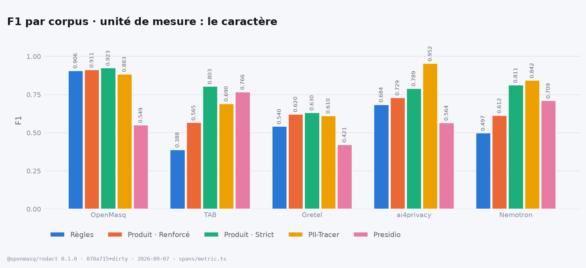
</picture>

| corpus | cas | `patterns` | **`ner`** (Renforcé) | `ner` (Strict) | PII-Tracer | Presidio |
|---|---:|---:|---:|---:|---:|---:|
| OpenMasq | 907 | 0.906 | 0.911 | 0.923 | 0.883 | 0.549 |
| TAB | 127 | 0.388 | 0.565 | 0.803 | 0.690 | 0.766 |
| Gretel | 2 000 | 0.540 | 0.620 | 0.630 | 0.610 | 0.421 |
| ai4privacy | 2 000 | 0.684 | 0.729 | 0.789 | 0.952 | 0.564 |
| Nemotron | 2 000 | 0.497 | 0.612 | 0.811 | 0.842 | 0.709 |

La figure porte la vue **toutes étiquettes**, celle qui se compare aux chiffres publiés.
Le même tableau sur le **périmètre du produit** — les étiquettes qu'il revendique masquer,
dates ordinaires, pays, professions et données démographiques retirés du dénominateur :

| corpus | cas | `patterns` | **`ner`** (Renforcé) | `ner` (Strict) | PII-Tracer | Presidio |
|---|---:|---:|---:|---:|---:|---:|
| OpenMasq | 907 | 0.908 | 0.913 | 0.925 | 0.884 | 0.550 |
| TAB | 127 | 0.526 | 0.797 | 0.819 | 0.543 | 0.621 |
| Gretel | 2 000 | 0.614 | 0.692 | 0.650 | 0.634 | 0.404 |
| ai4privacy | 2 000 | 0.749 | 0.792 | 0.819 | 0.952 | 0.575 |
| Nemotron | 2 000 | 0.595 | 0.715 | 0.871 | 0.894 | 0.748 |


**Presidio est désormais mesuré sur les cinq, et la cinquième colonne change la lecture.** Il
n'avait jamais tourné que sur notre corpus, où une installation anglaise par défaut affronte
quatorze langues et note 0,549 — un chiffre qui nous flattait par omission. Sur **TAB il note
0,766**, au-dessus du niveau par défaut de ce produit et à 0,04 de son niveau Strict : la prose
juridique anglaise, pleine d'organisations, de personnes et de dates, est exactement ce pour
quoi le modèle de spaCy a été entraîné. Sur Gretel il tombe à 0,421, là où sept langues
rencontrent une installation qui ne lit que l'anglais.

Cette configuration est `AnalyzerEngine()` avec ses reconnaisseurs prédéfinis et
`language="en"` — ce qu'un `pip install` donne, pas le plafond de Presidio, bibliothèque faite
pour recevoir des reconnaisseurs et des modèles. Chaque chiffre ici est ce défaut, sur chaque
corpus, et l'intérêt de le faire tourner partout est qu'une comparaison montrée sur un seul
corpus n'est pas une comparaison.

### Ce banc reproduit-il les chiffres publiés ?

<picture>
  <source media="(prefers-color-scheme: dark)" srcset="figures/reproduction-fr-dark.png">
  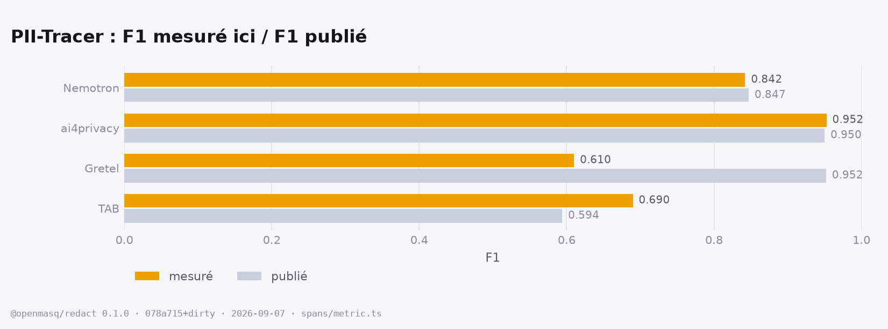
</picture>

| banc | mesuré ici | publié | écart |
|---|---:|---:|---:|
| TAB (ECHR) | 0.690 | 0.594 | 0.096 |
| Gretel | 0.610 | 0.952 | 0.342 |
| ai4privacy | 0.952 | 0.950 | 0.002 |
| Nemotron-PII | 0.842 | 0.847 | 0.005 |

**Deux sur quatre retombent à trois millièmes près.** La métrique a été écrite à partir de la
seule description de l'article : être d'accord avec son auteur sur ai4privacy et Nemotron-PII
est le seul contrôle externe disponible — et c'est ce qui rend les deux désaccords dignes
d'être écrits plutôt que tus.

- **TAB (0,690 ici, 0,594 publié).** TAB porte jusqu'à dix annotateurs par document et l'article
  ne dit pas comment il les regroupe ; ce banc en prend un (§ *Les jeux*). Sur cette ligne,
  comparez les colonnes entre elles, pas à l'article.
- **Gretel (0,610 ici, 0,952 publié).** Inexpliqué. Ce qui est mesurable : le rappel par
  étiquette de PII-Tracer y est de 96 à 100 % sur les e-mails, les IBAN et les adresses, et sa
  précision tombe à 0,606 sur les formats bancaires de machine à machine — MT940, SWIFT, EDI,
  FIX — où la vérité annote une adresse et où le reste du document est un mur de numéros de
  compte que personne n'a étiquetés. 5 % des documents portent 47 % de ses caractères faux
  positifs ; retirer ces formats remonte sa précision à 0,800 et son F1 à 0,671. Toujours pas 0,952.
- **⚠️ Et le 0,952 d'ai4privacy demande une réserve, dans les deux sens.** PII-Tracer y tient
  96 à 100 % sur les vingt-sept étiquettes — sexe, pays et coordonnées géographiques compris,
  qui n'ont aucune forme reconnaissable — avec 99 % de constance. C'est le profil d'un modèle
  mesuré dans sa propre distribution d'entraînement : l'article dit qu'il a appris sur des
  « exemples à enregistrement unique », ce qu'ai4privacy est exactement. Sur TAB, seul corpus
  ici fait de texte réel annoté à la main, le même modèle tombe à 0,529 de rappel.

### Précision contre rappel

<picture>
  <source media="(prefers-color-scheme: dark)" srcset="figures/precision-recall-fr-dark.png">
  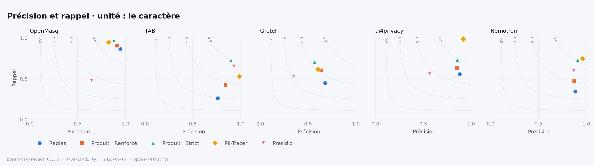
</picture>

Deux moteurs posés sur la même courbe d'iso-F1 partagent un nombre, pas un comportement. Il
n'y a pas d'**exactitude** utile ici : la classe négative, ce sont tous les autres caractères
du document, et tout moteur y ferait plus de 99 %.

### Trouver CHAQUE mention — la mesure introduite par PII-TRACE

<picture>
  <source media="(prefers-color-scheme: dark)" srcset="figures/consistency-fr-dark.png">
  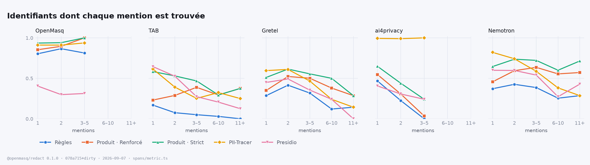
</picture>

Un identifiant ne compte que si **tous** ses caractères, dans **toutes** ses mentions, ont été
marqués. C'est la mesure sur laquelle un produit de masquage doit être jugé : une copie ratée
d'un nom, et le nom entier a fui. Le produit porte un coffre de conversation — une fois une
valeur dedans, chaque occurrence suivante est substituée sans être redétectée — et cela se voit
quand les courbes se croisent à mesure que la répétition augmente.

### Ce que chaque moteur coûte

<picture>
  <source media="(prefers-color-scheme: dark)" srcset="figures/latency-fr-dark.png">
  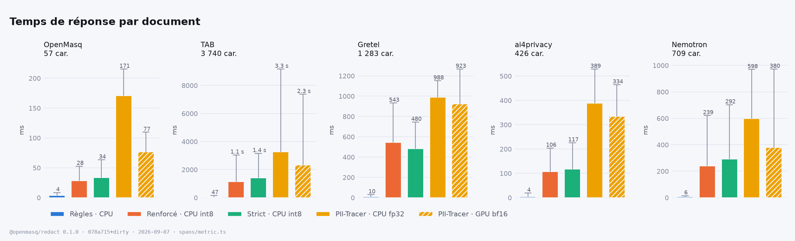
</picture>

| corpus | car. médians | `patterns`<br><sub>CPU</sub> | `ner` (Renforcé)<br><sub>CPU · int8</sub> | `ner` (Strict)<br><sub>CPU · int8</sub> | PII-Tracer<br><sub>CPU · fp32</sub> | PII-Tracer<br><sub>**GPU** · bf16</sub> |
|---|---:|---:|---:|---:|---:|---:|
| Notre corpus | 57 | 4 ms | 28 ms | 34 ms | 171 ms | 77 ms |
| TAB (ECHR) | 3 740 | 47 ms | 1.1 s | 1.4 s | 3.3 s | 2.3 s |
| Gretel | 1 283 | 10 ms | 543 ms | 480 ms | 988 ms | 923 ms |
| ai4privacy | 426 | 4 ms | 106 ms | 117 ms | 389 ms | 334 ms |
| Nemotron-PII | 709 | 6 ms | 239 ms | 292 ms | 598 ms | 380 ms |

⚠️ **Trois choses diffèrent entre ces colonnes, pas une** : l'appareil, le moteur d'exécution
et le type numérique. PII-Tracer est livré pour le GPU en bfloat16 sous PyTorch ; le produit
tourne sur le processeur, en entiers 8 bits via onnxruntime. Il est donc mesuré sur **les deux**
appareils, et c'est la colonne processeur qui se compare aux nôtres. Mesuré par `latency.mts` /
`pplx.py --latency` : un moteur à la fois, rien d'autre sur la machine, les mêmes documents,
une case d'échauffement écartée. Les temps par cas dans `results/<jeu>.<moteur>.json` ne sont
PAS cela — ils sont relevés pendant les passes de justesse, sous contention, et ne doivent
jamais être portés sur un graphique de latence.

### Chaque étiquette, chaque moteur

<picture>
  <source media="(prefers-color-scheme: dark)" srcset="figures/recall-by-label-fr-dark.png">
  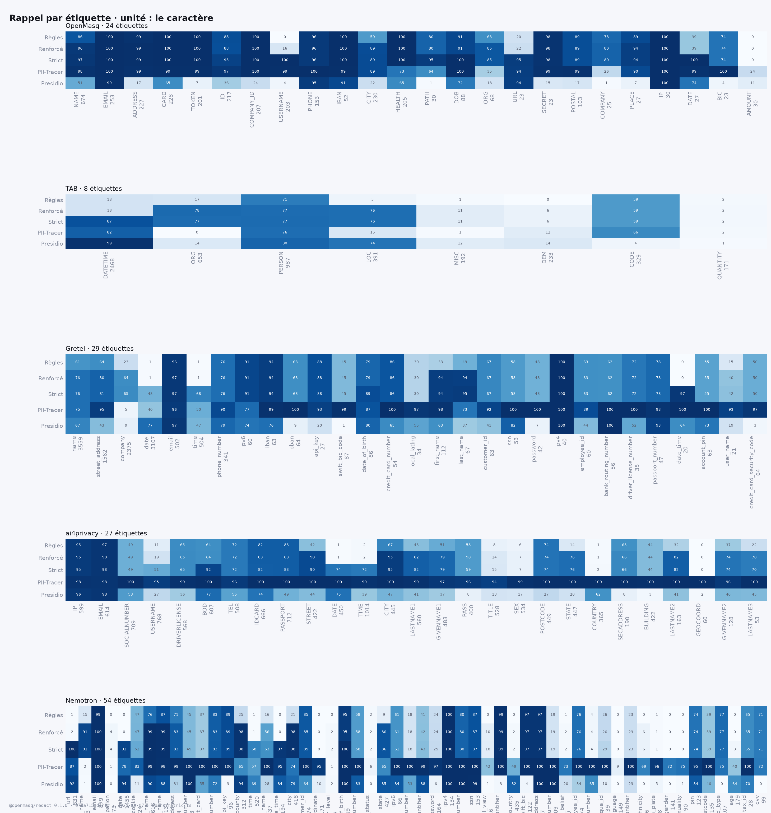
</picture>

<details>
<summary><b>Les tableaux complets</b> — par catégorie, par langue, par longueur, par nombre de mentions, pour chaque corpus</summary>

```
> openmasq@0.1.0 bench:spans /Users/thomasgaudibert/Desktop/info/OPENMASQ/openmasq
> tsx packages/redact/bench/spans/run.mts --replay --markdown


### ai4privacy — 2000 cases · 135871 annotated characters (115862 in the product's scope)

| metric | openmasq `patterns` | **openmasq `ner`** (the product, Renforcé) | openmasq `ner` (Strict) | PII-Tracer | Presidio (default) |
|---|---:|---:|---:|---:|---:|
| character precision | 0.881 | 0.854 | 0.857 | 0.920 | 0.568 |
| character recall · all labels | 0.558 | 0.636 | 0.732 | 0.987 | 0.561 |
| **character F1 · all labels** | **0.684** | **0.729** | **0.789** | **0.952** | **0.564** |
| character recall · product scope | 0.651 | 0.739 | 0.785 | 0.986 | 0.582 |
| character F1 · product scope | 0.749 | 0.792 | 0.819 | 0.952 | 0.575 |
| span-overlap F1 | 0.628 | 0.692 | 0.768 | 0.962 | 0.553 |
| span-containment F1 | 0.578 | 0.635 | 0.708 | 0.920 | 0.466 |
| recurring identifiers, every mention found | 19 % (228) | 27 % (228) | 41 % (228) | 99 % (228) | 30 % (228) |
| latency during this pass (ms/case) | 21.8 · 68.3 | 232.7 · 559.2 | 234.7 · 502.9 | 498.3 · 713.4 | 21.6 · 30.8 |

Identifiers whose every mention is fully covered, by number of mentions (all labels):

| mentions | openmasq `patterns` | **openmasq `ner`** (the product, Renforcé) | openmasq `ner` (Strict) | PII-Tracer | Presidio (default) |
|---|---:|---:|---:|---:|---:|
| 1 (12354) | 47 % | 55 % | 65 % | 99 % | 41 % |
| 2 (196) | 22 % | 31 % | 44 % | 99 % | 31 % |
| 3–5 (29) | 0 % | 3 % | 24 % | 100 % | 24 % |
| 6–10 (3) | 0 % | 0 % | 33 % | 67 % | 33 % |

Character F1 by language (all labels):

| language | openmasq `patterns` | **openmasq `ner`** (the product, Renforcé) | openmasq `ner` (Strict) | PII-Tracer | Presidio (default) |
|---|---:|---:|---:|---:|---:|
| de (1031) | 0.692 | 0.746 | 0.803 | 0.950 | 0.472 |
| en (969) | 0.674 | 0.709 | 0.774 | 0.955 | 0.703 |

Character recall by upstream label (spans · scope), all engines:

| label | openmasq `patterns` | **openmasq `ner`** (the product, Renforcé) | openmasq `ner` (Strict) | PII-Tracer | Presidio (default) |
|---|---:|---:|---:|---:|---:|
| IP (599 · in) | 95 % | 95 % | 95 % | 98 % | 96 % |
| EMAIL (614 · in) | 97 % | 98 % | 98 % | 98 % | 98 % |
| SOCIALNUMBER (709 · in) | 49 % | 49 % | 49 % | 100 % | 58 % |
| USERNAME (768 · in) | 11 % | 19 % | 51 % | 95 % | 27 % |
| DRIVERLICENSE (568 · in) | 65 % | 65 % | 65 % | 99 % | 36 % |
| BOD (607 · in) | 64 % | 64 % | 92 % | 100 % | 77 % |
| TEL (508 · in) | 72 % | 72 % | 72 % | 96 % | 55 % |
| IDCARD (666 · in) | 82 % | 83 % | 82 % | 100 % | 74 % |
| PASSPORT (712 · in) | 83 % | 83 % | 83 % | 100 % | 49 % |
| STREET (422 · in) | 42 % | 90 % | 90 % | 100 % | 44 % |
| DATE (450 · out) | 1 % | 1 % | 74 % | 100 % | 75 % |
| TIME (1014 · out) | 2 % | 2 % | 72 % | 99 % | 39 % |
| CITY (445 · in) | 67 % | 95 % | 95 % | 100 % | 47 % |
| LASTNAME1 (560 · in) | 43 % | 82 % | 82 % | 99 % | 41 % |
| GIVENNAME1 (483 · in) | 51 % | 79 % | 79 % | 97 % | 37 % |
| PASS (400 · in) | 58 % | 58 % | 59 % | 96 % | 8 % |
| TITLE (528 · out) | 8 % | 14 % | 15 % | 94 % | 18 % |
| SEX (534 · out) | 6 % | 7 % | 7 % | 99 % | 17 % |
| POSTCODE (449 · in) | 74 % | 74 % | 74 % | 100 % | 27 % |
| STATE (447 · in) | 14 % | 76 % | 76 % | 100 % | 20 % |
| COUNTRY (365 · out) | 1 % | 1 % | 2 % | 100 % | 62 % |
| SECADDRESS (190 · in) | 63 % | 66 % | 66 % | 100 % | 8 % |
| BUILDING (422 · in) | 44 % | 44 % | 44 % | 100 % | 3 % |
| LASTNAME2 (163 · in) | 32 % | 82 % | 82 % | 100 % | 41 % |
| GEOCOORD (60 · out) | 0 % | 0 % | 0 % | 100 % | 2 % |
| GIVENNAME2 (128 · in) | 37 % | 74 % | 74 % | 96 % | 46 % |
| LASTNAME3 (53 · in) | 22 % | 70 % | 70 % | 100 % | 45 % |

### gretel — 2000 cases · 212640 annotated characters (169592 in the product's scope)

| metric | openmasq `patterns` | **openmasq `ner`** (the product, Renforcé) | openmasq `ner` (Strict) | PII-Tracer | Presidio (default) |
|---|---:|---:|---:|---:|---:|
| character precision | 0.679 | 0.639 | 0.569 | 0.606 | 0.350 |
| character recall · all labels | 0.449 | 0.603 | 0.707 | 0.614 | 0.529 |
| **character F1 · all labels** | **0.540** | **0.620** | **0.630** | **0.610** | **0.421** |
| character recall · product scope | 0.560 | 0.753 | 0.757 | 0.663 | 0.477 |
| character F1 · product scope | 0.614 | 0.692 | 0.650 | 0.634 | 0.404 |
| span-overlap F1 | 0.525 | 0.582 | 0.636 | 0.581 | 0.501 |
| span-containment F1 | 0.411 | 0.472 | 0.535 | 0.531 | 0.407 |
| recurring identifiers, every mention found | 37 % (1870) | 51 % (1870) | 59 % (1870) | 55 % (1870) | 44 % (1870) |
| latency during this pass (ms/case) | 29.1 · 86.3 | 1177.8 · 2373.3 | 1191.7 · 2386.5 | 1464.4 · 1880 | 57.7 · 86.8 |

Identifiers whose every mention is fully covered, by number of mentions (all labels):

| mentions | openmasq `patterns` | **openmasq `ner`** (the product, Renforcé) | openmasq `ner` (Strict) | PII-Tracer | Presidio (default) |
|---|---:|---:|---:|---:|---:|
| 1 (7977) | 29 % | 35 % | 51 % | 60 % | 45 % |
| 2 (1236) | 42 % | 52 % | 61 % | 61 % | 49 % |
| 3–5 (519) | 32 % | 50 % | 55 % | 47 % | 35 % |
| 6–10 (108) | 12 % | 38 % | 50 % | 24 % | 24 % |
| 11+ (7) | 14 % | 29 % | 29 % | 14 % | 0 % |

Character P / R / F1 by text length (all labels):

| length | openmasq `patterns` | **openmasq `ner`** (the product, Renforcé) | openmasq `ner` (Strict) | PII-Tracer | Presidio (default) |
|---|---:|---:|---:|---:|---:|
| 1k–10k (1427) | 0.745 / 0.436 / 0.550 | 0.670 / 0.591 / 0.628 | 0.589 / 0.688 / 0.634 | 0.795 / 0.561 / 0.658 | 0.344 / 0.526 / 0.416 |
| <1k (573) | 0.536 / 0.493 / 0.514 | 0.558 / 0.645 / 0.598 | 0.516 / 0.772 / 0.619 | 0.385 / 0.793 / 0.519 | 0.372 / 0.541 / 0.441 |

Character F1 by language (all labels):

| language | openmasq `patterns` | **openmasq `ner`** (the product, Renforcé) | openmasq `ner` (Strict) | PII-Tracer | Presidio (default) |
|---|---:|---:|---:|---:|---:|
| en (1033) | 0.546 | 0.613 | 0.636 | 0.632 | 0.543 |
| de (187) | 0.548 | 0.635 | 0.658 | 0.631 | 0.315 |
| sv (161) | 0.506 | 0.636 | 0.620 | 0.599 | 0.356 |
| nl (156) | 0.484 | 0.577 | 0.553 | 0.510 | 0.316 |
| it (159) | 0.573 | 0.626 | 0.622 | 0.567 | 0.305 |
| es (166) | 0.499 | 0.618 | 0.613 | 0.551 | 0.284 |
| fr (138) | 0.589 | 0.685 | 0.687 | 0.648 | 0.412 |

Character recall by upstream label (spans · scope), all engines:

| label | openmasq `patterns` | **openmasq `ner`** (the product, Renforcé) | openmasq `ner` (Strict) | PII-Tracer | Presidio (default) |
|---|---:|---:|---:|---:|---:|
| name (3559 · in) | 61 % | 76 % | 76 % | 75 % | 67 % |
| street_address (1562 · in) | 64 % | 80 % | 81 % | 95 % | 43 % |
| company (2375 · in) | 23 % | 64 % | 65 % | 5 % | 9 % |
| date (3107 · out) | 1 % | 1 % | 48 % | 40 % | 77 % |
| email (502 · in) | 96 % | 97 % | 97 % | 96 % | 97 % |
| time (504 · out) | 1 % | 1 % | 68 % | 50 % | 47 % |
| phone_number (341 · in) | 76 % | 76 % | 76 % | 90 % | 79 % |
| ipv6 (60 · in) | 91 % | 91 % | 91 % | 77 % | 74 % |
| iban (63 · in) | 94 % | 94 % | 94 % | 99 % | 76 % |
| bban (64 · in) | 63 % | 63 % | 63 % | 100 % | 9 % |
| api_key (27 · in) | 88 % | 88 % | 88 % | 93 % | 20 % |
| swift_bic_code (87 · in) | 45 % | 45 % | 45 % | 99 % | 1 % |
| date_of_birth (86 · in) | 79 % | 79 % | 89 % | 87 % | 80 % |
| credit_card_number (54 · in) | 86 % | 86 % | 86 % | 100 % | 65 % |
| local_latlng (34 · in) | 30 % | 30 % | 30 % | 97 % | 55 % |
| first_name (112 · in) | 33 % | 94 % | 94 % | 98 % | 63 % |
| last_name (67 · in) | 49 % | 94 % | 95 % | 73 % | 37 % |
| customer_id (63 · in) | 67 % | 67 % | 67 % | 92 % | 41 % |
| ssn (53 · in) | 58 % | 58 % | 58 % | 100 % | 82 % |
| password (42 · in) | 48 % | 48 % | 48 % | 100 % | 7 % |
| ipv4 (40 · in) | 100 % | 100 % | 100 % | 100 % | 100 % |
| employee_id (60 · in) | 63 % | 63 % | 63 % | 89 % | 44 % |
| bank_routing_number (56 · in) | 63 % | 63 % | 63 % | 100 % | 100 % |
| driver_license_number (35 · in) | 72 % | 72 % | 72 % | 100 % | 52 % |
| passport_number (47 · in) | 78 % | 78 % | 78 % | 98 % | 93 % |
| date_time (20 · out) | 0 % | 0 % | 97 % | 100 % | 64 % |
| account_pin (63 · in) | 55 % | 55 % | 55 % | 100 % | 73 % |
| user_name (21 · in) | 15 % | 40 % | 42 % | 93 % | 19 % |
| credit_card_security_code (64 · in) | 50 % | 50 % | 50 % | 97 % | 3 % |

### internal — 907 cases · 49588 annotated characters (49392 in the product's scope)

| metric | openmasq `patterns` | **openmasq `ner`** (the product, Renforcé) | openmasq `ner` (Strict) | PII-Tracer | Presidio (default) |
|---|---:|---:|---:|---:|---:|
| character precision | 0.947 | 0.913 | 0.881 | 0.826 | 0.648 |
| character recall · all labels | 0.868 | 0.909 | 0.970 | 0.949 | 0.477 |
| **character F1 · all labels** | **0.906** | **0.911** | **0.923** | **0.883** | **0.549** |
| character recall · product scope | 0.872 | 0.912 | 0.974 | 0.952 | 0.478 |
| character F1 · product scope | 0.908 | 0.913 | 0.925 | 0.884 | 0.550 |
| span-overlap F1 | 0.886 | 0.897 | 0.913 | 0.877 | 0.553 |
| span-containment F1 | 0.851 | 0.853 | 0.875 | 0.782 | 0.469 |
| recurring identifiers, every mention found | 86 % (83) | 92 % (83) | 95 % (83) | 92 % (83) | 30 % (83) |
| latency during this pass (ms/case) | 5.4 · 20.3 | 102 · 400.5 | 103.8 · 418.3 | 147.8 · 297.7 | 0 · 0 |

Identifiers whose every mention is fully covered, by number of mentions (all labels):

| mentions | openmasq `patterns` | **openmasq `ner`** (the product, Renforcé) | openmasq `ner` (Strict) | PII-Tracer | Presidio (default) |
|---|---:|---:|---:|---:|---:|
| 1 (3159) | 80 % | 85 % | 94 % | 91 % | 40 % |
| 2 (67) | 87 % | 90 % | 94 % | 91 % | 30 % |
| 3–5 (16) | 81 % | 100 % | 100 % | 94 % | 31 % |

Character P / R / F1 by text length (all labels):

| length | openmasq `patterns` | **openmasq `ner`** (the product, Renforcé) | openmasq `ner` (Strict) | PII-Tracer | Presidio (default) |
|---|---:|---:|---:|---:|---:|
| 1k–10k (27) | 0.983 / 0.988 / 0.986 | 0.912 / 0.994 / 0.951 | 0.860 / 1.000 / 0.925 | 0.757 / 0.964 / 0.848 | 0.414 / 0.717 / 0.525 |
| <1k (880) | 0.945 / 0.862 / 0.901 | 0.913 / 0.904 / 0.909 | 0.882 / 0.968 / 0.923 | 0.830 / 0.948 / 0.885 | 0.681 / 0.464 / 0.552 |

Character F1 by language (all labels):

| language | openmasq `patterns` | **openmasq `ner`** (the product, Renforcé) | openmasq `ner` (Strict) | PII-Tracer | Presidio (default) |
|---|---:|---:|---:|---:|---:|
| fr (468) | 0.902 | 0.914 | 0.915 | 0.861 | 0.572 |
| en (215) | 0.898 | 0.910 | 0.938 | 0.916 | 0.528 |
| de (47) | 0.926 | 0.916 | 0.936 | 0.877 | 0.464 |
| es (32) | 0.929 | 0.895 | 0.925 | 0.922 | 0.497 |
| it (29) | 0.982 | 0.925 | 0.931 | 0.918 | 0.569 |
| pt (30) | 0.877 | 0.856 | 0.940 | 0.937 | 0.509 |
| nl (24) | 0.963 | 0.945 | 0.963 | 0.932 | 0.432 |
| pl (10) | 1.000 | 0.988 | 0.988 | 0.988 | 0.671 |
| sv (6) | 1.000 | 0.824 | 0.824 | 0.988 | 0.537 |
| da (5) | 1.000 | 1.000 | 1.000 | 0.995 | 0.634 |
| zh (17) | 0.372 | 0.441 | 0.430 | 0.545 | 0.411 |
| ko (11) | 0.756 | 0.800 | 0.800 | 0.738 | 0.407 |
| ja (12) | 0.323 | 0.490 | 0.490 | 0.436 | 0.529 |
| ru (1) | 0.000 | 1.000 | 1.000 | 0.739 | 0.000 |

Character recall by upstream label (spans · scope), all engines:

| label | openmasq `patterns` | **openmasq `ner`** (the product, Renforcé) | openmasq `ner` (Strict) | PII-Tracer | Presidio (default) |
|---|---:|---:|---:|---:|---:|
| NAME (674 · in) | 86 % | 96 % | 97 % | 98 % | 51 % |
| EMAIL (253 · in) | 100 % | 100 % | 100 % | 100 % | 99 % |
| ADDRESS (227 · in) | 99 % | 99 % | 99 % | 99 % | 17 % |
| CARD (228 · in) | 100 % | 100 % | 100 % | 99 % | 65 % |
| TOKEN (201 · in) | 100 % | 100 % | 100 % | 99 % | 7 % |
| ID (217 · in) | 88 % | 88 % | 93 % | 97 % | 36 % |
| COMPANY_ID (207 · in) | 100 % | 100 % | 100 % | 100 % | 24 % |
| USERNAME (203 · in) | 0 % | 16 % | 100 % | 99 % | 4 % |
| PHONE (153 · in) | 96 % | 96 % | 96 % | 100 % | 95 % |
| IBAN (52 · in) | 100 % | 100 % | 100 % | 99 % | 91 % |
| CITY (230 · in) | 59 % | 89 % | 89 % | 89 % | 22 % |
| HEALTH (205 · in) | 100 % | 100 % | 100 % | 73 % | 65 % |
| PATH (30 · in) | 80 % | 80 % | 95 % | 64 % | 1 % |
| DOB (88 · in) | 91 % | 91 % | 100 % | 100 % | 72 % |
| ORG (68 · in) | 63 % | 85 % | 85 % | 35 % | 18 % |
| URL (23 · in) | 20 % | 22 % | 95 % | 94 % | 94 % |
| SECRET (23 · in) | 98 % | 98 % | 98 % | 99 % | 15 % |
| POSTAL (103 · in) | 89 % | 89 % | 89 % | 99 % | 17 % |
| COMPANY (25 · in) | 78 % | 80 % | 80 % | 26 % | 1 % |
| PLACE (27 · in) | 89 % | 94 % | 94 % | 90 % | 7 % |
| IP (30 · in) | 100 % | 100 % | 100 % | 100 % | 100 % |
| DATE (27 · in) | 39 % | 39 % | 100 % | 99 % | 74 % |
| BIC (23 · in) | 74 % | 74 % | 74 % | 100 % | 4 % |
| AMOUNT (30 · out) | 0 % | 0 % | 0 % | 24 % | 11 % |

### nemotron — 2000 cases · 242739 annotated characters (187018 in the product's scope)

| metric | openmasq `patterns` | **openmasq `ner`** (the product, Renforcé) | openmasq `ner` (Strict) | PII-Tracer | Presidio (default) |
|---|---:|---:|---:|---:|---:|
| character precision | 0.886 | 0.875 | 0.912 | 0.965 | 0.871 |
| character recall · all labels | 0.345 | 0.470 | 0.731 | 0.747 | 0.598 |
| **character F1 · all labels** | **0.497** | **0.612** | **0.811** | **0.842** | **0.709** |
| character recall · product scope | 0.447 | 0.605 | 0.833 | 0.833 | 0.656 |
| character F1 · product scope | 0.595 | 0.715 | 0.871 | 0.894 | 0.748 |
| span-overlap F1 | 0.562 | 0.683 | 0.802 | 0.857 | 0.751 |
| span-containment F1 | 0.496 | 0.604 | 0.726 | 0.801 | 0.651 |
| recurring identifiers, every mention found | 41 % (2276) | 60 % (2276) | 73 % (2276) | 68 % (2276) | 56 % (2276) |
| latency during this pass (ms/case) | 35.1 · 85.8 | 469.6 · 1369.8 | 481.1 · 1307.7 | 678 · 1548.5 | 34.5 · 87 |

Identifiers whose every mention is fully covered, by number of mentions (all labels):

| mentions | openmasq `patterns` | **openmasq `ner`** (the product, Renforcé) | openmasq `ner` (Strict) | PII-Tracer | Presidio (default) |
|---|---:|---:|---:|---:|---:|
| 1 (10821) | 37 % | 46 % | 65 % | 82 % | 60 % |
| 2 (1498) | 43 % | 59 % | 74 % | 74 % | 60 % |
| 3–5 (661) | 39 % | 64 % | 72 % | 59 % | 54 % |
| 6–10 (110) | 25 % | 55 % | 60 % | 38 % | 27 % |
| 11+ (7) | 29 % | 57 % | 71 % | 29 % | 43 % |

Character P / R / F1 by text length (all labels):

| length | openmasq `patterns` | **openmasq `ner`** (the product, Renforcé) | openmasq `ner` (Strict) | PII-Tracer | Presidio (default) |
|---|---:|---:|---:|---:|---:|
| 1k–10k (675) | 0.885 / 0.300 / 0.447 | 0.861 / 0.449 / 0.591 | 0.903 / 0.719 / 0.801 | 0.975 / 0.661 / 0.788 | 0.833 / 0.551 / 0.663 |
| <1k (1325) | 0.888 / 0.388 / 0.540 | 0.887 / 0.490 / 0.631 | 0.920 / 0.742 / 0.821 | 0.957 / 0.828 / 0.888 | 0.904 / 0.642 / 0.751 |

Character recall by upstream label (spans · scope), all engines:

| label | openmasq `patterns` | **openmasq `ner`** (the product, Renforcé) | openmasq `ner` (Strict) | PII-Tracer | Presidio (default) |
|---|---:|---:|---:|---:|---:|
| url (831 · in) | 1 % | 2 % | 100 % | 87 % | 92 % |
| company_name (1043 · in) | 15 % | 91 % | 91 % | 2 % | 1 % |
| email (879 · in) | 99 % | 100 % | 100 % | 100 % | 100 % |
| occupation (773 · out) | 0 % | 4 % | 4 % | 1 % | 0 % |
| date (1455 · out) | 0 % | 0 % | 92 % | 78 % | 94 % |
| http_cookie (124 · in) | 47 % | 47 % | 52 % | 83 % | 11 % |
| first_name (1616 · in) | 76 % | 99 % | 99 % | 99 % | 90 % |
| last_name (1131 · in) | 87 % | 99 % | 99 % | 98 % | 88 % |
| street_address (354 · in) | 71 % | 83 % | 83 % | 99 % | 31 % |
| phone_number (448 · in) | 45 % | 45 % | 45 % | 100 % | 100 % |
| credit_debit_card (271 · in) | 37 % | 37 % | 37 % | 100 % | 55 % |
| account_number (403 · in) | 83 % | 83 % | 83 % | 100 % | 72 % |
| api_key (96 · in) | 89 % | 89 % | 89 % | 100 % | 3 % |
| county (312 · in) | 25 % | 98 % | 98 % | 65 % | 94 % |
| time (520 · out) | 1 % | 1 % | 68 % | 57 % | 69 % |
| user_name (337 · in) | 16 % | 56 % | 63 % | 100 % | 28 % |
| date_time (194 · out) | 0 % | 0 % | 97 % | 95 % | 84 % |
| city (418 · in) | 21 % | 98 % | 98 % | 74 % | 79 % |
| customer_id (374 · in) | 85 % | 85 % | 85 % | 100 % | 64 % |
| coordinate (171 · out) | 0 % | 0 % | 0 % | 95 % | 10 % |
| education_level (225 · out) | 0 % | 2 % | 2 % | 1 % | 2 % |
| date_of_birth (269 · in) | 95 % | 95 % | 100 % | 100 % | 100 % |
| medical_record_number (245 · in) | 58 % | 58 % | 58 % | 100 % | 83 % |
| employment_status (262 · out) | 2 % | 2 % | 2 % | 6 % | 0 % |
| state (427 · in) | 9 % | 86 % | 86 % | 65 % | 85 % |
| ipv6 (66 · in) | 61 % | 61 % | 61 % | 100 % | 84 % |
| health_plan_beneficiary_number (169 · in) | 18 % | 18 % | 18 % | 100 % | 53 % |
| biometric_identifier (172 · in) | 41 % | 42 % | 43 % | 99 % | 88 % |
| password (164 · in) | 24 % | 24 % | 25 % | 97 % | 6 % |
| ipv4 (134 · in) | 100 % | 100 % | 100 % | 100 % | 100 % |
| bank_routing_number (191 · in) | 80 % | 80 % | 80 % | 100 % | 100 % |
| ssn (153 · in) | 87 % | 87 % | 87 % | 100 % | 99 % |
| political_view (116 · out) | 0 % | 10 % | 10 % | 42 % | 1 % |
| vehicle_identifier (91 · in) | 99 % | 99 % | 99 % | 100 % | 3 % |
| country (435 · out) | 0 % | 2 % | 2 % | 49 % | 82 % |
| swift_bic (122 · in) | 97 % | 97 % | 97 % | 100 % | 4 % |
| mac_address (77 · in) | 97 % | 97 % | 97 % | 100 % | 100 % |
| fax_number (109 · in) | 19 % | 19 % | 19 % | 100 % | 100 % |
| religious_belief (110 · out) | 1 % | 2 % | 2 % | 73 % | 20 % |
| employee_id (174 · in) | 76 % | 76 % | 76 % | 100 % | 34 % |
| certificate_license_number (113 · in) | 4 % | 4 % | 4 % | 100 % | 65 % |
| unique_id (39 · in) | 26 % | 26 % | 29 % | 100 % | 10 % |
| language (149 · out) | 0 % | 0 % | 0 % | 9 % | 0 % |
| device_identifier (47 · in) | 23 % | 23 % | 23 % | 100 % | 23 % |
| race_ethnicity (156 · out) | 0 % | 6 % | 6 % | 69 % | 0 % |
| license_plate (98 · in) | 1 % | 1 % | 1 % | 96 % | 5 % |
| gender (141 · out) | 0 % | 0 % | 0 % | 72 % | 0 % |
| sexuality (90 · out) | 0 % | 0 % | 0 % | 75 % | 1 % |
| pin (123 · in) | 74 % | 74 % | 74 % | 95 % | 84 % |
| postcode (135 · in) | 39 % | 39 % | 39 % | 100 % | 46 % |
| blood_type (107 · in) | 77 % | 77 % | 77 % | 75 % | 0 % |
| age (179 · out) | 0 % | 0 % | 3 % | 40 % | 64 % |
| tax_id (28 · in) | 65 % | 65 % | 65 % | 100 % | 70 % |
| cvv (99 · in) | 71 % | 71 % | 71 % | 72 % | 0 % |

### tab — 127 cases · 72746 annotated characters (32423 in the product's scope)

| metric | openmasq `patterns` | **openmasq `ner`** (the product, Renforcé) | openmasq `ner` (Strict) | PII-Tracer | Presidio (default) |
|---|---:|---:|---:|---:|---:|
| character precision | 0.762 | 0.842 | 0.898 | 0.989 | 0.930 |
| character recall · all labels | 0.260 | 0.425 | 0.726 | 0.529 | 0.652 |
| **character F1 · all labels** | **0.388** | **0.565** | **0.803** | **0.690** | **0.766** |
| character recall · product scope | 0.402 | 0.757 | 0.753 | 0.374 | 0.467 |
| character F1 · product scope | 0.526 | 0.797 | 0.819 | 0.543 | 0.621 |
| span-overlap F1 | 0.470 | 0.638 | 0.852 | 0.717 | 0.816 |
| span-containment F1 | 0.252 | 0.418 | 0.686 | 0.695 | 0.699 |
| recurring identifiers, every mention found | 6 % (500) | 32 % (500) | 49 % (500) | 35 % (500) | 43 % (500) |
| latency during this pass (ms/case) | 92.1 · 260.2 | 1905.3 · 4359.1 | 1982.7 · 4658.6 | 3126.3 · 8939 | 147.4 · 349.9 |

Identifiers whose every mention is fully covered, by number of mentions (all labels):

| mentions | openmasq `patterns` | **openmasq `ner`** (the product, Renforcé) | openmasq `ner` (Strict) | PII-Tracer | Presidio (default) |
|---|---:|---:|---:|---:|---:|
| 1 (3925) | 17 % | 23 % | 58 % | 61 % | 64 % |
| 2 (319) | 8 % | 29 % | 53 % | 39 % | 53 % |
| 3–5 (139) | 5 % | 39 % | 47 % | 25 % | 27 % |
| 6–10 (34) | 3 % | 29 % | 29 % | 32 % | 21 % |
| 11+ (8) | 0 % | 38 % | 38 % | 25 % | 13 % |

Character P / R / F1 by text length (all labels):

| length | openmasq `patterns` | **openmasq `ner`** (the product, Renforcé) | openmasq `ner` (Strict) | PII-Tracer | Presidio (default) |
|---|---:|---:|---:|---:|---:|
| 1k–10k (117) | 0.766 / 0.260 / 0.388 | 0.847 / 0.426 / 0.567 | 0.902 / 0.724 / 0.803 | 0.989 / 0.535 / 0.695 | 0.930 / 0.646 / 0.762 |
| ≥10k (10) | 0.737 / 0.260 / 0.385 | 0.803 / 0.424 / 0.555 | 0.877 / 0.734 / 0.799 | 0.996 / 0.489 / 0.656 | 0.933 / 0.691 / 0.794 |

Character recall by upstream label (spans · scope), all engines:

| label | openmasq `patterns` | **openmasq `ner`** (the product, Renforcé) | openmasq `ner` (Strict) | PII-Tracer | Presidio (default) |
|---|---:|---:|---:|---:|---:|
| DATETIME (2468 · out/ctx) | 18 % | 18 % | 87 % | 82 % | 99 % |
| ORG (653 · ctx/in) | 17 % | 78 % | 77 % | 0 % | 14 % |
| PERSON (987 · in/ctx) | 71 % | 77 % | 77 % | 76 % | 80 % |
| LOC (391 · in/ctx) | 5 % | 76 % | 76 % | 15 % | 74 % |
| MISC (192 · out/ctx) | 1 % | 11 % | 11 % | 1 % | 12 % |
| DEM (233 · ctx/out) | 0 % | 6 % | 6 % | 12 % | 14 % |
| CODE (329 · in/ctx) | 59 % | 59 % | 59 % | 66 % | 4 % |
| QUANTITY (171 · out/ctx) | 2 % | 2 % | 2 % | 2 % | 1 % |
```

</details>


## Les lire

> [!WARNING]
> **Lisez les colonnes les unes contre les autres, et lisez les deux vues.** Un F1 unique
> cache lesquelles de vos données sont protégées, et sur ces corpus la réponse change avec ce
> que l'annotation a décidé d'appeler personnel.
>
> - **Un des quatre chiffres publiés par Perplexity se reproduit ici ; trois non.** Ils
>   annoncent un F1 caractère de 0,847 pour PII-Tracer sur Nemotron-PII, et ce banc mesure
>   0,847 sur la même partition, avec une implémentation de la métrique écrite à partir de
>   leur seule description. Sur ai4privacy, Gretel et TAB, il ne retombe pas sur leur chiffre.
>   Les notes ci-dessous disent ce qui diffère sur chacun. Un accord sur quatre, c'est la
>   raison pour laquelle cette page compare les colonnes entre elles plutôt qu'à l'article.
>
> - **TAB est le seul corpus ici fait de texte réel annoté à la main — et sa vérité est une
>   annotation de risque de réidentification, pas une liste de données personnelles.** Les
>   organisations pèsent 36 % des caractères annotés et les dates ordinaires 30 %, et le
>   produit ne masque pas les dates ordinaires, à dessein. D'où les deux lignes : toutes
>   étiquettes, 0,535 pour le produit contre 0,690 pour PII-Tracer ; sur le périmètre que le
>   produit revendique, 0,749 contre 0,543. Le renversement est une divergence de doctrine,
>   pas de détection. Et 2 141 des 7 565 mentions de TAB sont annotées `NO_MASK` — le banc les
>   traite en contexte, ni vérité ni erreur. Cette convention vaut 0,096 de F1 caractère au
>   produit et 0,006 à PII-Tracer, parce que le produit marque les organisations et que
>   PII-Tracer n'a pas d'étiquette pour elles. Les compter comme des erreurs donne 0,439 et
>   0,684. Les deux lectures sont là ; choisissez celle que vous croyez.
>
> - **Sur Gretel, ce qui sépare les colonnes est la précision, pas le rappel.** Le rappel
>   caractère de PII-Tracer par étiquette est de 96 % sur les e-mails, 99 % sur les IBAN, 95 %
>   sur les adresses — et 5 % sur les noms d'entreprise, que ses neuf étiquettes ne couvrent
>   pas. Sa précision tombe à 0,606 à cause des formats bancaires de machine à machine :
>   relevés MT940, messages SWIFT, charges EDI et FIX, où la vérité annote une adresse et où
>   le reste du document est un mur de numéros de compte que personne n'a étiquetés. 5 % des
>   documents portent 47 % de ses caractères faux positifs ; retirer ces formats remonte sa
>   précision à 0,800. Lisez la précision sur Gretel comme un énoncé sur la couverture de
>   l'annotation autant que sur la retenue du moteur.
>
> - **Sur notre propre corpus, le modèle achète du rappel et paie de la précision, et le F1
>   caractère ne bouge pas.** Règles seules 0,935, règles plus NER locale 0,935 — rappel 0,934
>   puis 0,967, précision 0,936 puis 0,905. Le banc au niveau des valeurs lit le même
>   événement comme 89 % puis 95 %. Les deux sont vrais : une métrique caractère facture
>   chaque caractère de trop que le modèle peint autour d'un nom, une métrique valeur non.
>
> - **La constance s'inverse quand une mention se répète.** Sur TAB, PII-Tracer trouve toutes
>   les mentions de 61 % des identifiants cités une fois, contre 19 % pour le produit ; à
>   trois à cinq mentions, c'est 25 % contre 39 %. Gretel dit la même chose, 60 % contre 33 %
>   à une mention et 47 % contre 51 % à trois à cinq. Le produit porte un coffre de
>   conversation : une fois une valeur dedans, chaque occurrence suivante est substituée sans
>   être redétectée. C'est une différence de conception, et la répétition est exactement l'axe
>   que PII-TRACE a été bâti pour mesurer.
>
> - **Ces bancs ont trouvé un défaut chez nous.** `Bitcoin` et `ISA` sont substitués dans une
>   phrase d'une ligne, alors que le comportement documenté laisse en clair les grandes
>   marques et les acronymes courants hors du niveau Strict. C'est une petite part des faux
>   positifs et c'est réel ; c'était invisible sur un corpus que nous écrivons nous-mêmes.
>
> **Quels que soient les chiffres, la détection n'est pas une garantie.** Le Coffre — les
> termes que vous marquez vous-même — est la seule promesse de couverture que le produit fait
> pour une chaîne donnée.

## Rejouer, régénérer

Mêmes commandes que ci-dessus. `figures/` porte six figures × **anglais et français** × thème clair et sombre (PNG,
192 ppp), plus le manifeste qui les rattache à une version du moteur. Une figure porte des
valeurs, des barres, un nom d'axe et une légende — jamais une phrase : ce qu'elle signifie est
ici, où cela se traduit et se corrige, pas cuit dans une image.
Elles sont COMMITÉES pour qu'un lecteur les voie sans rien exécuter ; le script qui les dessine
vit hors de ce dépôt, et tout ce dont il a besoin est `results/scores.json`
(`pnpm bench:spans --replay --json`).

`results/<jeu>.<moteur>.json` est la référence de chaque chiffre : spans prédits par cas, machine, date, latence par cas. `predict.ts` dit comment un
span est dérivé de ce que le moteur a remplacé (le coffre, rejoué avec les règles de
substitution du moteur — aucun offset n'est inventé).
