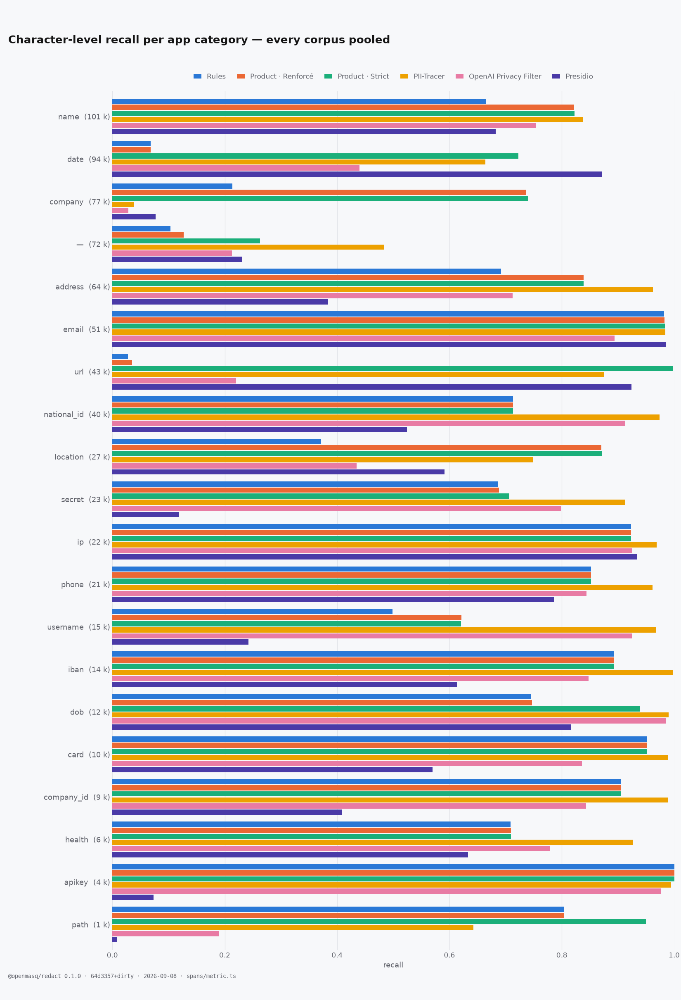

# `@openmasq/redact` — the public benchmarks

<sub>**English** · [Français](#openmasqredact--les-bancs-publics) · [openmasq.com](https://openmasq.com)</sub>

How well this engine finds personal data, measured on four public datasets and on our own,
next to two other detectors. Every number here comes from one scorer and replays offline:

```bash
pnpm bench:spans --replay --markdown
```

## What is measured

Three questions, three numbers. They do not rank the engines the same way, and that is the
point of showing all three.

| | what it asks |
|---|---|
| **F1** | Of the characters an engine marked, how many were personal data — and of the personal data, how much did it mark? Partial credit: a name half marked scores half. |
| **contained** | Did it mark the **whole** value? A name with the surname left in clear counts as a miss. |
| **every mention** | Did it mark **every copy** of that value in the document? One copy missed leaks the whole thing. |

The first is how the literature compares detectors, so it is the one that can sit beside
published figures. The last is what a redaction product actually promises.

Two views of every dataset, and picking the wrong one is how a benchmark lies.

**The app's categories** is the number to compare engines on. Each corpus annotates its own
idea of personal data — Gretel counts a company name, Nemotron annotates occupation, religion
and political view, TAB marks every date — so every upstream label is mapped onto one of the
categories this app actually has a switch for (`adapt.py` holds the mapping, label by label,
and refuses to derive a corpus carrying one it has never been shown). Read through that one
vocabulary, four corpora ask the product the same question.

**Every upstream label** counts everything the annotators marked, including what no category
of the app covers. It is comparable to a figure someone else published on the same corpus, and
to nothing else — pooled over four different definitions of what personal data is, it measures
the distance between taxonomies at least as much as the engines.

Precision is the same in both: an engine is never charged for marking real personal data we
chose not to score. What it IS charged for is marking text the corpus annotates nowhere — and
on some corpora that is where most of the precision goes (see Gretel below).

The product is measured **as it ships**: the app's own level arithmetic, including the
categories forced off in a shipped build. `health` is one of them — the corpora annotate
medical record numbers and blood types, the product no longer redacts them, and the
per-category table shows that hole rather than hiding it.

## The corpora

Five. One we wrote, four public, and only one made of real text.

| | what it is | cases | median length |
|---|---|---:|---:|
| **OpenMasq** | our own: French forms, payslips, deeds, lab results, tool output, OCR damage. Synthetic. | 907 | 125 |
| **TAB** | European Court of Human Rights judgments, annotated by people. **The only real text here.** | 127 | 3 886 |
| **Gretel** | synthetic finance: invoices, statements, and machine formats (MT940, SWIFT, EDI). 7 languages. | 5 594 | 1 306 |
| **ai4privacy** | dense synthetic records, 6 languages. Every value sits beside a label. | 6 000 | 426 |
| **Nemotron** | English documents across 50 industries, 55 label types. | 6 000 | 752 |

Three of them need a caveat before you read their numbers.

- **TAB** was annotated to anonymise a ruling, not to list personal data. Annotators marked
  anything that could identify the applicant, so organisations are 36 % of it and plain dates
  30 %. Mentions they judged safe to leave are counted here as neither hit nor error.
- **Gretel** leaves the account numbers in its machine formats unlabelled. Precision there
  measures how complete the annotation is, as much as how careful an engine is.
- **ai4privacy** puts a label beside every value, which makes it the easiest of the five for a
  model trained on that shape.

**Presidio means Presidio + spaCy.** A bare `AnalyzerEngine()` loads `en_core_web_lg` as its
NLP engine: every name, place and organisation in that column comes from spaCy, and Presidio's
own recognizers supply the regex-and-checksum half. It reads English only, while three of
these corpora are multilingual.

<details>
<summary>Provenance, sampling, and which categories are counted</summary>

`fetch.sh` downloads each dataset at a fixed version and checks its hash. `adapt.py` derives
the cases with a fixed seed, and writes the drawn ids into `manifest.json` — so the same cases
rebuild anywhere. Offsets come straight from the upstream annotation; nothing is re-annotated.

Every upstream label carries the **app category** it belongs to (`adapt.py`, label by label —
it refuses to derive a corpus holding one it has never been shown, so a new label is read
rather than silently filed under "not ours"). A span with no category is scored in the
all-labels view only, and never charged against precision in either.

| corpus | spans | in an app category | no category | `ctx` | what has no category |
|---|---:|---:|---:|---:|---|
| OpenMasq | 3 401 | 3 324 | 30 | 47 | AMOUNT |
| TAB | 7 565 | 4 828 | 596 | 2 141 | DEM, MISC, QUANTITY |
| Gretel | 36 990 | 35 147 | 1 843 | — | time, local_latlng |
| ai4privacy | 39 927 | 32 326 | 7 601 | — | TIME, SEX, TITLE, COUNTRY |
| Nemotron | 50 391 | 39 334 | 11 057 | — | occupation, country, time, employment_status |

`ctx` is the corpus's own "this mention identifies nobody" (TAB's `NO_MASK`, our `CONTEXT`):
never a hit, never an error. The per-corpus census lives in `manifest.json`.

Categories are not required to match: a name found as a company is found. That is how the
PII-TRACE paper scores its external benchmarks.

**The other two engines, pinned.** PII-Tracer is `perplexity-ai/pplx-pii-masking` through
transformers. Presidio is `presidio-analyzer==2.2.364` with `spacy==3.8.16` and
`en_core_web_lg`, a bare `AnalyzerEngine()` at score threshold 0. Its detections are committed,
so its column replays without Python.

</details>

## Results

<picture>
  <source media="(prefers-color-scheme: dark)" srcset="figures/f1-by-corpus-en-dark.png">
  
</picture>

**On the app's categories** — the number that compares engines, every corpus read through one
vocabulary:

| corpus | cases | rules | **the product** | the product · Strict | PII-Tracer | OpenAI PF | Presidio |
|---|---:|---:|---:|---:|---:|---:|---:|
| OpenMasq | 907 | 0.931 | 0.931 | 0.923 | 0.888 | 0.833 | 0.547 |
| TAB | 127 | 0.425 | 0.606 | 0.855 | 0.742 | 0.435 | 0.815 |
| Gretel | 2000 | 0.575 | 0.646 | 0.646 | 0.611 | 0.565 | 0.422 |
| ai4privacy | 2000 | 0.756 | 0.796 | 0.827 | 0.952 | 0.945 | 0.579 |
| Nemotron | 2000 | 0.627 | 0.735 | 0.928 | 0.887 | 0.736 | 0.768 |

**On every upstream label** — comparable to a figure published on the same corpus, and to
nothing else. The two differ most where a corpus annotates a lot the product has no category
for: Nemotron (occupation, religion, political view) and TAB (every date, every quantity).

| corpus | cases | rules | **the product** | the product · Strict | PII-Tracer | OpenAI PF | Presidio |
|---|---:|---:|---:|---:|---:|---:|---:|
| OpenMasq | 907 | 0.918 | 0.918 | 0.911 | 0.884 | 0.828 | 0.549 |
| TAB | 127 | 0.388 | 0.566 | 0.804 | 0.690 | 0.397 | 0.766 |
| Gretel | 2000 | 0.566 | 0.637 | 0.645 | 0.610 | 0.562 | 0.421 |
| ai4privacy | 2000 | 0.711 | 0.752 | 0.797 | 0.952 | 0.909 | 0.564 |
| Nemotron | 2000 | 0.582 | 0.679 | 0.861 | 0.842 | 0.685 | 0.709 |

### The three measures side by side

| corpus | engine | F1 | contained | every mention |
|---|---|---:|---:|---:|
| OpenMasq | rules | 0.931 | 0.858 | 87 % |
| OpenMasq | the product | 0.931 | 0.856 | 92 % |
| OpenMasq | the product · Strict | 0.923 | 0.845 | 95 % |
| OpenMasq | PII-Tracer | 0.888 | 0.783 | 92 % |
| OpenMasq | OpenAI PF | 0.833 | 0.732 | 64 % |
| OpenMasq | Presidio | 0.547 | 0.469 | 30 % |
| TAB | rules | 0.425 | 0.252 | 6 % |
| TAB | the product | 0.606 | 0.418 | 32 % |
| TAB | the product · Strict | 0.855 | 0.687 | 49 % |
| TAB | PII-Tracer | 0.742 | 0.695 | 35 % |
| TAB | OpenAI PF | 0.435 | 0.339 | 15 % |
| TAB | Presidio | 0.815 | 0.699 | 43 % |
| Gretel | rules | 0.575 | 0.435 | 38 % |
| Gretel | the product | 0.646 | 0.488 | 51 % |
| Gretel | the product · Strict | 0.646 | 0.549 | 59 % |
| Gretel | PII-Tracer | 0.611 | 0.535 | 55 % |
| Gretel | OpenAI PF | 0.565 | 0.489 | 35 % |
| Gretel | Presidio | 0.422 | 0.407 | 44 % |
| ai4privacy | rules | 0.756 | 0.614 | 21 % |
| ai4privacy | the product | 0.796 | 0.668 | 28 % |
| ai4privacy | the product · Strict | 0.827 | 0.725 | 41 % |
| ai4privacy | PII-Tracer | 0.952 | 0.920 | 99 % |
| ai4privacy | OpenAI PF | 0.945 | 0.840 | 47 % |
| ai4privacy | Presidio | 0.579 | 0.466 | 30 % |
| Nemotron | rules | 0.627 | 0.596 | 47 % |
| Nemotron | the product | 0.735 | 0.684 | 66 % |
| Nemotron | the product · Strict | 0.928 | 0.794 | 78 % |
| Nemotron | PII-Tracer | 0.887 | 0.801 | 68 % |
| Nemotron | OpenAI PF | 0.736 | 0.676 | 50 % |
| Nemotron | Presidio | 0.768 | 0.651 | 56 % |

**Partial credit flatters everyone, and it flatters us most.** On TAB our Strict level scores
0.855 on F1 and 49 % once every mention of an identifier has to be found. Read the last column if you want to
know whether a document is safe; read the first if you want to compare detectors.

### Where our misses actually are

Two categories sit visibly below PII-Tracer — `national_id` (71 % against 97 %) and `secret`
(66 % against 91 %) — and one family reads as a weakness that is not one. Both were traced to
the missed spans themselves, not guessed at.

**A bank number we miss is a bank number no bank could issue.** Crossing "did we cover it" with
"is its check digit valid" leaves nothing to interpret:

| corpus · label | checksum valid | found | checksum INVALID | found |
|---|---:|---:|---:|---:|
| Gretel · `credit_card_number` | 56 | **100 %** | 61 | 62 % |
| Gretel · `iban` | 159 | **99 %** | 36 | 86 % |
| Nemotron · `credit_debit_card` | 82 | **100 %** | 682 | 93 % |
| Nemotron · `account_number` | 0 | — | 101 | 82 % |
| OpenMasq · `CARD` / `IBAN` | 274 | **100 %** | 3 | 100 % |

Every value whose key verifies is found. **89 % of Nemotron's card numbers and 52 % of Gretel's
fail Luhn**; a fifth of Gretel's IBANs fail mod-97 — they were drawn at random, and the engine
refuses them on purpose, because accepting any 16 digits is how a redaction tool starts eating
order numbers and invoice references (the precision bar in `src/engine/CLAUDE.md`). The recall
printed for `card` and `iban` is therefore a property of the corpora, not a ceiling: measured
against the values a real issuer could emit, it is 100 %. What still catches most of the invalid
ones is the labelled-field path — `IBAN: …` is taken on the strength of its label, no checksum
asked. Our own corpus recomputes valid keys for exactly this reason.

**The other two are ours to fix, and here is what is missing.** The misses are not spread thin;
they are three mechanisms:

| gap | evidence | what it needs |
|---|---|---|
| **No cookie rule at all** | Nemotron `http_cookie`: **330 of 331 missed** — `user_sid=j9k2l8m5n7p6o3q4r1s2; Path=/; HttpOnly` | a `name=value; Path=/; …` shape. A session id in clear IS a credential |
| **A labelled secret too short or too word-like for the entropy gate** | ai4privacy `PASS` 46 % missed (`Passwort: 2FhX^`, `<Password>2P~e>A</Password>`), Nemotron `password` 31 % (`password, abcdefg`), `pin`/`account_pin` (`the PUK code is 482781`) | the label is right there; the value should be taken FROM the label, as `contextFields` already does elsewhere — including when the label is an XML tag |
| **Identifiers of arbitrary shape, listed under a heading** | ai4privacy `SOCIALNUMBER` 56 % missed, `IDCARD` 26 %, `DRIVERLICENSE` 28 %, `PASSPORT` 21 % — `Reisepassnummern:` then one per line; `<Student><A13687645>` | a heading that governs the LINES under it, not only the value on its own line |

**Two of the three were closed on 2026-09-08**, and the measurement is on this page: a UUID is
now `apikey` (RFC-4122 form required, so an arbitrary hex-and-dashes run is not one), a markup
value may carry the `>` a password is made of, and a PIN or PUK named in prose is taken however
long its number is. On Nemotron that moved `secret` 61.5 → 63.8 % and `company_id` 87.5 → 90.2 %,
for **no measurable precision cost** (0.907 → 0.907); on ai4privacy `secret` gained a point. It is
worth 0.002 of F1 there — the categories are a small share of the annotated mass, and a rule that
closes a real hole is not obliged to move a headline.

It cost 0.001 of precision on Gretel, and the whole of that cost is 31 UUIDs the corpus annotates
nowhere. That is the trade taken knowingly: an opaque identifier a system minted is exactly what
`apikey` exists for, and a corpus choosing not to annotate it does not make it non-identifying.

**The third is deliberately NOT fixed.** A password announced in prose after a comma — « or
password, abcdefg, you can use » — is 46 % of ai4privacy's `PASS` misses, and the only signal is
the comma: the value is seven lowercase letters, indistinguishable from the sentence that follows.
Catching it means masking the word after every "password," in ordinary text. The miss is preferred
to the false positive, and `contextFields.codes.test.ts` pins that choice as a negative test.

### Does this bench match the published figures?

<picture>
  <source media="(prefers-color-scheme: dark)" srcset="figures/reproduction-en-dark.png">
  
</picture>

Two of four land within three thousandths: ai4privacy 0.952 against 0.950, Nemotron 0.842
against 0.847. The metric here was written from the paper's description alone, so that
agreement is the only external check available.

The two that differ:

- **TAB** — the paper does not say how it pools TAB's ten annotators; this bench takes one.
- **Gretel** — 0.610 here against 0.952 published. It decomposes into three layers, and none
  of them is the model performing worse than announced:
  - **Taxonomy — worth +0.104.** Gretel annotates `company` (19.9 % of the annotated
    characters) and `date`/`time` (19.8 %): two families PII-Tracer does not treat carry 40 %
    of the gold, and it scores 5 % recall on the first, 40 % on the second. Scored without
    them, it goes 0.610 → 0.714.
  - **Machine formats — worth +0.081.** MT940, SWIFT, FpML, XBRL, FIX and data feeds are 320
    of the 2 000 documents, and the corpus leaves their account numbers unlabelled. PII-Tracer
    scores **0.977 recall and 0.235 precision** there: it marks every number, the corpus
    annotates a fraction. On prose alone, 0.714 → 0.795.
  - **The annotation is incomplete even in prose.** 25.7 % of what it marks there is annotated
    nowhere, and it is not junk: placeholder account and tax numbers (`123456789`,
    `12-3456789`), the `mailto:` and `@example.com` halves of an address the corpus annotates
    only in part, and city, country and civility — which Gretel does not annotate and which
    ARE in PII-Tracer's taxonomy, inherited from ai4privacy.

  Even stacking the two most generous corrections available from outside, F1 caps at 0.795
  with precision stuck at 0.743. Reaching 0.952 would need precision ≥ 0.91, which no
  restriction of labels buys: the published figure must rest on another perimeter — a filtered
  subset, an entity-level protocol restricted to the shared types, or an annotation other than
  this split's `pii_spans`. Two guardrails hold: the same code reproduces the published figure
  to three thousandths on ai4privacy and Nemotron, and a more forgiving span-overlap metric
  puts PII-Tracer LOWER still (0.762) on that same prose subset.

  We take the same hits. 36 % of what our own `ner` marks on Gretel is annotated nowhere
  either, and our precision falls to 0.430 on the machine formats. **Gretel punishes any
  detector that reads a bare number as an identifier** — the ranking between engines stays
  readable there, the absolute level does not.

⚠️ And ai4privacy's 0.952 cuts both ways. PII-Tracer scores 96–100 % there on all 27 labels,
including sex and country, which have no recognisable shape. That is a model measured inside
its own training distribution — the paper says it learned on single-record examples, which is
what ai4privacy is. On TAB, the only real text here, the same model drops to 0.529 recall.

### Response time

<picture>
  <source media="(prefers-color-scheme: dark)" srcset="figures/latency-en-dark.png">
  
</picture>

| corpus | median chars | rules<br><sub>CPU</sub> | product<br><sub>CPU int8</sub> | product Strict<br><sub>CPU int8</sub> | PII-Tracer<br><sub>CPU</sub> | PII-Tracer<br><sub>GPU</sub> | Presidio<br><sub>CPU</sub> |
|---|---:|---:|---:|---:|---:|---:|---:|
| OpenMasq | 57 | 4 ms | 28 ms | 34 ms | 171 ms | 77 ms | 4 ms |
| TAB | 3 740 | 47 ms | 1.1 s | 1.4 s | 3.3 s | 2.3 s | 124 ms |
| Gretel | 1 283 | 10 ms | 543 ms | 480 ms | 988 ms | 923 ms | 49 ms |
| ai4privacy | 426 | 4 ms | 106 ms | 117 ms | 389 ms | 334 ms | 18 ms |
| Nemotron | 709 | 6 ms | 239 ms | 292 ms | 598 ms | 380 ms | 35 ms |

Bar = median, whisker = p90, hatched = GPU. One engine at a time, nothing else running, 40
documents per corpus. A default Presidio install is the cheapest thing here after the bare
rules, which is what says how much the local model really costs.

⚠️ Three things differ between the product and PII-Tracer: the device, the runtime and the
numeric type. PII-Tracer ships for the GPU in bfloat16; ours runs on the CPU in int8. So it is
measured on both, and the CPU column is the one that compares.

### Precision and recall

<picture>
  <source media="(prefers-color-scheme: dark)" srcset="figures/precision-recall-en-dark.png">
  
</picture>

Two engines on the same curve share a number and not a behaviour. There is no useful
**accuracy** here: the negative class is every other character of the document, so everything
would score above 99 %.

### Every mention, as repetition grows

<picture>
  <source media="(prefers-color-scheme: dark)" srcset="figures/consistency-en-dark.png">
  
</picture>

An identifier repeated four times is four chances to miss one. The product holds; the rules alone do not.

### Every category

<picture>
  <source media="(prefers-color-scheme: dark)" srcset="figures/recall-by-category-en-dark.png">
  
</picture>

Recall per **app category** — the tables at the end of this page — so a gap is traced to a kind
of value rather than to a corpus, and an opt-in category that is simply OFF at this level reads
as the setting it is rather than as a miss. Two rows are worth reading on their own: `—`
collects what no category of the app covers (a time of day, an occupation, a religion), and
`health` is annotated by two corpora while the product no longer redacts it.

The figure is drawn by `spans/figures.py`, from `results/scores.json` and nothing else.

The full tables — per category, language, length and mention count — are at the [end of this page](#the-full-tables--tableaux-complets).

## Replay and regenerate

```bash
pnpm bench:spans --replay --markdown          # the tables above, from committed results
pnpm bench:spans --replay --json              # results/scores.json, what the figures read
pnpm bench:spans --probe                      # the ITERATION lane: 300 cases per corpus,
                                              # scored against the COMMITTED column, ~1 min,
                                              # results/ untouched
packages/redact/bench/spans/fetch.sh          # the upstream files (~500 MB), pinned
python3.12 -m venv v && v/bin/pip install pyarrow pandas
v/bin/python packages/redact/bench/spans/adapt.py     # data/ + manifest.json
pnpm build && pnpm bench:spans --dataset tab          # measure the product
```

**Iterate on a probe, publish on the full pass.** `--probe` measures the first 300 cases of
each corpus and scores them against the committed column on those same cases — one line per
corpus plus every label that moved by five points. `--engines ner --dataset gretel --limit
100` narrows it further. The full pass, which rewrites `results/`, is what a published figure
comes from.

**The model's inference is cached** (`../nerCache.ts` — scratch, machine-local, gitignored).
Measured 2026-09-07: `ner` and `ner (Strict)` cost the same to within one percent because
they run the SAME inference over the same text and differ only by a policy applied AFTER
detection — 3 h 08 of model time over the five corpora, half of it recomputing what was just
computed. The cache sits at the model boundary and nowhere else: run merging, chunk
re-offsetting, the detector's filters and every rule still execute, so a change is measured
rather than masked. `OPENMASQ_BENCH_NER_CACHE=0` re-measures inference itself, and a latency
figure must be taken with it off. ⚠️ It belongs to the bench, which reads synthetic and public
corpora; the product must never write model output over a user's text to disk.

`results/<dataset>.<engine>.json` holds every predicted span, the machine and the date.
`figures/` holds six figures × English and French × light and dark, plus a manifest tying them
to an engine version. A figure carries values and bars, never a sentence — what it means is
here, where it can be translated and corrected.

The other engines have sidecars: `pplx.py` for PII-Tracer, `presidio.py` for Presidio, each
with a `--latency` mode. `figures.py` draws every figure, from `results/scores.json` and
nothing else (plus `results/latency.*.json` for the response-time one, which is a different
measurement and says so on the figure). It lived outside the repository until 2026-09-08, and
was lost — twenty-four PNGs then sat here with no way to redraw them.

```bash
pnpm bench:spans --replay --json     # results/scores.json
python spans/figures.py              # six figures × en/fr × light/dark + figures/manifest.json
```

---

# `@openmasq/redact` — les bancs publics

<sub>[English](#openmasqredact--the-public-benchmarks) · **Français** · [openmasq.com](https://openmasq.com)</sub>

Ce que ce moteur trouve comme données personnelles, mesuré sur quatre jeux publics et sur le
nôtre, à côté de deux autres détecteurs. Tous les chiffres viennent d'un seul scoreur et se
rejouent hors ligne :

```bash
pnpm bench:spans --replay --markdown
```

## Ce qui est mesuré

Trois questions, trois nombres. Ils ne classent pas les moteurs dans le même ordre, et c'est
pour cela qu'ils sont tous les trois là.

| | ce qu'il demande |
|---|---|
| **F1** | Sur les caractères qu'un moteur a marqués, combien étaient des données personnelles — et sur les données personnelles, combien a-t-il marqué ? Crédit partiel : un nom marqué à moitié compte pour moitié. |
| **contenu** | A-t-il marqué la valeur **entière** ? Un nom dont le patronyme reste en clair compte comme raté. |
| **chaque mention** | A-t-il marqué **toutes les copies** de cette valeur dans le document ? Une copie ratée, et tout a fui. |

Le premier est la façon dont la littérature compare des détecteurs : c'est donc celui qui peut
se poser à côté des chiffres publiés. Le dernier est ce qu'un produit de masquage promet.

Deux vues de chaque jeu, et se tromper de vue est la façon dont un banc ment.

**Les catégories de l'app** est le chiffre sur lequel comparer des moteurs. Chaque corpus
annote sa propre idée de la donnée personnelle — Gretel compte un nom d'entreprise, Nemotron
annote le métier, la religion et l'opinion politique, TAB marque toutes les dates — alors
chaque étiquette amont est ramenée à une catégorie que cette app a vraiment en réglage
(`adapt.py` tient la carte, étiquette par étiquette, et refuse de dériver un corpus qui en
porte une qu'on ne lui a jamais montrée). Lus dans ce vocabulaire unique, quatre corpus posent
au produit la même question.

**Toutes étiquettes amont** compte tout ce que les annotateurs ont marqué, y compris ce
qu'aucune catégorie de l'app ne couvre. C'est comparable à un chiffre publié par quelqu'un
d'autre sur le même corpus, et à rien d'autre : agrégé sur quatre définitions différentes de
la donnée personnelle, il mesure l'écart entre des taxonomies au moins autant que les moteurs.

La précision est la même dans les deux : un moteur n'est jamais pénalisé pour avoir marqué une
donnée personnelle réelle que nous avons choisi de ne pas noter. Ce qui LUI est facturé, c'est
de marquer du texte que le corpus n'annote nulle part — et sur certains corpus, c'est là que
part l'essentiel de la précision (voir Gretel plus bas).

Le produit est mesuré **tel qu'il est livré** : l'arithmétique de niveaux de l'app, y compris
les catégories forcées à l'arrêt dans un build livré. `health` en fait partie — les corpus
annotent des numéros de dossier médical et des groupes sanguins, le produit ne les masque
plus, et le tableau par catégorie montre ce trou plutôt que de le cacher.

## Les corpus

Cinq. Un que nous avons écrit, quatre publics, et un seul fait de texte réel.

| | ce que c'est | cas | longueur médiane |
|---|---|---:|---:|
| **OpenMasq** | le nôtre : imprimés français, bulletins de paie, actes, résultats de labo, sorties d'outils, dégâts OCR. Synthétique. | 907 | 125 |
| **TAB** | des arrêts de la Cour européenne des droits de l'homme, annotés par des personnes. **Le seul texte réel ici.** | 127 | 3 886 |
| **Gretel** | finance synthétique : factures, relevés, et formats machine (MT940, SWIFT, EDI). 7 langues. | 5 594 | 1 306 |
| **ai4privacy** | enregistrements synthétiques denses, 6 langues. Chaque valeur est collée à une étiquette. | 6 000 | 426 |
| **Nemotron** | documents anglais, 50 secteurs, 55 types d'étiquettes. | 6 000 | 752 |

Trois d'entre eux demandent une réserve avant qu'on lise leurs chiffres.

- **TAB** a été annoté pour anonymiser une décision, pas pour lister des données personnelles.
  Les annotateurs ont marqué tout ce qui pouvait identifier le requérant : les organisations en
  font 36 %, les dates ordinaires 30 %. Les mentions qu'ils ont jugées sans danger ne comptent
  ici ni comme trouvées, ni comme erreurs.
- **Gretel** laisse sans étiquette les numéros de compte de ses formats machine. La précision y
  mesure la complétude de l'annotation autant que la retenue d'un moteur.
- **ai4privacy** pose une étiquette à côté de chaque valeur, ce qui en fait le plus facile des
  cinq pour un modèle entraîné sur cette forme.

**Presidio, ici, c'est Presidio + spaCy.** Un `AnalyzerEngine()` nu charge `en_core_web_lg`
comme moteur linguistique : tous les noms, lieux et organisations de cette colonne viennent de
spaCy, et les reconnaisseurs propres à Presidio fournissent la moitié regex et sommes de
contrôle. Il ne lit que l'anglais, alors que trois de ces corpus sont multilingues.

<details>
<summary>Provenance, échantillonnage, et les catégories comptées</summary>

`fetch.sh` télécharge chaque jeu à une version fixe et vérifie son empreinte. `adapt.py` en
tire les cas à graine fixe et écrit les identifiants tirés dans `manifest.json` — les mêmes cas
se reconstruisent donc ailleurs. Les offsets viennent de l'annotation amont ; rien n'est
ré-annoté.

Chaque étiquette amont porte la **catégorie de l'app** dont elle relève (`adapt.py`, étiquette
par étiquette — il refuse de dériver un corpus qui en porte une qu'on ne lui a jamais montrée,
pour qu'une nouvelle étiquette soit LUE et non rangée en silence dans « pas à nous »). Un span
sans catégorie n'est noté que dans la vue toutes étiquettes, et n'est jamais facturé en
précision dans l'une ou l'autre.

| corpus | spans | dans une catégorie | sans catégorie | `ctx` | ce qui n'a pas de catégorie |
|---|---:|---:|---:|---:|---|
| OpenMasq | 3 401 | 3 324 | 30 | 47 | AMOUNT |
| TAB | 7 565 | 4 828 | 596 | 2 141 | DEM, MISC, QUANTITY |
| Gretel | 36 990 | 35 147 | 1 843 | — | time, local_latlng |
| ai4privacy | 39 927 | 32 326 | 7 601 | — | TIME, SEX, TITLE, COUNTRY |
| Nemotron | 50 391 | 39 334 | 11 057 | — | occupation, country, time, employment_status |

`ctx`, c'est le « cette mention n'identifie personne » du corpus lui-même (le `NO_MASK` de TAB,
notre `CONTEXT`) : jamais trouvée, jamais erreur. Le recensement par corpus est dans
`manifest.json`.

Les catégories n'ont pas à coïncider : un nom trouvé comme entreprise est trouvé. C'est ainsi
que l'article PII-TRACE note ses bancs externes.

**Les deux autres moteurs, épinglés.** PII-Tracer, c'est `perplexity-ai/pplx-pii-masking` via
transformers. Presidio, c'est `presidio-analyzer==2.2.364` avec `spacy==3.8.16` et
`en_core_web_lg`, un `AnalyzerEngine()` nu au seuil de score 0. Ses détections sont commitées :
sa colonne se rejoue sans Python.

</details>

## Résultats

<picture>
  <source media="(prefers-color-scheme: dark)" srcset="figures/f1-by-corpus-fr-dark.png">
  
</picture>

**Sur les catégories de l'app** — le chiffre qui compare des moteurs, chaque corpus lu dans un
vocabulaire unique :

| corpus | cas | règles | **le produit** | le produit · Strict | PII-Tracer | OpenAI PF | Presidio |
|---|---:|---:|---:|---:|---:|---:|---:|
| OpenMasq | 907 | 0.931 | 0.931 | 0.923 | 0.888 | 0.833 | 0.547 |
| TAB | 127 | 0.425 | 0.606 | 0.855 | 0.742 | 0.435 | 0.815 |
| Gretel | 2000 | 0.575 | 0.646 | 0.646 | 0.611 | 0.565 | 0.422 |
| ai4privacy | 2000 | 0.756 | 0.796 | 0.827 | 0.952 | 0.945 | 0.579 |
| Nemotron | 2000 | 0.627 | 0.735 | 0.928 | 0.887 | 0.736 | 0.768 |

**Sur toutes les étiquettes amont** — comparable à un chiffre publié sur le même corpus, et à
rien d'autre. Les deux s'écartent le plus là où un corpus annote beaucoup de choses dont le
produit n'a aucune catégorie : Nemotron (métier, religion, opinion politique) et TAB (toutes
les dates, toutes les quantités).

| corpus | cas | règles | **le produit** | le produit · Strict | PII-Tracer | OpenAI PF | Presidio |
|---|---:|---:|---:|---:|---:|---:|---:|
| OpenMasq | 907 | 0.918 | 0.918 | 0.911 | 0.884 | 0.828 | 0.549 |
| TAB | 127 | 0.388 | 0.566 | 0.804 | 0.690 | 0.397 | 0.766 |
| Gretel | 2000 | 0.566 | 0.637 | 0.645 | 0.610 | 0.562 | 0.421 |
| ai4privacy | 2000 | 0.711 | 0.752 | 0.797 | 0.952 | 0.909 | 0.564 |
| Nemotron | 2000 | 0.582 | 0.679 | 0.861 | 0.842 | 0.685 | 0.709 |

### Les trois mesures côte à côte

| corpus | moteur | F1 | contenu | chaque mention |
|---|---|---:|---:|---:|
| OpenMasq | règles | 0.931 | 0.858 | 87 % |
| OpenMasq | le produit | 0.931 | 0.856 | 92 % |
| OpenMasq | le produit · Strict | 0.923 | 0.845 | 95 % |
| OpenMasq | PII-Tracer | 0.888 | 0.783 | 92 % |
| OpenMasq | OpenAI PF | 0.833 | 0.732 | 64 % |
| OpenMasq | Presidio | 0.547 | 0.469 | 30 % |
| TAB | règles | 0.425 | 0.252 | 6 % |
| TAB | le produit | 0.606 | 0.418 | 32 % |
| TAB | le produit · Strict | 0.855 | 0.687 | 49 % |
| TAB | PII-Tracer | 0.742 | 0.695 | 35 % |
| TAB | OpenAI PF | 0.435 | 0.339 | 15 % |
| TAB | Presidio | 0.815 | 0.699 | 43 % |
| Gretel | règles | 0.575 | 0.435 | 38 % |
| Gretel | le produit | 0.646 | 0.488 | 51 % |
| Gretel | le produit · Strict | 0.646 | 0.549 | 59 % |
| Gretel | PII-Tracer | 0.611 | 0.535 | 55 % |
| Gretel | OpenAI PF | 0.565 | 0.489 | 35 % |
| Gretel | Presidio | 0.422 | 0.407 | 44 % |
| ai4privacy | règles | 0.756 | 0.614 | 21 % |
| ai4privacy | le produit | 0.796 | 0.668 | 28 % |
| ai4privacy | le produit · Strict | 0.827 | 0.725 | 41 % |
| ai4privacy | PII-Tracer | 0.952 | 0.920 | 99 % |
| ai4privacy | OpenAI PF | 0.945 | 0.840 | 47 % |
| ai4privacy | Presidio | 0.579 | 0.466 | 30 % |
| Nemotron | règles | 0.627 | 0.596 | 47 % |
| Nemotron | le produit | 0.735 | 0.684 | 66 % |
| Nemotron | le produit · Strict | 0.928 | 0.794 | 78 % |
| Nemotron | PII-Tracer | 0.887 | 0.801 | 68 % |
| Nemotron | OpenAI PF | 0.736 | 0.676 | 50 % |
| Nemotron | Presidio | 0.768 | 0.651 | 56 % |

**Le crédit partiel flatte tout le monde, et nous le plus.** Sur TAB notre niveau Strict note
0,855 en F1 et 49 % dès qu'il faut trouver chaque mention d'un identifiant. Lisez la dernière colonne si vous
voulez savoir si un document est sûr ; la première si vous voulez comparer des détecteurs.

### Où sont nos ratés, vraiment

Deux catégories passent visiblement sous PII-Tracer — `national_id` (71 % contre 97 %) et
`secret` (66 % contre 91 %) — et une famille se lit comme une faiblesse qui n'en est pas une.
Les deux ont été tracées sur les spans ratés eux-mêmes, pas devinées.

**Un numéro bancaire que nous ratons est un numéro qu'aucune banque n'émettrait.** Croiser
« l'avons-nous couvert » et « sa clé de contrôle est-elle valide » ne laisse rien à interpréter :

| corpus · étiquette | clé valide | trouvés | clé FAUSSE | trouvés |
|---|---:|---:|---:|---:|
| Gretel · `credit_card_number` | 56 | **100 %** | 61 | 62 % |
| Gretel · `iban` | 159 | **99 %** | 36 | 86 % |
| Nemotron · `credit_debit_card` | 82 | **100 %** | 682 | 93 % |
| Nemotron · `account_number` | 0 | — | 101 | 82 % |
| OpenMasq · `CARD` / `IBAN` | 274 | **100 %** | 3 | 100 % |

Toute valeur dont la clé se vérifie est trouvée. **89 % des numéros de carte de Nemotron et 52 %
de ceux de Gretel échouent au Luhn** ; un cinquième des IBAN de Gretel échouent au mod-97 — ils
ont été tirés au hasard, et le moteur les refuse volontairement, parce qu'accepter n'importe
quels seize chiffres est la façon dont un outil de masquage se met à manger des numéros de
commande et des références de facture (la barre de précision de `src/engine/CLAUDE.md`). Le
rappel affiché pour `card` et `iban` est donc une propriété des corpus, pas un plafond : mesuré
sur les valeurs qu'un émetteur réel pourrait produire, il est de 100 %. Ce qui rattrape la
plupart des invalides, c'est le chemin des champs étiquetés — `IBAN : …` est pris sur la foi de
son étiquette, sans clé demandée. Notre propre corpus recalcule des clés valides exactement pour
cette raison.

**Les deux autres sont à nous, et voici ce qui manque.** Les ratés ne sont pas éparpillés : ce
sont trois mécanismes.

| manque | preuve | ce qu'il faut |
|---|---|---|
| **Aucune règle cookie** | Nemotron `http_cookie` : **330 ratés sur 331** — `user_sid=j9k2l8m5n7p6o3q4r1s2; Path=/; HttpOnly` | la forme `nom=valeur; Path=/; …`. Un identifiant de session en clair EST un secret |
| **Un secret étiqueté trop court ou trop « mot » pour la porte d'entropie** | ai4privacy `PASS` 46 % ratés (`Passwort: 2FhX^`, `<Password>2P~e>A</Password>`), Nemotron `password` 31 % (`password, abcdefg`), `pin`/`account_pin` (`the PUK code is 482781`) | l'étiquette est là ; la valeur devrait être prise DEPUIS l'étiquette, comme `contextFields` le fait déjà ailleurs — y compris quand l'étiquette est une balise XML |
| **Des identifiants de forme arbitraire, listés sous un intitulé** | ai4privacy `SOCIALNUMBER` 56 % ratés, `IDCARD` 26 %, `DRIVERLICENSE` 28 %, `PASSPORT` 21 % — `Reisepassnummern :` puis un par ligne ; `<Student><A13687645>` | qu'un intitulé gouverne les LIGNES qui le suivent, pas seulement la valeur de sa propre ligne |

**Deux des trois ont été fermés le 08/09/2026**, et la mesure est sur cette page : un UUID est
désormais un `apikey` (forme RFC-4122 exigée, donc une suite hexa-tirets quelconque n'en est pas
un), une valeur en balise peut porter le `>` dont un mot de passe est fait, et un PIN ou un PUK
nommé en prose est pris quelle que soit la longueur de son nombre. Sur Nemotron, `secret` passe de
61,5 à 63,8 % et `company_id` de 87,5 à 90,2 %, **sans coût de précision mesurable** (0,907 →
0,907) ; sur ai4privacy, `secret` gagne un point. Cela vaut 0,002 de F1 là-bas — ces catégories
pèsent peu dans la masse annotée, et une règle qui ferme un vrai trou n'est pas tenue de déplacer
un chiffre de tête.

Cela a coûté 0,001 de précision sur Gretel, et tout ce coût tient en 31 UUID que le corpus
n'annote nulle part. C'est l'arbitrage assumé : un identifiant opaque émis par un système est
exactement ce pour quoi `apikey` existe, et qu'un corpus choisisse de ne pas l'annoter ne le rend
pas non identifiant.

**Le troisième n'est délibérément PAS corrigé.** Un mot de passe annoncé en prose après une
virgule — « or password, abcdefg, you can use » — fait 46 % des ratés `PASS` d'ai4privacy, et le
seul indice est la virgule : la valeur est sept lettres minuscules, indiscernable de la phrase qui
suit. La rattraper, c'est masquer le mot qui suit « password, » dans n'importe quel texte. Le raté
est préféré au faux positif, et `contextFields.codes.test.ts` épingle ce choix en test négatif.

### Ce banc retrouve-t-il les chiffres publiés ?

<picture>
  <source media="(prefers-color-scheme: dark)" srcset="figures/reproduction-fr-dark.png">
  
</picture>

Deux sur quatre à trois millièmes près : ai4privacy 0,952 contre 0,950, Nemotron 0,842 contre
0,847. La métrique a été écrite à partir de la seule description de l'article : cet accord est
le seul contrôle externe dont nous disposons.

Les deux qui divergent :

- **TAB** — l'article ne dit pas comment il regroupe les dix annotateurs de TAB ; ce banc en
  prend un.
- **Gretel** — 0,610 ici contre 0,952 publié. L'écart se décompose en trois couches, et aucune
  n'est un modèle moins bon qu'annoncé :
  - **La taxonomie — vaut +0,104.** Gretel annote `company` (19,9 % des caractères annotés) et
    `date`/`time` (19,8 %) : deux familles que PII-Tracer ne traite pas portent 40 % de l'or,
    et il y fait 5 % de rappel sur la première, 40 % sur la seconde. Noté sans elles, il passe
    de 0,610 à 0,714.
  - **Les formats machine — valent +0,081.** MT940, SWIFT, FpML, XBRL, FIX et flux de données
    font 320 des 2 000 documents, et le corpus y laisse ses numéros de compte sans étiquette.
    PII-Tracer y fait **0,977 de rappel pour 0,235 de précision** : il marque tous les nombres,
    le corpus en annote une fraction. Sur la prose seule, 0,714 → 0,795.
  - **L'annotation est incomplète même en prose.** 25,7 % de ce qu'il y marque n'est annoté
    nulle part, et ce n'est pas du bruit : des numéros de compte et d'identification fiscale
    laissés en gabarit (`123456789`, `12-3456789`), les moitiés `mailto:` et `@example.com`
    d'une adresse que le corpus n'annote qu'en partie, et la ville, le pays, la civilité — que
    Gretel n'annote pas et qui SONT dans la taxonomie de PII-Tracer, héritée d'ai4privacy.

  Même en empilant les deux corrections les plus généreuses possibles de l'extérieur, le F1
  plafonne à 0,795 avec une précision bloquée à 0,743. Atteindre 0,952 demanderait une
  précision ≥ 0,91, qu'aucune restriction d'étiquettes n'achète : le chiffre publié repose donc
  sur un autre périmètre — un sous-ensemble filtré, un protocole par entité restreint aux types
  communs, ou une annotation autre que le `pii_spans` de ce split. Deux garde-fous tiennent :
  le même code retrouve le chiffre publié à trois millièmes sur ai4privacy et Nemotron, et une
  métrique par chevauchement, plus permissive, place PII-Tracer ENCORE plus bas (0,762) sur ce
  même sous-ensemble de prose.

  Nous prenons les mêmes coups. 36 % de ce que notre `ner` marque sur Gretel n'est annoté nulle
  part non plus, et notre précision tombe à 0,430 sur les formats machine. **Gretel punit tout
  détecteur qui lit un nombre nu comme un identifiant** — le classement entre moteurs y reste
  lisible, le niveau absolu non.

⚠️ Et le 0,952 d'ai4privacy coupe dans les deux sens. PII-Tracer y note 96 à 100 % sur les
vingt-sept étiquettes, sexe et pays compris, qui n'ont aucune forme reconnaissable. C'est un
modèle mesuré dans sa propre distribution d'entraînement : l'article dit qu'il a appris sur des
exemples à enregistrement unique, ce qu'ai4privacy est. Sur TAB, seul texte réel ici, le même
modèle tombe à 0,529 de rappel.

### Temps de réponse

<picture>
  <source media="(prefers-color-scheme: dark)" srcset="figures/latency-fr-dark.png">
  
</picture>

| corpus | car. médians | rules<br><sub>CPU</sub> | product<br><sub>CPU int8</sub> | product Strict<br><sub>CPU int8</sub> | PII-Tracer<br><sub>CPU</sub> | PII-Tracer<br><sub>GPU</sub> | Presidio<br><sub>CPU</sub> |
|---|---:|---:|---:|---:|---:|---:|---:|
| OpenMasq | 57 | 4 ms | 28 ms | 34 ms | 171 ms | 77 ms | 4 ms |
| TAB | 3 740 | 47 ms | 1.1 s | 1.4 s | 3.3 s | 2.3 s | 124 ms |
| Gretel | 1 283 | 10 ms | 543 ms | 480 ms | 988 ms | 923 ms | 49 ms |
| ai4privacy | 426 | 4 ms | 106 ms | 117 ms | 389 ms | 334 ms | 18 ms |
| Nemotron | 709 | 6 ms | 239 ms | 292 ms | 598 ms | 380 ms | 35 ms |

Barre = médiane, moustache = p90, hachures = GPU. Un moteur à la fois, rien d'autre en marche,
40 documents par corpus. Une installation Presidio par défaut est ce qu'il y a de moins cher
ici après les règles nues, et c'est ce qui dit combien le modèle local coûte vraiment.

⚠️ Trois choses diffèrent entre le produit et PII-Tracer : l'appareil, le moteur d'exécution et
le type numérique. PII-Tracer est livré pour le GPU en bfloat16 ; le nôtre tourne sur le
processeur en entiers 8 bits. Il est donc mesuré sur les deux, et c'est la colonne processeur
qui se compare.

### Précision et rappel

<picture>
  <source media="(prefers-color-scheme: dark)" srcset="figures/precision-recall-fr-dark.png">
  
</picture>

Deux moteurs sur la même courbe partagent un nombre, pas un comportement. Il n'y a pas
d'**exactitude** utile ici : la classe négative, ce sont tous les autres caractères du
document, et tout le monde ferait plus de 99 %.

### Chaque mention, quand la répétition augmente

<picture>
  <source media="(prefers-color-scheme: dark)" srcset="figures/consistency-fr-dark.png">
  
</picture>

Un identifiant répété quatre fois, ce sont quatre occasions d'en rater une. Le produit tient ; les règles seules non.

### Chaque catégorie

<picture>
  <source media="(prefers-color-scheme: dark)" srcset="figures/recall-by-category-fr-dark.png">
  
</picture>

Le rappel par **catégorie de l'app** — les tableaux en fin de page — pour qu'un écart se
rattache à un type de valeur plutôt qu'à un corpus, et qu'une catégorie sur demande, simplement
éteinte à ce niveau, se lise comme le réglage qu'elle est et non comme un raté. Deux lignes se
lisent à part : `—` rassemble ce qu'aucune catégorie de l'app ne couvre (une heure, un métier,
une religion), et `health` est annotée par deux corpus alors que le produit ne la masque plus.

La figure est dessinée par `spans/figures.py`, à partir de `results/scores.json` et de rien d'autre.

Les tableaux complets — par catégorie, langue, longueur et nombre de mentions — sont en [fin de page](#the-full-tables--tableaux-complets).

## Rejouer, régénérer

Mêmes commandes que dans la moitié anglaise. `results/<jeu>.<moteur>.json` porte chaque passage
prédit, la machine et la date. `figures/` porte six figures × anglais et français × clair et
sombre, plus un manifeste qui les rattache à une version du moteur. Une figure porte des
valeurs et des barres, jamais une phrase — ce qu'elle signifie est ici, où cela se traduit et
se corrige.

Les autres moteurs ont leurs annexes : `pplx.py` pour PII-Tracer, `presidio.py` pour Presidio,
chacune avec un mode `--latency`. `figures.py` dessine toutes les figures, à partir de
`results/scores.json` et de rien d'autre (plus `results/latency.*.json` pour celle du temps de
réponse, qui est une autre mesure et le dit sur la figure). Il vivait hors du dépôt jusqu'au
08/09/2026, et il a été perdu — vingt-quatre PNG sont alors restés là sans moyen de les
redessiner.

```bash
pnpm bench:spans --replay --json     # results/scores.json
python spans/figures.py              # six figures × en/fr × clair/sombre + figures/manifest.json
```

---

## The full tables · Tableaux complets

Every metric, per corpus and per engine, plus the breakdowns by category, language, text
length and mention count. Regenerate with `pnpm bench:spans --replay --markdown`.

<details>
<summary>Open · Ouvrir</summary>

```
### ai4privacy — 2000 cases · 135871 annotated characters (121614 in the app's categories)

| metric | openmasq `patterns` | **openmasq `ner`** (the product, Renforcé) | openmasq `ner` (Strict) | PII-Tracer | OpenAI Privacy Filter | Presidio (default) |
|---|---:|---:|---:|---:|---:|---:|
| character-level precision | 0.892 | 0.865 | 0.867 | 0.920 | 0.935 | 0.568 |
| character-level recall · the app's categories | 0.656 | 0.738 | 0.790 | 0.987 | 0.955 | 0.590 |
| **character-level F1 · the app's categories** | **0.756** | **0.796** | **0.827** | **0.952** | **0.945** | **0.579** |
| character-level recall · every upstream label | 0.591 | 0.665 | 0.738 | 0.987 | 0.884 | 0.561 |
| character-level F1 · every upstream label | 0.711 | 0.752 | 0.797 | 0.952 | 0.909 | 0.564 |
| span-overlap F1 | 0.654 | 0.713 | 0.773 | 0.962 | 0.865 | 0.553 |
| span-containment F1 | 0.614 | 0.668 | 0.725 | 0.920 | 0.840 | 0.466 |
| recurring identifiers, every mention found | 21 % (228) | 28 % (228) | 41 % (228) | 99 % (228) | 47 % (228) | 30 % (228) |
| latency during this pass (ms/case) | 5 · 12.9 | 7.6 · 17.8 | 8.1 · 17.6 | 498.3 · 713.4 | 3327 · 4333.8 | 21.6 · 30.8 |

Identifiers whose every mention is fully covered, by number of mentions (all labels):

| mentions | openmasq `patterns` | **openmasq `ner`** (the product, Renforcé) | openmasq `ner` (Strict) | PII-Tracer | OpenAI Privacy Filter | Presidio (default) |
|---|---:|---:|---:|---:|---:|---:|
| 1 (12354) | 50 % | 58 % | 66 % | 99 % | 81 % | 41 % |
| 2 (196) | 24 % | 32 % | 44 % | 99 % | 51 % | 31 % |
| 3–5 (29) | 0 % | 3 % | 21 % | 100 % | 28 % | 24 % |
| 6–10 (3) | 0 % | 0 % | 33 % | 67 % | 33 % | 33 % |

Character-level F1 by language (all labels):

| language | openmasq `patterns` | **openmasq `ner`** (the product, Renforcé) | openmasq `ner` (Strict) | PII-Tracer | OpenAI Privacy Filter | Presidio (default) |
|---|---:|---:|---:|---:|---:|---:|
| de (1031) | 0.716 | 0.765 | 0.806 | 0.950 | 0.905 | 0.472 |
| en (969) | 0.705 | 0.737 | 0.787 | 0.955 | 0.913 | 0.703 |

Character-level recall by APP CATEGORY (annotated characters · spans), all engines:

| category | openmasq `patterns` | **openmasq `ner`** (the product, Renforcé) | openmasq `ner` (Strict) | PII-Tracer | OpenAI Privacy Filter | Presidio (default) |
|---|---:|---:|---:|---:|---:|---:|
| name (9950 · 1387) | 43 % | 80 % | 80 % | 98 % | 96 % | 40 % |
| dob (8019 · 607) | 64 % | 64 % | 92 % | 100 % | 100 % | 77 % |
| date (5752 · 450 · opt-in, off by default) | 1 % | 1 % | 74 % | 100 % | 97 % | 75 % |
| username (9337 · 768) | 47 % | 52 % | 52 % | 95 % | 92 % | 27 % |
| email (13017 · 614) | 97 % | 98 % | 98 % | 98 % | 98 % | 98 % |
| phone (7696 · 508) | 77 % | 77 % | 77 % | 96 % | 96 % | 55 % |
| address (9132 · 1034) | 47 % | 79 % | 79 % | 100 % | 97 % | 31 % |
| location (9864 · 1341) | 56 % | 85 % | 85 % | 100 % | 73 % | 35 % |
| national_id (30421 · 2655) | 68 % | 68 % | 68 % | 100 % | 99 % | 54 % |
| ip (15660 · 599) | 95 % | 95 % | 95 % | 98 % | 98 % | 96 % |
| secret (3286 · 400) | 62 % | 62 % | 62 % | 96 % | 94 % | 8 % |
| — (14672 · 2501 · no app category) | 4 % | 6 % | 30 % | 98 % | 29 % | 31 % |

### gretel — 2000 cases · 212640 annotated characters (206846 in the app's categories)

| metric | openmasq `patterns` | **openmasq `ner`** (the product, Renforcé) | openmasq `ner` (Strict) | PII-Tracer | OpenAI Privacy Filter | Presidio (default) |
|---|---:|---:|---:|---:|---:|---:|
| character-level precision | 0.718 | 0.664 | 0.587 | 0.606 | 0.696 | 0.350 |
| character-level recall · the app's categories | 0.480 | 0.628 | 0.718 | 0.615 | 0.475 | 0.531 |
| **character-level F1 · the app's categories** | **0.575** | **0.646** | **0.646** | **0.611** | **0.565** | **0.422** |
| character-level recall · every upstream label | 0.468 | 0.612 | 0.716 | 0.614 | 0.471 | 0.529 |
| character-level F1 · every upstream label | 0.566 | 0.637 | 0.645 | 0.610 | 0.562 | 0.421 |
| span-overlap F1 | 0.551 | 0.596 | 0.649 | 0.585 | 0.558 | 0.501 |
| span-containment F1 | 0.435 | 0.488 | 0.549 | 0.535 | 0.489 | 0.407 |
| recurring identifiers, every mention found | 38 % (1870) | 51 % (1870) | 59 % (1870) | 55 % (1870) | 35 % (1870) | 44 % (1870) |
| latency during this pass (ms/case) | 9.5 · 21.2 | 15.1 · 30.5 | 16.2 · 32.1 | 1464.4 · 1880 | 5202.9 · 6363.9 | 57.7 · 86.8 |

Identifiers whose every mention is fully covered, by number of mentions (all labels):

| mentions | openmasq `patterns` | **openmasq `ner`** (the product, Renforcé) | openmasq `ner` (Strict) | PII-Tracer | OpenAI Privacy Filter | Presidio (default) |
|---|---:|---:|---:|---:|---:|---:|
| 1 (7977) | 31 % | 37 % | 53 % | 60 % | 43 % | 45 % |
| 2 (1236) | 42 % | 53 % | 62 % | 61 % | 38 % | 49 % |
| 3–5 (519) | 33 % | 50 % | 56 % | 47 % | 31 % | 35 % |
| 6–10 (108) | 11 % | 37 % | 49 % | 24 % | 17 % | 24 % |
| 11+ (7) | 14 % | 29 % | 29 % | 14 % | 0 % | 0 % |

Character-level P / R / F1 by text length (all labels):

| length | openmasq `patterns` | **openmasq `ner`** (the product, Renforcé) | openmasq `ner` (Strict) | PII-Tracer | OpenAI Privacy Filter | Presidio (default) |
|---|---:|---:|---:|---:|---:|---:|
| 1k–10k (1427) | 0.772 / 0.447 / 0.566 | 0.687 / 0.596 / 0.638 | 0.601 / 0.693 / 0.644 | 0.795 / 0.561 / 0.658 | 0.831 / 0.430 / 0.567 | 0.344 / 0.526 / 0.416 |
| <1k (573) | 0.600 / 0.539 / 0.567 | 0.604 / 0.667 / 0.634 | 0.550 / 0.794 / 0.649 | 0.385 / 0.793 / 0.519 | 0.501 / 0.613 / 0.551 | 0.372 / 0.541 / 0.441 |

Character-level F1 by language (all labels):

| language | openmasq `patterns` | **openmasq `ner`** (the product, Renforcé) | openmasq `ner` (Strict) | PII-Tracer | OpenAI Privacy Filter | Presidio (default) |
|---|---:|---:|---:|---:|---:|---:|
| en (1033) | 0.565 | 0.629 | 0.649 | 0.632 | 0.564 | 0.543 |
| de (187) | 0.589 | 0.655 | 0.675 | 0.631 | 0.587 | 0.315 |
| sv (161) | 0.535 | 0.644 | 0.627 | 0.599 | 0.517 | 0.356 |
| nl (156) | 0.516 | 0.597 | 0.569 | 0.510 | 0.502 | 0.316 |
| it (159) | 0.594 | 0.642 | 0.637 | 0.567 | 0.553 | 0.305 |
| es (166) | 0.530 | 0.637 | 0.630 | 0.551 | 0.556 | 0.284 |
| fr (138) | 0.641 | 0.712 | 0.712 | 0.648 | 0.643 | 0.412 |

Character-level recall by APP CATEGORY (annotated characters · spans), all engines:

| category | openmasq `patterns` | **openmasq `ner`** (the product, Renforcé) | openmasq `ner` (Strict) | PII-Tracer | OpenAI Privacy Filter | Presidio (default) |
|---|---:|---:|---:|---:|---:|---:|
| name (53583 · 3738) | 62 % | 76 % | 76 % | 76 % | 68 % | 67 % |
| dob (946 · 86) | 82 % | 82 % | 89 % | 87 % | 86 % | 80 % |
| date (38058 · 3127 · opt-in, off by default) | 1 % | 1 % | 49 % | 41 % | 33 % | 77 % |
| username (228 · 21) | 26 % | 38 % | 38 % | 93 % | 82 % | 19 % |
| email (12061 · 502) | 96 % | 96 % | 96 % | 96 % | 61 % | 97 % |
| phone (4956 · 341) | 83 % | 83 % | 83 % | 90 % | 66 % | 79 % |
| address (43967 · 1562) | 70 % | 83 % | 83 % | 95 % | 64 % | 43 % |
| company (42665 · 2375) | 23 % | 64 % | 65 % | 5 % | 4 % | 9 % |
| card (1074 · 118) | 84 % | 84 % | 84 % | 99 % | 63 % | 54 % |
| iban (4187 · 270) | 75 % | 75 % | 75 % | 99 % | 79 % | 42 % |
| national_id (1457 · 135) | 70 % | 70 % | 70 % | 99 % | 83 % | 76 % |
| company_id (1112 · 123) | 69 % | 69 % | 69 % | 91 % | 72 % | 43 % |
| ip (2544 · 100) | 93 % | 93 % | 93 % | 82 % | 67 % | 79 % |
| secret (2019 · 132) | 89 % | 89 % | 89 % | 96 % | 88 % | 25 % |
| — (5794 · 538 · no app category) | 4 % | 5 % | 63 % | 56 % | 33 % | 48 % |

### internal — 907 cases · 49640 annotated characters (48081 in the app's categories)

| metric | openmasq `patterns` | **openmasq `ner`** (the product, Renforcé) | openmasq `ner` (Strict) | PII-Tracer | OpenAI Privacy Filter | Presidio (default) |
|---|---:|---:|---:|---:|---:|---:|
| character-level precision | 0.946 | 0.913 | 0.879 | 0.827 | 0.837 | 0.648 |
| character-level recall · the app's categories | 0.917 | 0.950 | 0.973 | 0.958 | 0.829 | 0.473 |
| **character-level F1 · the app's categories** | **0.931** | **0.931** | **0.923** | **0.888** | **0.833** | **0.547** |
| character-level recall · every upstream label | 0.891 | 0.924 | 0.945 | 0.949 | 0.818 | 0.477 |
| character-level F1 · every upstream label | 0.918 | 0.918 | 0.911 | 0.884 | 0.828 | 0.549 |
| span-overlap F1 | 0.894 | 0.895 | 0.884 | 0.877 | 0.839 | 0.553 |
| span-containment F1 | 0.858 | 0.856 | 0.845 | 0.783 | 0.732 | 0.469 |
| recurring identifiers, every mention found | 87 % (83) | 92 % (83) | 95 % (83) | 92 % (83) | 64 % (83) | 30 % (83) |
| latency during this pass (ms/case) | 5.5 · 21.4 | 6.9 · 26.1 | 1.9 · 5.3 | 147.8 · 297.7 | 2215.9 · 5306.2 | 0 · 0 |

Identifiers whose every mention is fully covered, by number of mentions (all labels):

| mentions | openmasq `patterns` | **openmasq `ner`** (the product, Renforcé) | openmasq `ner` (Strict) | PII-Tracer | OpenAI Privacy Filter | Presidio (default) |
|---|---:|---:|---:|---:|---:|---:|
| 1 (3166) | 82 % | 86 % | 88 % | 91 % | 75 % | 40 % |
| 2 (67) | 87 % | 90 % | 94 % | 91 % | 63 % | 30 % |
| 3–5 (16) | 88 % | 100 % | 100 % | 94 % | 69 % | 31 % |

Character-level P / R / F1 by text length (all labels):

| length | openmasq `patterns` | **openmasq `ner`** (the product, Renforcé) | openmasq `ner` (Strict) | PII-Tracer | OpenAI Privacy Filter | Presidio (default) |
|---|---:|---:|---:|---:|---:|---:|
| 1k–10k (27) | 0.989 / 0.983 / 0.986 | 0.916 / 0.990 / 0.952 | 0.864 / 0.996 / 0.925 | 0.757 / 0.964 / 0.848 | 0.864 / 0.859 / 0.862 | 0.414 / 0.717 / 0.525 |
| <1k (880) | 0.944 / 0.886 / 0.914 | 0.913 / 0.920 / 0.916 | 0.880 / 0.942 / 0.910 | 0.831 / 0.948 / 0.886 | 0.836 / 0.816 / 0.826 | 0.681 / 0.463 / 0.552 |

Character-level F1 by language (all labels):

| language | openmasq `patterns` | **openmasq `ner`** (the product, Renforcé) | openmasq `ner` (Strict) | PII-Tracer | OpenAI Privacy Filter | Presidio (default) |
|---|---:|---:|---:|---:|---:|---:|
| fr (468) | 0.907 | 0.917 | 0.911 | 0.861 | 0.796 | 0.572 |
| en (215) | 0.941 | 0.943 | 0.931 | 0.918 | 0.873 | 0.527 |
| de (47) | 0.933 | 0.911 | 0.897 | 0.877 | 0.836 | 0.464 |
| es (32) | 0.896 | 0.860 | 0.847 | 0.922 | 0.872 | 0.497 |
| it (29) | 0.923 | 0.871 | 0.871 | 0.918 | 0.901 | 0.569 |
| pt (30) | 0.916 | 0.869 | 0.869 | 0.937 | 0.872 | 0.509 |
| nl (24) | 0.893 | 0.863 | 0.863 | 0.932 | 0.867 | 0.432 |
| pl (10) | 1.000 | 0.988 | 0.988 | 0.988 | 0.762 | 0.671 |
| sv (6) | 1.000 | 0.824 | 0.824 | 0.988 | 0.985 | 0.537 |
| da (5) | 1.000 | 1.000 | 1.000 | 0.995 | 0.980 | 0.634 |
| zh (17) | 0.447 | 0.505 | 0.492 | 0.545 | 0.433 | 0.411 |
| ko (11) | 0.756 | 0.800 | 0.800 | 0.738 | 0.632 | 0.407 |
| ja (12) | 0.323 | 0.490 | 0.490 | 0.436 | 0.430 | 0.529 |
| ru (1) | 0.000 | 1.000 | 1.000 | 0.739 | 0.786 | 0.000 |

Character-level recall by APP CATEGORY (annotated characters · spans), all engines:

| category | openmasq `patterns` | **openmasq `ner`** (the product, Renforcé) | openmasq `ner` (Strict) | PII-Tracer | OpenAI Privacy Filter | Presidio (default) |
|---|---:|---:|---:|---:|---:|---:|
| name (8937 · 674) | 87 % | 97 % | 97 % | 98 % | 74 % | 51 % |
| dob (986 · 88) | 95 % | 95 % | 100 % | 100 % | 98 % | 72 % |
| date (317 · 28 · opt-in, off by default) | 44 % | 44 % | 100 % | 99 % | 100 % | 75 % |
| username (2123 · 203) | 100 % | 100 % | 100 % | 99 % | 98 % | 4 % |
| email (6193 · 253) | 100 % | 100 % | 100 % | 100 % | 97 % | 99 % |
| phone (2117 · 153) | 96 % | 96 % | 96 % | 100 % | 98 % | 95 % |
| address (5258 · 227) | 99 % | 99 % | 99 % | 99 % | 79 % | 17 % |
| location (2521 · 360) | 72 % | 90 % | 90 % | 91 % | 67 % | 18 % |
| company (1496 · 93) | 68 % | 83 % | 83 % | 32 % | 21 % | 12 % |
| card (4197 · 228) | 100 % | 100 % | 100 % | 99 % | 92 % | 65 % |
| iban (1885 · 75) | 96 % | 96 % | 96 % | 99 % | 88 % | 79 % |
| national_id (2892 · 223) | 92 % | 91 % | 91 % | 97 % | 88 % | 35 % |
| company_id (2554 · 207) | 100 % | 100 % | 100 % | 100 % | 93 % | 24 % |
| ip (391 · 30) | 100 % | 100 % | 100 % | 100 % | 97 % | 100 % |
| path (1128 · 30) | 80 % | 80 % | 95 % | 64 % | 19 % | 1 % |
| url (919 · 23 · opt-in, off by default) | 20 % | 22 % | 95 % | 94 % | 61 % | 94 % |
| secret (845 · 23) | 98 % | 98 % | 98 % | 99 % | 77 % | 15 % |
| apikey (4007 · 201) | 100 % | 100 % | 100 % | 99 % | 98 % | 7 % |
| health (1363 · 205 · retired) | 11 % | 11 % | 11 % | 73 % | 54 % | 65 % |
| — (196 · 30 · no app category) | 0 % | 0 % | 0 % | 24 % | 2 % | 11 % |

### nemotron — 2000 cases · 242739 annotated characters (193788 in the app's categories)

| metric | openmasq `patterns` | **openmasq `ner`** (the product, Renforcé) | openmasq `ner` (Strict) | PII-Tracer | OpenAI Privacy Filter | Presidio (default) |
|---|---:|---:|---:|---:|---:|---:|
| character-level precision | 0.929 | 0.909 | 0.933 | 0.965 | 0.970 | 0.871 |
| character-level recall · the app's categories | 0.473 | 0.617 | 0.923 | 0.821 | 0.593 | 0.687 |
| **character-level F1 · the app's categories** | **0.627** | **0.735** | **0.928** | **0.887** | **0.736** | **0.768** |
| character-level recall · every upstream label | 0.424 | 0.542 | 0.799 | 0.747 | 0.530 | 0.598 |
| character-level F1 · every upstream label | 0.582 | 0.679 | 0.861 | 0.842 | 0.685 | 0.709 |
| span-overlap F1 | 0.640 | 0.741 | 0.849 | 0.857 | 0.731 | 0.751 |
| span-containment F1 | 0.596 | 0.684 | 0.794 | 0.801 | 0.676 | 0.651 |
| recurring identifiers, every mention found | 47 % (2276) | 66 % (2276) | 78 % (2276) | 68 % (2276) | 50 % (2276) | 56 % (2276) |
| latency during this pass (ms/case) | 7.6 · 13 | 11.5 · 19.8 | 12.4 · 21 | 678 · 1548.5 | 3566.7 · 5896.5 | 34.5 · 87 |

Identifiers whose every mention is fully covered, by number of mentions (all labels):

| mentions | openmasq `patterns` | **openmasq `ner`** (the product, Renforcé) | openmasq `ner` (Strict) | PII-Tracer | OpenAI Privacy Filter | Presidio (default) |
|---|---:|---:|---:|---:|---:|---:|
| 1 (10821) | 47 % | 55 % | 74 % | 82 % | 59 % | 60 % |
| 2 (1498) | 50 % | 65 % | 79 % | 74 % | 55 % | 60 % |
| 3–5 (661) | 43 % | 67 % | 76 % | 59 % | 43 % | 54 % |
| 6–10 (110) | 32 % | 59 % | 64 % | 38 % | 23 % | 27 % |
| 11+ (7) | 43 % | 71 % | 71 % | 29 % | 29 % | 43 % |

Character-level P / R / F1 by text length (all labels):

| length | openmasq `patterns` | **openmasq `ner`** (the product, Renforcé) | openmasq `ner` (Strict) | PII-Tracer | OpenAI Privacy Filter | Presidio (default) |
|---|---:|---:|---:|---:|---:|---:|
| 1k–10k (675) | 0.907 / 0.374 / 0.530 | 0.880 / 0.516 / 0.651 | 0.913 / 0.780 / 0.841 | 0.975 / 0.661 / 0.788 | 0.975 / 0.434 / 0.600 | 0.833 / 0.551 / 0.663 |
| <1k (1325) | 0.946 / 0.470 / 0.628 | 0.935 / 0.566 / 0.706 | 0.952 / 0.816 / 0.879 | 0.957 / 0.828 / 0.888 | 0.967 / 0.620 / 0.755 | 0.904 / 0.642 / 0.751 |

Character-level recall by APP CATEGORY (annotated characters · spans), all engines:

| category | openmasq `patterns` | **openmasq `ner`** (the product, Renforcé) | openmasq `ner` (Strict) | PII-Tracer | OpenAI Privacy Filter | Presidio (default) |
|---|---:|---:|---:|---:|---:|---:|
| name (16514 · 2747) | 83 % | 99 % | 99 % | 99 % | 92 % | 89 % |
| dob (2690 · 269) | 96 % | 96 % | 100 % | 100 % | 99 % | 100 % |
| date (18896 · 1649 · opt-in, off by default) | 0 % | 0 % | 93 % | 81 % | 77 % | 92 % |
| username (3988 · 337) | 31 % | 67 % | 66 % | 100 % | 92 % | 28 % |
| email (20285 · 879) | 100 % | 100 % | 100 % | 100 % | 98 % | 100 % |
| phone (6693 · 557) | 92 % | 92 % | 92 % | 100 % | 81 % | 100 % |
| address (5784 · 354) | 74 % | 85 % | 85 % | 99 % | 82 % | 31 % |
| location (11230 · 1292) | 24 % | 92 % | 92 % | 70 % | 26 % | 84 % |
| company (20611 · 1043) | 18 % | 90 % | 90 % | 2 % | 1 % | 1 % |
| card (5364 · 370) | 94 % | 94 % | 94 % | 98 % | 81 % | 52 % |
| iban (8059 · 716) | 95 % | 95 % | 95 % | 100 % | 87 % | 67 % |
| national_id (3215 · 294) | 96 % | 96 % | 96 % | 100 % | 93 % | 83 % |
| company_id (5909 · 587) | 91 % | 91 % | 91 % | 100 % | 83 % | 48 % |
| ip (4158 · 200) | 80 % | 80 % | 80 % | 100 % | 88 % | 91 % |
| url (42615 · 831 · opt-in, off by default) | 2 % | 3 % | 100 % | 87 % | 21 % | 92 % |
| secret (17777 · 507) | 66 % | 66 % | 69 % | 90 % | 76 % | 11 % |
| — (43645 · 3812 · no app category) | 15 % | 17 % | 24 % | 39 % | 21 % | 20 % |
| health (5306 · 521 · retired) | 86 % | 86 % | 86 % | 98 % | 84 % | 63 % |

### tab — 127 cases · 72746 annotated characters (64202 in the app's categories)

| metric | openmasq `patterns` | **openmasq `ner`** (the product, Renforcé) | openmasq `ner` (Strict) | PII-Tracer | OpenAI Privacy Filter | Presidio (default) |
|---|---:|---:|---:|---:|---:|---:|
| character-level precision | 0.767 | 0.844 | 0.901 | 0.989 | 0.947 | 0.930 |
| character-level recall · the app's categories | 0.294 | 0.473 | 0.813 | 0.594 | 0.283 | 0.726 |
| **character-level F1 · the app's categories** | **0.425** | **0.606** | **0.855** | **0.742** | **0.435** | **0.815** |
| character-level recall · every upstream label | 0.260 | 0.425 | 0.725 | 0.529 | 0.251 | 0.652 |
| character-level F1 · every upstream label | 0.388 | 0.566 | 0.804 | 0.690 | 0.397 | 0.766 |
| span-overlap F1 | 0.471 | 0.638 | 0.852 | 0.717 | 0.439 | 0.816 |
| span-containment F1 | 0.252 | 0.418 | 0.687 | 0.695 | 0.339 | 0.699 |
| recurring identifiers, every mention found | 6 % (500) | 32 % (500) | 49 % (500) | 35 % (500) | 15 % (500) | 43 % (500) |
| latency during this pass (ms/case) | 54.9 · 136 | 95.1 · 241.7 | 108.5 · 270.5 | 3126.3 · 8939 | 8102.8 · 15089.5 | 147.4 · 349.9 |

Identifiers whose every mention is fully covered, by number of mentions (all labels):

| mentions | openmasq `patterns` | **openmasq `ner`** (the product, Renforcé) | openmasq `ner` (Strict) | PII-Tracer | OpenAI Privacy Filter | Presidio (default) |
|---|---:|---:|---:|---:|---:|---:|
| 1 (3925) | 17 % | 23 % | 58 % | 61 % | 27 % | 64 % |
| 2 (319) | 8 % | 29 % | 53 % | 39 % | 18 % | 53 % |
| 3–5 (139) | 5 % | 39 % | 47 % | 25 % | 9 % | 27 % |
| 6–10 (34) | 3 % | 29 % | 29 % | 32 % | 12 % | 21 % |
| 11+ (8) | 0 % | 38 % | 38 % | 25 % | 0 % | 13 % |

Character-level P / R / F1 by text length (all labels):

| length | openmasq `patterns` | **openmasq `ner`** (the product, Renforcé) | openmasq `ner` (Strict) | PII-Tracer | OpenAI Privacy Filter | Presidio (default) |
|---|---:|---:|---:|---:|---:|---:|
| 1k–10k (117) | 0.772 / 0.260 / 0.389 | 0.851 / 0.425 / 0.567 | 0.904 / 0.724 / 0.804 | 0.989 / 0.535 / 0.695 | 0.947 / 0.241 / 0.384 | 0.930 / 0.646 / 0.762 |
| ≥10k (10) | 0.735 / 0.261 / 0.385 | 0.802 / 0.424 / 0.555 | 0.876 / 0.734 / 0.799 | 0.996 / 0.489 / 0.656 | 0.947 / 0.317 / 0.475 | 0.933 / 0.691 / 0.794 |

Character-level recall by APP CATEGORY (annotated characters · spans), all engines:

| category | openmasq `patterns` | **openmasq `ner`** (the product, Renforcé) | openmasq `ner` (Strict) | PII-Tracer | OpenAI Privacy Filter | Presidio (default) |
|---|---:|---:|---:|---:|---:|---:|
| name (12931 · 987) | 71 % | 77 % | 77 % | 76 % | 71 % | 80 % |
| date (31792 · 2468 · opt-in, off by default) | 18 % | 18 % | 87 % | 82 % | 28 % | 99 % |
| location (3896 · 391) | 5 % | 76 % | 76 % | 15 % | 2 % | 74 % |
| company (13182 · 653) | 17 % | 78 % | 77 % | 0 % | 0 % | 14 % |
| national_id (2494 · 329) | 59 % | 59 % | 59 % | 66 % | 1 % | 4 % |
| — (8617 · 596 · no app category) | 1 % | 7 % | 7 % | 5 % | 1 % | 10 % |
